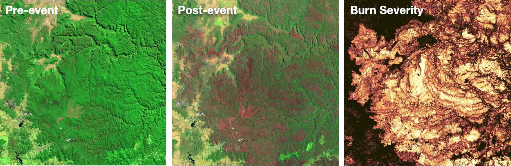
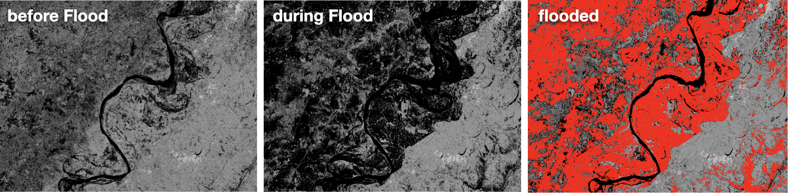
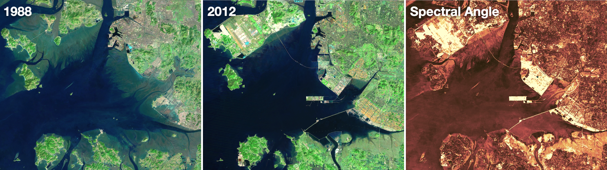

# 4. Change detection

## Introduction

Remote sensing has revolutionized the way we study and monitor the Earth's surface. With advancements in technology and an increase in the number of Earth observation satellites, we now have access to a vast amount of satellite data at regular intervals over long periods of time. This has enabled us to monitor and detect changes on the Earth's surface with unprecedented accuracy and efficiency. Change detection is a key application of remote sensing, which helps us to identify and quantify changes that have occurred in land use, land cover, vegetation, and other features over time. This can be useful for a variety of applications, including monitoring urbanization and land use changes, tracking the spread of invasive species, detecting natural disasters such as landslides or forest fires, and monitoring the health of crops and other vegetation.

## Objective

The goal of today's session is to provide an overview of change detection techniques using the Earth Engine. After this session you should be able to detect, visualize and quantify the changes you are interested in.

## Content

Change detection techniques in remote sensing can be broadly categorized into three categories:&#x20;

1. Single band change
2. Multi-band change
3. Post-classification comparison

In this session, we will discuss these categories in detail and how they are used to detect changes in remote sensing imagery.

## Single band change

Many types of changes can be detected by calculating the variations in spectral indices and applying a simple threshold. This technique is suitable when a specific spectral index has been established for the type of change that is being investigated.&#x20;

The general procedure is:

1. Define a suitable dataset (e.g. Sentinel-2)
2. Generate pre- and post-event images (e.g. cloud-free composites)
3. Calculate the pre- and post-event index (e.g. NBR, Normalized Burn Ratio)
4. Calculate the difference between the pre- and post-event index (e.g. dNBR)
5. Apply a threshold and display the results

### Burned area detection

Here, we apply this technique to map the extent and severity of fires in Australia. In late 2019 and early 2020, Australia experienced concurrent mega-fires throughout New South Wales, Queensland, Victoria and South Australia and its most devastating fire season on record. According to the Australian Government Department of Environment, the fires burned an estimated 186,000 square kilometers, an area about four time the size of Switzerland. The fire season in New South Wales normally ramps up in December. In 2019, unusually hot weather and a potent drought primed the region for a roaring start in October. Two months later, more than 100 fires were raging in forests and bush areas near the southeast coast, including some subtropical rainforests and eucalyptus forests that do not often see fire. The fires have been particularly damaging to eucalypt forests and woodlands, which thrive in areas of relatively dry and nutrient-poor soil. These forests are prone to big outbreaks of fire because many of the trees species have oil-rich foliage that is extremely flammable.

The following script calculates the Relativised Normalized Burn Ratio (rNBR) on pre- and post-event Sentinel-2 composites.

[Open in Code Editor (1)](https://code.earthengine.google.co.in/11ccc609913f6038231a671df334990e) - simple ESA cloudmask

[Open in Code Editor (2)](https://code.earthengine.google.co.in/437f66e3ae85a83149091e9b454b15b1) - proper S2cloudless cloudmask

<figure><figcaption>
Fire events observed by Sentinel-2
</figcaption></figure>

### Flood detection

In early September 2022, floods in Pakistan were the worst in a decade. Monsoon rains had pummeled the region for several weeks and floodwaters inundated 75,000 square kilometers of the country. The floods affected 33 million people, while more than 1,700 lives were lost and more than 2.2 million houses damaged or destroyed. The immediate causes of the floods were heavier than usual monsoon rains (up to 800%) and melting glaciers that followed a severe heat wave, both of which are linked to climate change.

Flood detection using satellite imagery typically involves SAR technology, as it penetrates clouds and can detect changes on the Earth's surface in a timely manner. As flood events often occur during overcast conditions, SAR imagery is frequently preferred over optical imagery. By comparing images acquired before and during a flood event, analysts can identify areas that have been inundated by water. The high temporal and spatial resolution of Sentinel-1 imagery makes it a valuable tool for flood detection and monitoring.

The following script uses a simple threshold on Sentinel-1 backscatter imagery before and during the flood event in Pakistan:

[Open in Code Editor](https://code.earthengine.google.com/3fb0eb85a59ab66e6b514cff60fbb5de)

<figure><figcaption>
Flood extent observed by Sentinel-1
</figcaption></figure>


Task: Verify if you can achieve similar results when mapping flood extent with Sentinel-2 optical imagery.


## Multi-band change

When analyzing multi-band images for changes, computing the Spectral Distance and Spectral Angle between two images can be a useful technique. This technique is particularly valuable in situations where there are no appropriate indices available to detect changes. Pixels that exhibit significant changes will have a larger distance compared to those that remain unchanged.&#x20;

A practical example of this is the analysis of the shoreline area of Incheon, South Korea. Over the past four decades, this area has undergone substantial transformations, with marsh areas being converted into usable land through land reclamation, and the city's urban growth expanding. The land reclamation has also resulted in previously separate islands being joined together to form the site of the Incheon International Airport. The airport, which opened in 2001, is now one of the largest and busiest in the world. In addition, the newly constructed Incheon Bridge, also known as the Incheon Grand Bridge, was opened in October 2009.

[Open in Code Editor](https://code.earthengine.google.com/2e46a0d68fa04160ff3231273e8b04c6)

<figure><figcaption>
Spectral Angle Mapper (SAM), which highlights the changes between the Landsat 5 and Landsat 7 scenes.
</figcaption></figure>

## Post-classification Comparison

Change detection through the comparison of two classified images from different points in time can be used to identify change locations and quantify class transitions (how many pixels from a particular class X have changed to another class Y).&#x20;

[Dynamic World](https://developers.google.com/earth-engine/datasets/catalog/GOOGLE_DYNAMICWORLD_V1#description) is a highly valuable dataset in this context. Its 10m resolution and near-real-time updates make it an excellent tool for monitoring land use and land cover changes. The dataset's class probabilities and label information for nine classes ('water', 'trees', 'grass', 'flooded\_vegetation', 'crops', 'shrub\_and\_scrub', 'built', 'bare', 'snow\_and\_ice') provide detailed insights into changes occurring on the Earth's surface. Dynamic World predictions are generated for Sentinel-2 L1C images with the property CLOUDY\_PIXEL\_PERCENTAGE <= 35%.

This example illustrates the chance detection potential on the Kenyan side of Lake Victoria.

[Open in Code Editor](https://code.earthengine.google.com/0f07c42cad856254da3885efd7c6cc1b)

<figure><figcaption>
Land cover transitions based on the Dynamic World dataset.
</figcaption></figure>
