# 1. Introduction to Earth Engine

## Acknowledgments

* Google Earth Engine Team ([EE guides](https://developers.google.com/earth-engine/guides))
* Ujaval Gandhi ([Spatial Thoughts](https://spatialthoughts.com/))

## Introduction

Google Earth Engine is a cloud-based platform that enables large-scale processing of geospatial data to detect changes, map trends, and quantify differences on the Earth’s surface. This course covers a range of topics in Earth Engine to give you practical skills to master the platform and implement your geoscience projects.

This block course is offered by the [Geography Department at UZH](https://www.geo.uzh.ch/en.html). All material is available under a CC-BY 4.0 license.

## Objective

The main aim of this course is to familiarize you with the many possibilities you have with Earth Engine. By its very nature, this course can only introduce the basic elements of this geospatial processing service. We hope that it sparks your enthusiasm to go the remaining mile.

The aim of today's session is to give you an introduction to the Google Earth Engine processing environment and its basic elements. By the end of this day you will know the main pillars that make up Earth Engine. We strongly recommend that you play around with the following code snippets. By default, you can't break anything. Enjoy the ride and have fun experimenting.

## Error culture

During the exercises in this gitbook, mistakes are not just inevitable, they’re an important part of the learning process. By encountering and addressing errors, you deepen your understanding and develop practical problem-solving skills. I have a habit of often making mistakes myself. If you notice any mistakes or areas for improvement in this gitbook, please let me know ([hendrik.wulf@geo.uzh.ch](mailto:hendrik.wulf@geo.uzh.ch)) your feedback helps me refine and improve the materials for everyone. Embrace the process, and remember: learning happens through trying, failing, and improving!

## Prerequisites

Completing this course requires a Google Earth Engine account. This account is associated with Google Cloud, and users must create a Google Cloud project to use the service. For a step-by-step guide on signing up for a GEE account with a cloud project, click here:

[Sign up for Earth Engine](https://courses.spatialthoughts.com/gee-sign-up.html)

## Development environments

Earth Engine offers two primary development environments for users:&#x20;

* the [Python client library](https://developers.google.com/earth-engine/guides/python_install), which enables integration with the broader Python ecosystem and supports advanced workflows in environments such as Jupyter notebooks
* the [JavaScript Code Editor](https://code.earthengine.google.com), a web-based platform designed for rapid prototyping, interactive exploration, and Earth Engine App development.&#x20;

In this course, we will focus on the _JavaScript API_ and the Code Editor environment, as it provides a streamlined and accessible interface for learning the core functionalities of Earth Engine:

## Learning Resources

#### Code repository (this course)

[https://code.earthengine.google.com/?accept\_repo=users/wulf/GEO717](https://code.earthengine.google.com/?accept_repo=users/wulf/GEO717)&#x20;

#### Documentation

The [Earth Engine Guides](https://developers.google.com/earth-engine/guides) provide structured, in-depth documentation to support users at all stages of their Earth Engine journey. These guides cover everything from initial setup to [best practices](https://developers.google.com/earth-engine/guides/best_practices) and advanced data handling.

For additional learning and inspiration, explore the [Earth Engine Tutorials and Community Content](https://developers.google.com/earth-engine/tutorials). This resource hub features a wide range of tutorials created by and for Earth Engine users, from beginner guides to advanced techniques.

#### Discussion Group

[Google Earth Engine Developers](https://groups.google.com/forum/?utm_source=digest\&utm_medium=email#!forum/google-earth-engine-developers)

#### Online-Book

[Could-Based Remote Sensing with Google Earth Engine: Fundamentals and Applications](https://www.eefabook.org/)

[Google earth engine tutorials](https://google-earth-engine.com/) (same book as above with easy web access)

#### User summits

[2025 user summit Geo for Good](https://earthoutreachonair.withgoogle.com/events/geoforgood25-nyc) ([2nd summit in Singapure](https://earthoutreachonair.withgoogle.com/events/geoforgood25-singapore))

[2024 user summit Geo for Good](https://earthoutreachonair.withgoogle.com/events/geoforgood24-dublin) ([2nd summit in Sāo Paulo](https://earthoutreachonair.withgoogle.com/events/geoforgood24-saopaulo))

[2023 user summit Geo for Good](https://earthoutreachonair.withgoogle.com/events/geoforgood23)

[2022 user summit Geo for Good](https://earthoutreachonair.withgoogle.com/events/geoforgood22)

[2021 user summit Geo for Good](https://earthoutreachonair.withgoogle.com/events/geoforgood21)

[2020 user summit Geo for Good](https://earthoutreachonair.withgoogle.com/events/geoforgood20)

[2019 user summit Geo for Good](https://sites.google.com/earthoutreach.org/geoforgood19/agenda/breakout-sessions)

[2018 user summit in Dublin](https://sites.google.com/earthoutreach.org/eeus2018/agenda/session-descriptions)

[2017 user summit in Mountain View](https://events.withgoogle.com/google-earth-engine-user-summit-2017/)

[2016 user summit in Mountain View](http://earthenginesummit2016.earthoutreach.org/)

#### Google Earth Outreach

[Google Earth Outreach](https://earthoutreachonair.withgoogle.com/) offers training videos on how to use the tools to map environmental change.

#### Github

[https://github.com/google/earthengine-api](https://github.com/google/earthengine-api)

[https://github.com/gee-community](https://github.com/gee-community)

[https://github.com/giswqs/Awesome-GEE](https://github.com/giswqs/Awesome-GEE)

#### Python tools

Google Earth Engine (GEE) can be accessed directly in Python using the Earth Engine Python API, allowing users to harness its vast geospatial data catalog and powerful cloud-based processing capabilities in a familiar programming environment. This integration supports scalable analyses, reproducible workflows, and seamless data handling.

_Advantages of key tools:_

* [Geemap](https://geemap.org/): Enables interactive mapping and visualization within Jupyter Notebooks, making it easy to explore and export Earth Engine results without writing JavaScript.
* [Xarray-Earth-Engine](https://github.com/google/Xee) (XEE): Converts Earth Engine outputs to xarray datasets, streamlining the analysis of large spatiotemporal datasets with Python’s scientific ecosystem.

#### EE Courses

[SpatialThoughts](https://courses.spatialthoughts.com/end-to-end-gee.html)

[GEARS Lab](https://www.gears-lab.com/)

## Data resources

[Earth Engine data catalog](https://developers.google.com/earth-engine/datasets)

[Awesome gee community catalog](https://gee-community-catalog.org/)

## The Earth Engine code editor

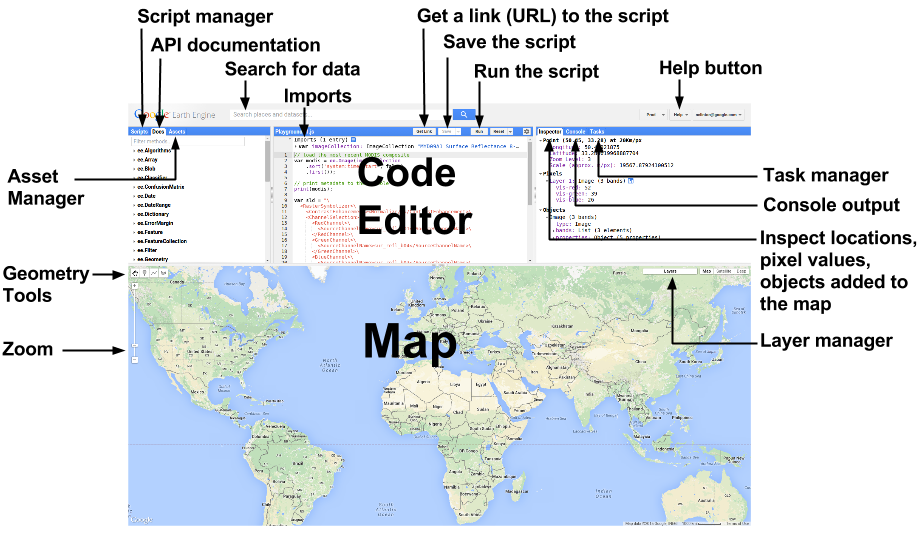

1. Editor Panel
   * The _Code Editor_ is where you type, debug, run and manage your Javascript code
2. Right Panel
   * Console tab for printing output.
   * Inspector tab for querying map results.
   * Tasks tab for managing long­ running tasks.
3. Left Panel
   * Scripts tab for managing your programming scripts.
   * Docs tab for accessing documentation of Earth Engine objects and methods, as well as a few specific to the Code Editor application
   * Assets tab for managing assets that you upload.
4. Interactive Map
   * For visualizing map layer output
5. Search Bar
   * For finding datasets and places of interest
6. Help Menu
   * User guide­: reference documentation
   * Developers Q\&A site: link to EE's [gis.stackexchange.com](https://gis.stackexchange.com/questions/tagged/google-earth-engine) site
   * Developers disscussion group: [Google group](https://groups.google.com/g/google-earth-engine-developers) for discussing Earth Engine
   * Shortcuts: ­Keyboard shortcuts for the Code Editor
   * Feature Tour: ­ overview of the Code Editor

## Earth Engine basics

### Printing

Printing out information to the console is a basic task for getting information about an object, displaying the numeric result of a computation, displaying object metadata or helping with debugging. The iconic ‘_Ay caramba!’_ example in the Code Editor is:

```javascript
print('Ay caramba!');
```

[Open in Code Editor](https://code.earthengine.google.com/?scriptPath=users%2Fwulf%2FGEO717%3AEE01_Introduction%2F00a%20-%20Basics_Printing%20example) or copy this line into the Code Editor and click **Run**. Note that the output is displayed in the **Console** tab, on the right of the Code Editor.&#x20;

### Basic data types

The two most fundamental geographic data structures in Earth Engine are [`Image`](https://developers.google.com/earth-engine/guides/image_overview) and [`Feature`](https://developers.google.com/earth-engine/guides/features) corresponding to raster and vector data types, respectively. Images are composed of bands and a dictionary of properties. Features are composed of a [`Geometry`](https://developers.google.com/earth-engine/guides/geometries) and a dictionary of properties. A stack of images (e.g. an image time series) is handled by an [`ImageCollection`](https://developers.google.com/earth-engine/guides/ic_creating). A collection of features is handled by a [`FeatureCollection`](https://developers.google.com/earth-engine/guides/feature_collections). Other fundamental data structures in Earth Engine include `Dictionary`, `List`, [`Array`](https://developers.google.com/earth-engine/guides/arrays_intro), `Date`, `Number` and `String`.&#x20;

#### Strings

Using variables to store objects and primitives helps code readability. For example, a variable that stores a string object is defined by single `'` or double `"` quotes (but don't mix them), with [single quotes preferred](https://google.github.io/styleguide/javascriptguide.xml#Strings). Make a new string and store it in a variable called `greetString`:

```javascript
// Use single (or double) quotes to make a string.
var greetString = 'Hi-Diddily-Ho!';

// Use parentheses to pass arguments to functions.
print(greetString);
```

[Open in Code Editor](https://code.earthengine.google.com/?scriptPath=users%2Fwulf%2FGEO717%3AEE01_Introduction%2F01a%20-%20Basics_DataTypes%20examples) (all data type examples)

#### Numbers

Note that variables are defined with the keyword `var`. Variables can also store numbers:

```javascript
// Store a number in a variable.
var number = 42;
print('The Answer to the Ultimate Question of Life is:', number);
```

#### Lists

Define lists with square brackets `[]`. A list of numbers, for example:

```javascript
// Use square brackets [] to make a list.
var listOfMonths = [1, 2, 3, 4, 5, 6, 7, 8, 9, 10, 11, 12];
print('List of months:', listOfMonths);

// Make a sequence the easy way!
var months = ee.List.sequence(1,12);
print('Another list of months:', months);
```

Lists can also store strings or other objects. For example:

```javascript
// Make a list of strings.
var listOfStrings = ['s', 't', 'r', 'i', 'n', 'g', 's'];
print("no", listOfStrings, 'attached');
```

#### Dictionaries

Dictionaries in JavaScript are `key: value` pairs. Make a dictionary using curly brackets `{}`, for example:

```javascript
// Use curly brackets {} to make a dictionary of key:value pairs.
var dictionary = {
  foo: 'bar',
  lucky: 13,
  stuff: ["Whatever, ", "I'll be at ", "Moe's"]
};
print('Dictionary:', dictionary);

// Access dictionary items using square brackets.
print('Print foo:', dictionary['foo']);

// Access dictionary items using dot notation.
print('Print stuff:', dictionary.stuff);
```

Note that you can get a value from a dictionary by supplying the key. This example shows you how to do that for JavaScript dictionaries on your client. Later you'll learn how to do it for dictionaries that are on the Earth Engine server.

#### Playtime

These are the Top 3 happiest countries (and their scores) in the world (2024):

* Finland (7.74)
* Denmark (7.52)
* Iceland (7.51)


Task: (1) Create a dictionary named 'happyCountries'. The dictionary should feature the countries as keys and their scores as value. (2) Print the dictionary.


[Use the Code Editor](https://code.earthengine.google.com/?scriptPath=users%2Fwulf%2FGEO717%3AEE01_Introduction%2F01b%20-%20Basics_DataTypes%20task)

### Saving scripts

When you modify any script from the course repository, you may want to save a copy for yourself. If you try to click the _Save_ button, you will get an error message like below

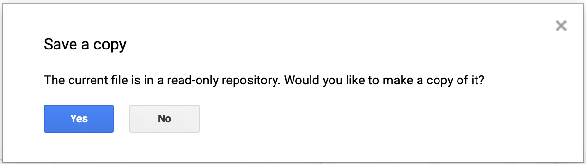

This message appears because the shared course repository is a _Read-only_ repository. You can click _Yes_ to save a copy in your repository. If this is the first time you are using Earth Engine, you will be prompted to choose the name of your _home folder_. Choose the name carefully, as it cannot be changed once created.

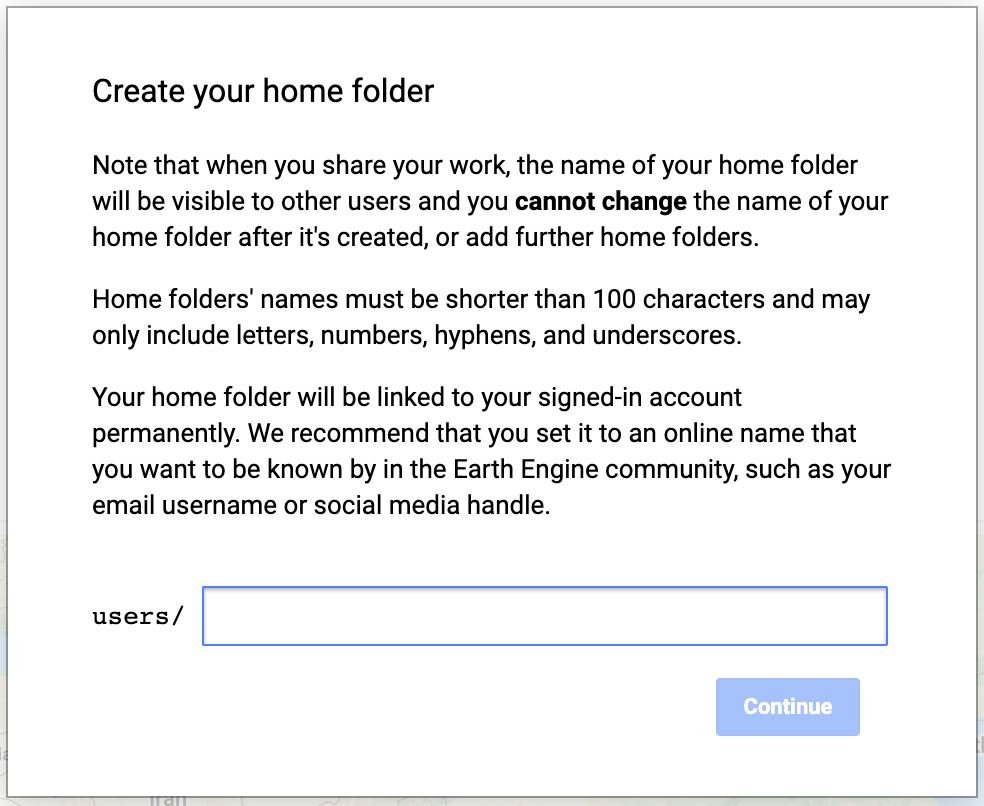

### JavaScript Syntax

All the JavaScript you need to know (almost)

#### Comments

[Open in Code Editor](https://code.earthengine.google.com/?scriptPath=users%2Fwulf%2FGEO717%3AEE01_Introduction%2F02a%20-%20Basics_Syntax%20examples) (all Syntax examples)

```javascript
// Line comments start with two forward slashes. Like this line. 

/* Multi line comments start with a forward slash and a star,
and end with a star and a forward slash. */
```

#### Quotes&#x20;

```javascript
// String objects start and end with a single quote.
var my_variable = 'Woo Hoo!';

// String objects can also start and end with double quotes.
// But don't mix and match them.
var my_other_variable = "D'oh!";
```

#### Semi-colon

Statements can but don't need to end with a semi-colon (no complains)

```javascript
var test = 'I feel (in)complete...'
```

#### Parentheses

Parentheses are used to pass parameters to functions.

```javascript
print("Yes Sir, I Can Boogie.");
```

#### Square brackets

Square brackets are used for selecting items within a list.&#x20;

```javascript
var my_list = ['Eat', 'My', 'Shorts'];

// The zero index refers to the first item in the list.
print(my_list[0]);
```

#### Curly brackets

Curly brackets (or braces) can be used to define dictionaries (key:value pairs)

```javascript
var my_dict = {'food':'donots', 'color':'yellow', 'troublemakers':3};

// Square brackets can be used to access dictionary items by key.
print(my_dict['color']);

// Or you can use the dot notation to get the same result.
print(my_dict.color);
```

#### Errors

Syntax errors in client-side JavaScript are generally caught by the Code Editor, which alerts you to their presence with a  on the left side of the editor panel. Hovering on the  with the cursor will provide a clue about the source of the error. The example below illustrates what happens when a list is incorrectly coded. Specifically, without a closing bracket (`]`), the list is not correctly specified, a problem the Code Editor explains as `Expected ']' to match '[' from line 1 and saw ';'.`

```javascript
var bad = ['something', 'is', 'missing';
```

#### Playtime


Task: Get to know your enemy. Generate errors by using (a) different quotes in a list and (b) missing brackets and debug them.


[Use the code editor](https://code.earthengine.google.com/?scriptPath=users%2Fwulf%2FGEO717%3AEE01_Introduction%2F02b%20-%20Basics_Syntax%20task)

### ee.Objects

To ease processing at Google' cloud servers, Earth Engine wants you to put JavaScript objects and primitives into Earth Engine containers.

#### Declaring variables

```javascript
var variableName = ee.ContainerType(value);
```

A container object (usually in the form `ee.SomeVariableType`) is used to wrap a native JavaScript object so that Google's servers can perform operations on it.

#### Strings

Think of `ee.Thing` as a container for a thing that exists on the server. In this example, the string is defined first, then put into the container.

[Open in Code Editor](./#acknowledgments) (all ee.Objects examples)

```javascript
// Define a string, then put it into an EE container.
var aString = 'To the cloud!';
var eeString = ee.String(aString);
print('Where to?', eeString);
```

Although the first argument to `print()` is just a string on the client, the second argument is actually sent to the server to be evaluated, then sent back.

#### Numbers

```javascript
var num = ee.Number(42);
```

#### Arrays

```javascript
var arr = ee.Array([[5, 2, 3], [-2, 7, 10], [6, 6, 9]]);
```

#### Lists

```javascript
var list = ee.List([5, 'five', 6, 'six']); 
```

#### Dictionaries

```javascript
var dict = ee.Dictionary({five: 5, six: 6}); 
```

#### Casting

Sometimes, Earth Engine doesn't know the type of an object that gets returned from a method. You, as the programmer, know the object and need to cast it into the correct container.

```javascript
// Make a sequence
var sequence = ee.List.sequence(1, 5);

// Use a method on an ee.List to extract a value.
var value = sequence.get(2);

// value.add is not a function
/* 
Performing an operation will result in an error
because EE does not know which object 'value' is.
The resulting error message reads:
"value.add is not a function"
*/

print('Error', value.add(3));

// Cast the return value of get() to a number.
print('No error:', ee.Number(value).add(3));
```


Task: What is the correct result of this operation?


#### Dates

Date objects are the way Earth Engine represents time. As in the previous examples, it is important to distinguish between a JavaScript [`Date`](https://developer.mozilla.org/en-US/docs/Web/JavaScript/Reference/Global_Objects/Date) object and an Earth Engine `ee.Date` object. Construct an `ee.Date` from a string, from a JavaScript `Date`, or using static methods provided by the `ee.Date` class. (See the Date section in the [**Docs** tab](https://developers.google.com/earth-engine/guides/playground#api-reference-docs-tab) for details). This example illustrates the construction of dates from strings or a JavaScript date representing milliseconds since midnight on January 1, 1970:

```javascript
// Define a date in Earth Engine.
var date = ee.Date('2015-12-31');
print('Date:', date);

// Get the current time using the JavaScript Date.now() method.
var now = Date.now();
print('Milliseconds since January 1, 1970', now);

// Initialize an ee.Date object.
var eeNow = ee.Date(now);
print('Now:', eeNow);
```

Dates are useful for filtering collections, specifically as arguments to the `filterDate()` method.

#### Playtime


Task 1: Numbers&#x20;

* Generate a list of numbers from 1 to 10
* Extract the number 4 from that list and define it a new variable
* Add the number 7 to it by using the function ".add()"



Task 2: Dictionary

* Read in the following data: var data = {'city': 'Marseille', 'population': 860000, 'elevation': 36}
* Print the name of the city using the ".get()" function.



Task 3: Dates

* Define your birthday as an "ee.Date".&#x20;
* Calculate your current age in days using the ".difference()" function.&#x20;
* Add ten years to your birthday using the function ".advance()".


[Use the Code Editor](https://code.earthengine.google.com/?scriptPath=users%2Fwulf%2FGEO717%3AEE01_Introduction%2F03b%20-%20Basics_eeObjects%20task)

### Functions

A function is a set of instructions to perform a specific task. Define a function with the `function` keyword. Function names start with a letter and have a pair of parentheses at the end. Functions often take _parameters_ which tell the function what to do. These parameters go inside the parentheses `()`. The set of statements making up the function go inside curly brackets. The `return` keyword indicates what the function output is. There are several ways to declare a function, but here we'll use something like this:

```javascript
var myFunction = function(parameter1, parameter2, parameter3) {
  statement;
  statement;
  statement;
  return statement;
};
```

Let's consider the lines one by one. The first line creates a new function and assigns it to the variable `myFunction`. This variable could have been named anything. It defines how to call the function later. The terms in the parentheses after the function name (i.e. parameter1, parameter2, parameter3) are the parameter names and could have been named anything as well, though it's good practice to give them unique names that are different from the code outside the function. Whatever you name them, these are the names that function will use to refer to the values that are passed into the function when it is called. The value of a parameter once it's been passed into a function is called an _argument_. Although functions can use variables declared outside the function (_global_ variables), function arguments are not visible outside the function. Functions can take as many parameters as you need, even zero. Here's a simple example of a function that just returns its argument with some text:

Open in Code Editor

```javascript
// Functions can be defined as a way to reuse code 
// and make it easier to read
var my_naming_function = function(name, firstName) {
  return 'I have a funny name: ' + firstName + ' ' + name;
};
print(my_naming_function('Bacon', 'Chris P.'));
```

Here is another simple example using numbers.

```javascript
// Define a function that takes a number and adds 1 to it
var my_counting_function = function(number) {
  return number + 1;
}
print(my_counting_function(1));
```

#### Calling a function

```javascript
var result = functionName(input);
```

#### Playtime


Task: Write a function that converts temperature from Kelvin to Celsius.


[Use the Code Editor](https://code.earthengine.google.com/?scriptPath=users%2Fwulf%2FGEO717%3AEE01_Introduction%2F04b%20-%20Basics_Functions%20task%201)

#### Mapping a function

Mapping a function over a collection applies the function to every element in the collection.

```javascript
var outputCollection = inputCollection.map(functionName);
```

Here is an example converting temperatures from Celsius to Fahrenheit using the formula:&#x20;

$$
^\circ\mathrm{F} = (^\circ\mathrm{C} \times \frac{9}{5}) + 32
$$

```javascript
// 1. Create a list of Celsius temperatures
var celsiusTemps = ee.List.sequence(0, 40, 5); 

// 2. Define a function to convert Celsius to Fahrenheit
var celsiusToFahrenheit = function(c) {
  return ee.Number(c).multiply(9).divide(5).add(32);
};

// 3. Map the function over the list
var fahrenheitTemps = celsiusTemps.map(celsiusToFahrenheit);

// 4. Print results
print('Celsius values:', celsiusTemps);
print('Fahrenheit values:', fahrenheitTemps);
```

#### Playtime


Task: Define and test functions converting temperatures from Fahrenheit to Kelvin.


[Use the Code Editor](https://code.earthengine.google.com/c5e85fb7cffdc4c5f8b31f86b9533519)

## Image

Okily Dokily! Let's get started with remote sensing images. Any raster data are represented as `Image` objects in Earth Engine. Images are composed of one or more bands and each band has its own name, data type, scale, mask and projection. Each image has metadata stored as a set of properties. An easy way to look into these properties is to print the image.

### Printing

The following example prints the metadata of a Landsat 8 image:

[Open in Code Editor](https://code.earthengine.google.com/?scriptPath=users%2Fwulf%2FGEO717%3AEE01_Introduction%2F05a%20-%20Image_Printing%20examples)

```javascript
// Load an image.
var image = ee.Image("LANDSAT/LC08/C02/T1_TOA/LC08_196030_20190629")

// Print the image.
print('Landsat 8 image', image);
```

Inspect the output in the console to see metadata available for Landsat images.

#### Playtime


&#x20;Task: Let's find out at which date and time the image was acquired.

* to retrieve image properties use: var property\_name = image.get('property')
* to convert the time from milliseconds to a common date format, use the ee.Date() container and print it.
* Be aware that the default time zone is UTC


[Use the Code Editor](https://code.earthengine.google.com/?scriptPath=users%2Fwulf%2FGEO717%3AEE01_Introduction%2F05b%20-%20Image_Printing%20task)

### Image Visualization

The following illustrates the use of parameters to style a Landsat 8 image as a false-color composite:

[Open in Code Editor](https://code.earthengine.google.com/?scriptPath=users%2Fwulf%2FGEO717%3AEE01_Introduction%2F06a%20-%20Image_Visualization%20examples)

```javascript
// Define the basemap
Map.setOptions('TERRAIN');  // "ROADMAP", "SATELLITE", "HYBRID" or "TERRAIN" 

// Load an image.
var image = ee.Image("LANDSAT/LC08/C02/T1_TOA/LC08_196030_20190629")

// Define the visualization parameters.
var vizParams = {
  bands: ['B5', 'B4', 'B3'],
  min: 0.05,
  max: 0.3,
};

// Center the map and display the image.
Map.centerObject(image); // Carmague, France
Map.addLayer(image, vizParams, 'false color infrared', true);
```

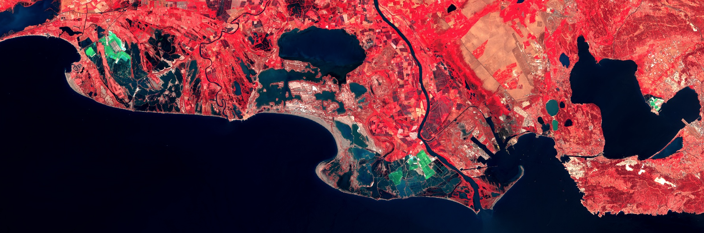

#### Playtime


Tasks:&#x20;

* Display the image as a 'natural false color image' using the bands B7 (SWIR2), B5 (NIR) and B4 (red).
* Adjust the maximum reflectance of each band to B7 = 0.25, B5 = 0.35, B4 = 0.25.&#x20;
* Use the command "Map.setCenter()" to define the display location (lon: 4.99, lat: 43.43) and zoom level (11).


[Use the Code Editor](https://code.earthengine.google.com/?scriptPath=users%2Fwulf%2FGEO717%3AEE01_Introduction%2F06b%20-%20Image_Visualization%20task)

#### Playtime Extra


No task - just playtime :)&#x20;

If you are into basemaps you will like this. Using the Snazzy Maps library you can add custom basemap styles to your Earth Engine map. With the script [here](https://code.earthengine.google.com/09f9f2c643ee2ab9261a280957564cf3) you can explore different map looks by either linking directly to a style from [snazzymaps.com](https://snazzymaps.com), choosing a style by name, or selecting from keyword tags like `"colorful"` or `"simple"`. You can even pick a random style that matches certain tags. This is a fun way to play around with map aesthetics and find a background that fits the story you want to tell with your data.


[Use the Code Editor](https://code.earthengine.google.com/09f9f2c643ee2ab9261a280957564cf3)

### Image Math

Image math can be performed using operators like `add()` and `subtract()`, but for complex computations with more than a couple of terms, the `expression()` function provides a good alternative.

#### Operators

Math operators perform basic arithmetic operations on image bands. They take two inputs: either two images or one image and a constant term, which is interpreted as a single-band constant image with no masked pixels. Operations are performed per pixel for each band.

As a simple example, consider the task of calculating the Normalized Difference Vegetation Index (NDVI) using Landsat imagery, where `add()`, `subtract()`, and `divide()` operators are used:

$$
NDVI = \frac{NIR - Red}{NIR + Red}
$$

[Open in Code Editor](https://code.earthengine.google.com/?scriptPath=users%2Fwulf%2FGEO717%3AEE01_Introduction%2F07a%20-%20Image_MathOperators%20example%201)

```javascript
// Load an image.
var image = ee.Image("LANDSAT/LC08/C02/T1_TOA/LC08_196030_20190629")

// Select the relevant spectral bands: Red and NIR
var red = image.select('B4');
var nir = image.select('B5');

// Perform the mathematical operations
var ndvi = nir.subtract(red).divide(nir.add(red));

// Stick the resulting NDVI image on the map
Map.addLayer(ndvi, {min:0, max:1}, 'NDVI');
```

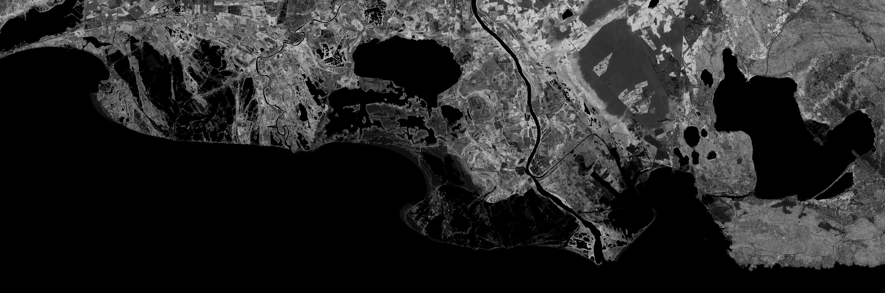

**Note:** the normalized difference operation is available as a shortcut method: [`normalizedDifference()`](https://developers.google.com/earth-engine/apidocs/ee-image-normalizeddifference).

[Open in Code Editor](https://code.earthengine.google.com/?scriptPath=users%2Fwulf%2FGEO717%3AEE01_Introduction%2F07a%20-%20Image_MathOperators%20example%202)

```javascript
// NDVI the easy way
// Load an image.
var image = ee.Image("LANDSAT/LC08/C02/T1_TOA/LC08_196030_20190629")

// Perform the normalized difference operation
var ndvi = image.normalizedDifference(['B5', 'B4']);

// Stick the resulting NDVI image on the map
Map.addLayer(ndvi, {min:0, max:1}, 'NDVI');
```

#### Playtime


Task: Perform the normalizedDifference() operation to calculate the NDWI (normalized difference water index, formula below) for the same scene.


$$
NDWI = \frac{B3 - B5}{B3 + B5}
$$

[Use the Code Editor](https://code.earthengine.google.com/6b1578a849a9c917f9713c66a7bc4283)

#### Expressions

Excellent! To implement more complex mathematical expressions, consider using `image.expression()`, which parses a text representation of a math operation. The following example uses `expression()` to compute the Enhanced Vegetation Index (EVI):

$$
\text{EVI} = 2.5 \cdot \frac{NIR - Red}{NIR + 6 \cdot Red - 7.5 \cdot Blue + 1}
$$

[Open in Code Editor](https://code.earthengine.google.com/?scriptPath=users%2Fwulf%2FGEO717%3AEE01_Introduction%2F07d%20-%20Image_MathExpressions%20example)

```javascript
// Load an image.
var image = ee.Image("LANDSAT/LC08/C02/T1_TOA/LC08_196030_20190629")

// Compute the EVI using an expression.
var evi = image.expression(
    '2.5 * ((NIR - Red) / (NIR + 6 * Red - 7.5 * Blue + 1))', {
      'NIR': image.select('B5'),
      'Red': image.select('B4'),
      'Blue': image.select('B2')
});

// Stick the resulting EVI image on the map
Map.centerObject(image, 9);
Map.addLayer(evi, {min: -0.4, max: 0.6, 
  palette: ['blue','cyan','yellow','green']}, 'EVI');
```

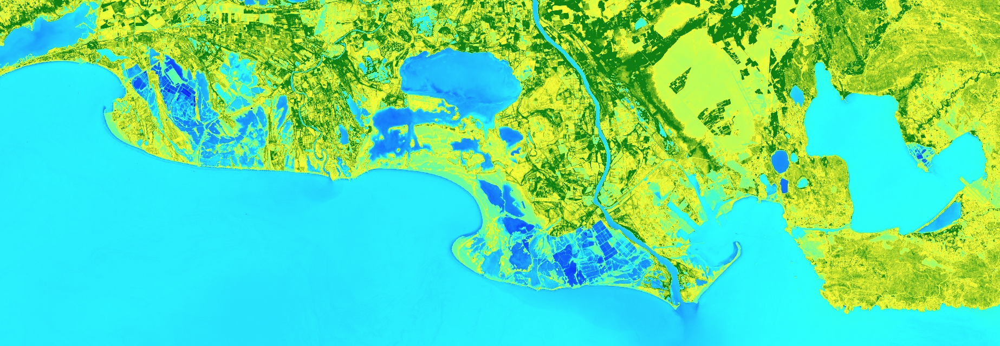

Observe that the first argument to `expression()` is the textual representation of the math operation, the second argument is a dictionary where the keys are variable names used in the expression and the values are the image bands to which the variables should be mapped.

#### Playtime


Task: Perform an image.expression() operation to calculate the Bare Soil Index (BSI, see formula below):


$$
BSI = \frac{(Red + SWIR1) - (NIR + Blue)}{(Red + SWIR1) + (NIR + Blue)}
$$

[Use the Code Editor](https://code.earthengine.google.com/?scriptPath=users%2Fwulf%2FGEO717%3AEE01_Introduction%2F07e%20-%20Image_MathExpressions%20task)

#### Playtime Extra


This playtime session is on color palettes. Maybe not as fancy as basemaps, but still useful for styling.&#x20;

[This GitHub repository](https://github.com/gee-community/ee-palettes) provides an excellent overview of the various colour palettes available (e.g. ColorBrewer, Crameri) and explains how to incorporate them into Earth Engine. It's a great way to find palettes that support both aesthetics and interpretation.

Choose a suitable palette for the BSI index of the previous task.


[Use the Code Editor](https://code.earthengine.google.com/fc8ce5e3d3cabf17829f64006d54b3c9)

### Image Operations

`ee.Image` objects have a set of relational, conditional, and boolean methods for constructing decision-making expressions. The results of these methods are useful for limiting analysis to certain pixels or regions through masking, developing classified maps, and value reassignment.

#### Relational and Boolean Operations

**Relational** methods include:`eq()`(meaning 'equal' or '=') ,`gt()`(meaning 'greater than' or '>') , `gte()`, (meaning 'greater than or equal' or '>=') ,`lt()`, (meaning 'less than' or '<') and `lte()`(meaning 'less than or equal' or '<=') .

**Boolean** methods include: `and()`,`or()`, and `not()`

To perform per-pixel comparisons between images, use relational operators. To extract urbanized areas in an image, this example uses relational operators to threshold spectral indices, combining the thresholds with the _and_ operator:

[Open in Code Editor](https://code.earthengine.google.com/?scriptPath=users%2Fwulf%2FGEO717%3AEE01_Introduction%2F08a%20-%20Image_OperationsRelational%20example)

```javascript
// Load a Landsat 8 image.
var image = ee.Image("LANDSAT/LC08/C02/T1_TOA/LC08_196030_20190629")

// Create NDVI and NDWI spectral indices.
var ndvi = image.normalizedDifference(['B5', 'B4']);
var ndwi = image.normalizedDifference(['B3', 'B5']);

// Create a binary layer using logical operations.
var bare = ndvi.lt(0.3).and(ndwi.lt(0));


// Stick the resulting images on the map
Map.addLayer(ndvi, {min:0, max:1}, 'NDVI', false);
Map.addLayer(ndwi, {min:0, max:1}, 'NDWI', false);

// Mask and display the binary layer.
Map.setCenter(4.7875, 43.5408, 10);
Map.setOptions('satellite');
Map.addLayer(bare, {}, 'bare');
Map.addLayer(bare.selfMask(), {}, 'bare selfMask');
Map.addLayer(bare.updateMask(bare), {}, 'bare updateMask');
```

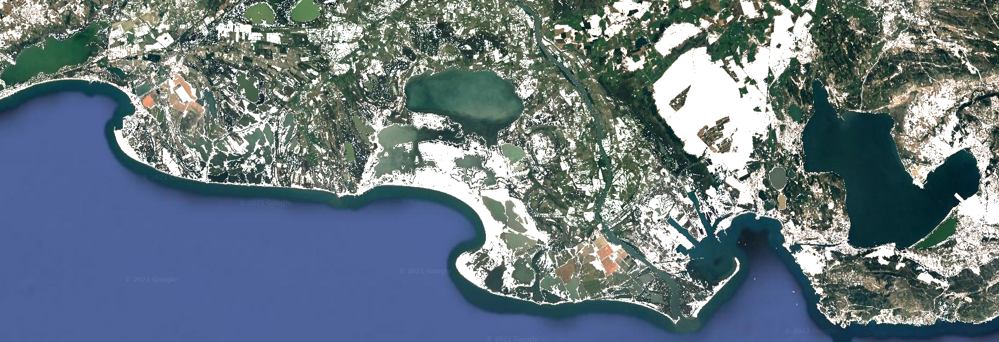

#### Playtime


Task:&#x20;

* ".select()" the thermal band 'B10' from the image, threshold it at 300 K, and mask areas that are 'no water'.&#x20;
* Display the water in blue on top of the natural false colour image (B7, B5, B2).


[Use the Code Editor](https://code.earthengine.google.com/?scriptPath=users%2Fwulf%2FGEO717%3AEE01_Introduction%2F08b%20-%20Image_OperationsRelational%20task)

#### Conditional Operations

Another way to implement conditional operations on images is with the `where()` operator. Consider the need to replace masked pixels with some other data. In the following example, cloudy pixels are replaced by pixels from a cloud-free image using `where()`:

[Open in Code Editor](https://code.earthengine.google.com/?scriptPath=users%2Fwulf%2FGEO717%3AEE01_Introduction%2F09a%20-%20Image_OperationsConditional%20example)

```javascript
// Load a cloudy Landsat 8 image.
var image = ee.Image('LANDSAT/LC08/C02/T1_TOA/LC08_196030_20180712')
print('cloud cover (%)', image.get('CLOUD_COVER'))

// Define the visualization parameters.
var vizParams = {
  bands: ['B7', 'B5', 'B3'],
  min: 0.05,
  max: 0.3,
};

// Center the map and display the image.
Map.centerObject(image, 9); // Carmague, France
Map.addLayer(image, vizParams, 'cloudy L8 image', true);

// Load another image to replace the cloudy pixels.
var replacement = ee.Image('LANDSAT/LC08/C02/T1_TOA/LC08_196030_20180914');
Map.addLayer(replacement, vizParams, 'replacement image', true);

// Compute a cloud score band.
var cloud = ee.Algorithms.Landsat.simpleCloudScore(image).select('cloud');
Map.addLayer(cloud, {}, 'L8 - cloud score', true);

// Set cloudy pixels to the other image.
var replaced = image.where(cloud.gt(10), replacement);

// Display the result.
Map.addLayer(replaced, vizParams, 'clouds replaced', true);
```

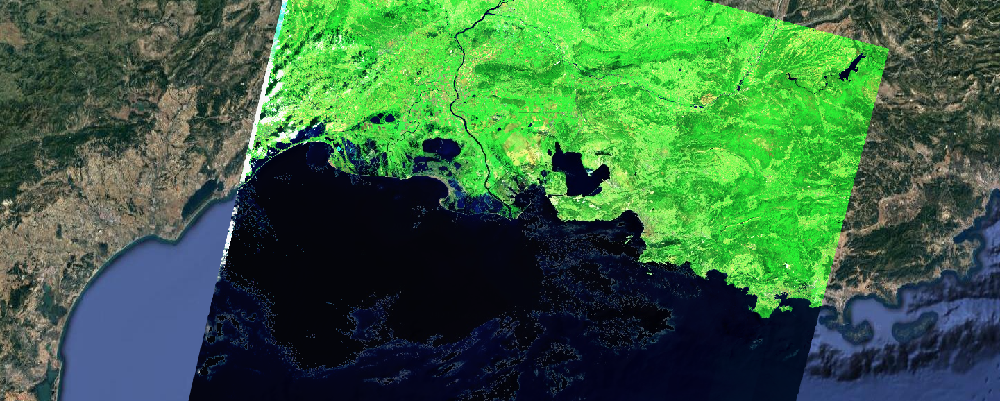

There are a couple of things in this code that are worth mentioning in detail. First, the `select()` function is useful for extracting the bands of interest from an image. Here, we select only the band we care about: `cloud`. The next thing is the logical operator gt`()` which stands for "greater thean." We use `gt(10)` to create a binary image in which all the pixels that exceed the value of 10 (those that are clouds) get replaced by pixel values of the less cloudy image.

#### Playtime


Task: Replace the snow covered pixels from one image with the snow free pixel from the other image

* Threshold the NDSI at 0.35 to identify snow covered pixel
* Seperate water from snow using the NIR reflectance at 0.2
* Replace the snow pixels using the ".where()" function


[Use the Code Editor](https://code.earthengine.google.com/?scriptPath=users%2Fwulf%2FGEO717%3AEE01_Introduction%2F09b%20-%20Image_OperationsConditional%20task)

#### Masking

Masking pixels in an image makes those pixels transparent and excludes them from analysis. Each pixel in each band of an image has a mask. Those with a mask value of 0 or below will be transparent. Those with a mask of any value above 0 will be rendered. The mask of an image is set using a call like `image1.mask(image2)`. This call takes the values of `image2` and makes them the mask of `image1`. Any pixels in `image2` that have the value 0 will be made transparent in `image1`.

[Open in Code Editor](https://code.earthengine.google.com/?scriptPath=users%2Fwulf%2FGEO717%3AEE01_Introduction%2F10a%20-%20Image_OperationsMasking%20example)

```javascript
var image = ee.Image('LANDSAT/LC08/C02/T1_TOA/LC08_196030_20180712')
print('L8 image', image)

// Define the visualization parameters.
var vizParams = {
  bands: ['B7', 'B5', 'B3'],
  min: 0.05,
  max: 0.3,
};

// Center the map and display the image.
Map.centerObject(image); // Carmague, France
Map.addLayer(image, vizParams, 'L8 - false color image', true);


// Compute a cloud score band.
var cloud = ee.Algorithms.Landsat.simpleCloudScore(image).select('cloud');
Map.addLayer(cloud, {}, 'L8 - cloud score', true);

// mask the image with a boolean cloud image using .updateMask()
image = image.updateMask(cloud.gt(10).not())
Map.addLayer(image, vizParams, 'L8 - masked for clouds', true);
```

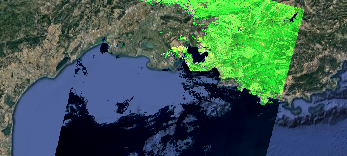

The command `.updateMask()`updates an image's mask at all positions where the existing mask is not zero. In other words, if mask == 1 the data is retained, if mask == 0 the data is masked (set to transparent, NaN). The output image retains the metadata and footprint of the input image. The same operations apply to the command `.mask()`

The command `.selfMask()` updates an image's mask at all positions where the existing mask is not zero using the value of the image as the new mask value. In other words, all pixel with the image value zero get masked (set to transparent).

The command `.unmask()` replaces mask and value of the input image with the mask and value of another image at all positions where the input mask is zero. If only the input image gets unmasked, all masked pixel are set to zero.

#### Playtime


Task: Mask a Landsat 7 image based on its VZA-band (viewing zenith angle) to exclude all pixel affected by its SLC (scan line corrector) failure.


[Use the Code Editor](https://code.earthengine.google.com/?scriptPath=users%2Fwulf%2FGEO717%3AEE01_Introduction%2F10b%20-%20Image_OperationsMasking%20task)

#### Morphology

Earth Engine implements morphological operations as focal operations, specifically `focal_max()`, `focal_min()`, `focal_median()`, and `focal_mode()` instance methods in the `Image` class. The morphological operators are useful for performing operations such as _erosion, dilation, opening_ and _closing._ For example, to perform an [opening operation](http://en.wikipedia.org/wiki/Opening_\(morphology\)), use `focal_min()` followed by `focal_max()`:

[Open in Code Editor](https://code.earthengine.google.com/?scriptPath=users%2Fwulf%2FGEO717%3AEE01_Introduction%2F11a%20-%20Image_OperationsMorphology%20example)

```javascript
// Load a Landsat 8 image, select the NIR band, threshold, display.
var image = ee.Image("LANDSAT/LC08/C02/T1_TOA/LC08_196030_20190629")
            .select('B5').gt(0.10);
Map.setCenter(4.71777, 43.38775, 13);
Map.addLayer(image, {}, 'NIR threshold');

// Define a kernel.
var kernel = ee.Kernel.circle({radius: 1});

// Perform an erosion followed by a dilation, display.
var opened = image
             .focal_min({kernel: kernel, iterations: 2})
             .focal_max({kernel: kernel, iterations: 2});
Map.addLayer(opened, {}, 'opened');
```

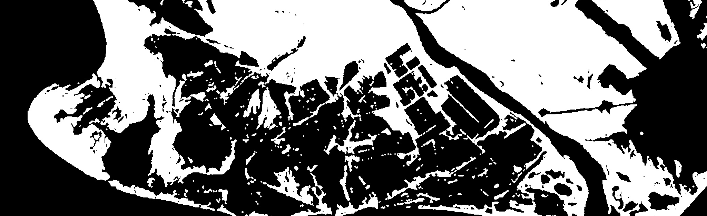

Note that in the previous example, a kernel argument is provided to the morphological operator. The pixels covered by non-zero elements of the kernel are used in the computation. The iterations argument indicates how many times to apply the operator.

#### Playtime


Task: Let's go to a happy place (Finland) and buffer clouds. Calculate the simpleCloudScore, threshold the score at 50 and perform an opening operation to eliminate false positives and buffer the cloud margins. Mask the image based on your buffered cloud mask.


[Use the Code Editor](https://code.earthengine.google.com/?scriptPath=users%2Fwulf%2FGEO717%3AEE01_Introduction%2F11b%20-%20Image_OperationsMorphology%20task)

## ImageCollection

An `ImageCollection` is a stack or sequence of images. An `ImageCollection` can be loaded by pasting an Earth Engine asset ID into the `ImageCollection` constructor. You can find `ImageCollection` IDs in the [data catalog](https://developers.google.com/earth-engine/datasets). For example, to load the [Sentinel-2 surface reflectance collection](https://developers.google.com/earth-engine/datasets/catalog/COPERNICUS_S2_SR):

```javascript
var s2col = ee.ImageCollection('COPERNICUS/S2_SR_HARMONIZED');
```

For each dataset you will find an "_Explore with Earth Engine"_ section, which provides a code snippet to load and visualise the collection. This snippet is a great starting point for your work with this dataset.&#x20;

### ImageCollection overview

#### Filtering&#x20;

This collection contains every Sentinel-2 image in the public catalog. There are a lot. Usually you want to filter the collection to include only relevant data that supports your purpose. Consider dates, spatial extent, quality, and other properties specific to a given dataset.

For instance, filter a Sentinel-2 surface reflectance collection by a single date range, a region of interest, or an image property.

```javascript
var s2col = ee.ImageCollection('COPERNICUS/S2_SR_HARMONIZED')
  .filterDate('2018-01-01', '2019-01-01')
  .filterBounds(ee.Geometry.Point(23.6, 37.9))
  .filter('CLOUDY_PIXEL_PERCENTAGE < 50');
```

#### Sorting

Sort a collection by time to ensure proper chronological sequence, or order by a property of your choice. By default, the visualization frame series is sorted in natural order of the collection. The arrangement of the series can be altered using the `sort` collection method, whereby an `Image` property is selected for sorting in either ascending or descending order. For example, to sort by time of observation, use the ubiquitous `system:time_start` property.

```javascript
var s2col = ee.ImageCollection('COPERNICUS/S2_SR_HARMONIZED')
  .filterBounds(ee.Geometry.Point(23.6, 37.9))
  .sort('system:time_start');
```

Or perhaps the order should be defined by increasing cloudiness:

```javascript
var s2col = ee.ImageCollection('COPERNICUS/S2_SR_HARMONIZED')
  .filterBounds(ee.Geometry.Point(23.6, 37.9))
  .sort('CLOUDY_PIXEL_PERCENTAGE');
```


Task: Filter the Sentinel-2 image collection to display the least-cloudy image of your hometown. Use the function ".first()" to select the first image of a collection.


#### Information and Metadata

As with Images, there are a variety of ways to get information about an `ImageCollection`. The collection can be printed directly to the console, but the console printout is limited to 5000 elements. Collections larger than 5000 images will need to be filtered before printing. Printing a large collection will be correspondingly slower. The following example shows various ways of getting information about image collections programmatically:

[Open in Code Editor](https://code.earthengine.google.com/?scriptPath=users%2Fwulf%2FGEO717%3AEE01_Introduction%2F12a%20-%20ImageCollection_Overview%20example)

```javascript
// ====================================================================================
// Sentinel-2 Image Collection Filtering
// ====================================================================================

// Define parameters
var point = ee.Geometry.Point([23.6, 37.9]);        // Location of interest
var startDate = '2018-01-01';
var endDate = '2020-01-01';
var maxCloudCover = 50;                             // Max cloud cover percentage

// Filter the Sentinel-2 SR harmonized collection
var s2col = ee.ImageCollection('COPERNICUS/S2_SR_HARMONIZED')
  .filterDate(startDate, endDate)
  .filterBounds(point)
  .filter(ee.Filter.lt('CLOUDY_PIXEL_PERCENTAGE', maxCloudCover));

print('Filtered Sentinel-2 collection', s2col);

// ====================================================================================
// Collection Properties and Metadata Statistics
// ====================================================================================

// Total number of images
var imageCount = s2col.size();
print('Number of images:', imageCount);

// Time range of the images
var dateRange = s2col.reduceColumns(ee.Reducer.minMax(), ['system:time_start']);
print('Date range:', 
      'Start:', ee.Date(dateRange.get('min')), 
      'End:', ee.Date(dateRange.get('max')));

// Sun angle statistics
var sunZenithStats = s2col.aggregate_stats('MEAN_SOLAR_ZENITH_ANGLE');
print('Sun zenith angle stats:', sunZenithStats);

// ====================================================================================
// Explore Collection
// ====================================================================================

// Least cloudy image
var leastCloudy = ee.Image(s2col.sort('CLOUDY_PIXEL_PERCENTAGE').first());
print('Least cloudy image:', leastCloudy);

// Second least cloudy image
var secondLeastCloudy = ee.Image(s2col.sort('CLOUDY_PIXEL_PERCENTAGE').toList(5).get(1));
print('2nd least cloudy image:', secondLeastCloudy);

// Ten most recent images (based on capture time)
var mostRecent10 = s2col.sort('system:time_start', false).limit(10);
print('10 most recent images:', mostRecent10);
```


Task: Provide the date for least-cloudy Sentinel-2 image with the lowest solar zenith angle (least amount of shadows) obtained in Istanbul.


[Use the Code Editor](https://code.earthengine.google.com/?scriptPath=users%2Fwulf%2FGEO717%3AEE01_Introduction%2F12b%20-%20ImageCollection_Overview%20task)

### Reducing an ImageCollection

To composite images in an `ImageCollection`, use `imageCollection.reduce()`. This will composite all the images in the collection to a single image representing, for example, the min, max, mean or standard deviation of the images. (See the [Reducers section](https://developers.google.com/earth-engine/guides/reducers_image_collection) for more information about reducers). For example, to create a median value image from a collection:

[Open in Code Editor](https://code.earthengine.google.com/?scriptPath=users%2Fwulf%2FGEO717%3AEE01_Introduction%2F13b%20-%20ImageCollection_Reducing%20example%201)

```javascript
// Load a Landsat 8 collection for a single path-row.
var collection = ee.ImageCollection('LANDSAT/LC08/C02/T1_TOA')
  .filter(ee.Filter.eq('WRS_PATH', 199))
  .filter(ee.Filter.eq('WRS_ROW', 34))
  .filterDate('2014-01-01', '2015-01-01');

// Compute a median image and display.
var median = collection.median();
Map.setCenter(-1.7461, 37.7906, 9);
Map.addLayer(median, {bands: ['B7', 'B5', 'B3'], max: 0.4}, 'median');
```

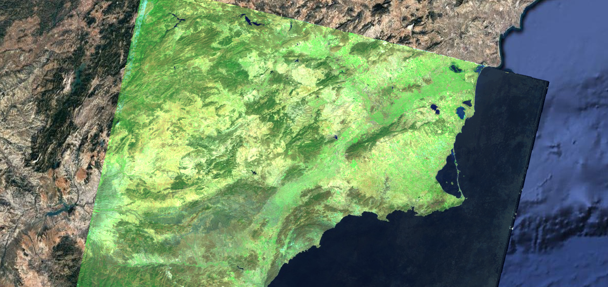

At each location in the output image, in each band, the pixel value is the median of all unmasked pixels in the input imagery (the images in the collection). In the previous example, `median()` is a convenience method for the following call:

[Open in Code Editor](https://code.earthengine.google.com/?scriptPath=users%2Fwulf%2FGEO717%3AEE01_Introduction%2F13b%20-%20ImageCollection_Reducing%20example%202)

```javascript
// Load a Landsat 8 collection for a single path-row.
var collection = ee.ImageCollection('LANDSAT/LC08/C02/T1_TOA')
  .filter(ee.Filter.eq('WRS_PATH', 199))
  .filter(ee.Filter.eq('WRS_ROW', 34))
  .filterDate('2014-01-01', '2015-01-01');

// Reduce the collection with a median reducer.
var median = collection.reduce(ee.Reducer.median());

// Display the median image.
Map.setCenter(-1.7461, 37.7906, 9);
Map.addLayer(median,
             {bands: ['B7_median', 'B5_median', 'B3_median'], max: 0.4},
             'also median');
```

Note that the band names differ as a result of using `reduce()` instead of the convenience method. Specifically, the names of the reducer have been appended to the band names.

#### Playtime


Task: Use the entire Landsat 8 Collection 2 (TOA) from 2014 to 2024 at path 172 and row 72 as your input dataset.&#x20;

* Print the number of images from this collection.
* Compute and display the median and the mean of the collection.
* Compute and display the ratio image between the sum of all optical mean bands and the sum of all optical median bands. &#x20;


[Use the Code Editor](https://code.earthengine.google.com/?scriptPath=users%2Fwulf%2FGEO717%3AEE01_Introduction%2F13b%20-%20ImageCollection_Reducing%20task)

### Mapping over an ImageCollection

To apply a function to every `Image` in an `ImageCollection` use `imageCollection.map()`. The only argument to `map()` is a function which takes one parameter: an `ee.Image`. For example, the following code adds a timestamp band to every image in the collection:

[Open in Code Editor](https://code.earthengine.google.com/?scriptPath=users%2Fwulf%2FGEO717%3AEE01_Introduction%2F14a%20-%20ImageCollection_Mapping%20example%201)

```javascript
// Load a Landsat 8 collection for a single path-row.
var collection = ee.ImageCollection('LANDSAT/LC08/C02/T1_TOA')
  .filter(ee.Filter.eq('WRS_PATH', 195))
  .filter(ee.Filter.eq('WRS_ROW', 28));

// This function adds a band representing the image timestamp.
var addTime = function(image) {
  return image.addBands(image.metadata('system:time_start').rename('time'));
};

// Map the function over the collection and display the result.
print(collection.map(addTime));
```

Note that in the predefined function, the `metadata()` method is used to create a new `Image` from the value of a property. Having that time band is useful for the linear modelling of change and for making composites.

Even more useful is to apply a cloud filter to an entire ImageCollection. Let's see the example below:

[Open in Code Editor](https://code.earthengine.google.com/?scriptPath=users%2Fwulf%2FGEO717%3AEE01_Introduction%2F14a%20-%20ImageCollection_Mapping%20example%202)

```javascript
// Load a Landsat 8 collection for a single path-row.
var collection = ee.ImageCollection('LANDSAT/LC08/C02/T1_TOA')
  .filterDate('2018-01-01', '2020-01-01')
  .filterBounds(ee.Geometry.Point(-4.441, 57.336)) // Scotland

// Compute a median image and display.
var median = collection.median();
Map.setCenter(-4.441, 57.336, 8);
Map.addLayer(median, {bands: ['B7', 'B5', 'B3'], max: 0.4}, 'median');

// This function masks clouds in Landsat 8 imagery.
var maskClouds = function(image) {
  var scored = ee.Algorithms.Landsat.simpleCloudScore(image);
  return image.updateMask(scored.select(['cloud']).lt(20));
};

// Map the cloud masking function over the collection.
var collection_cloudfree = collection.map(maskClouds);

// Compute a cloud-filtered median image and display.
var median_cloudfree = collection_cloudfree.median();
Map.addLayer(median_cloudfree, {bands: ['B7', 'B5', 'B3'], max: 0.4}, 'median cloudfree');
```

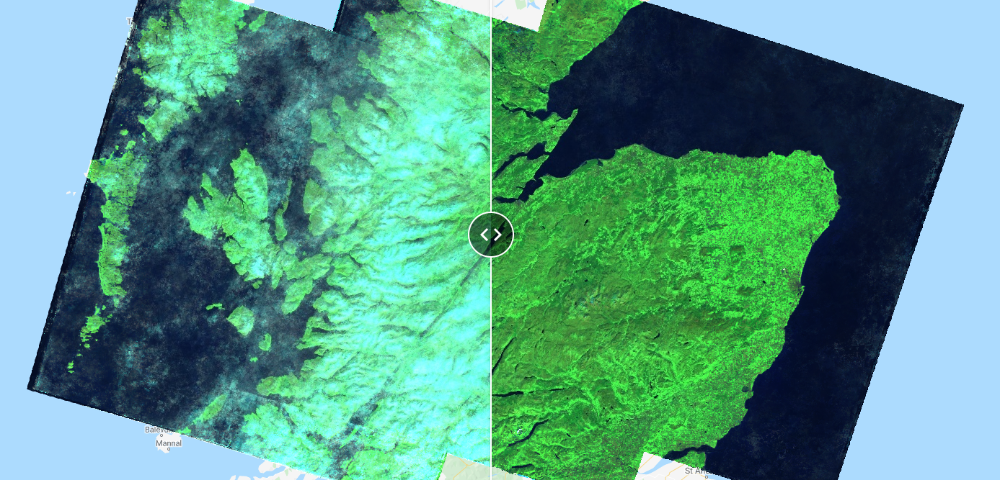

Note the marked difference in image quality between the 'normal' median and the 'cloud-free' median image. Mapping a function over an ImageCollection is a powerful tool, we will use a lot.

#### Playtime


Task: Write and map a function that adds a NDVI-band to the ImageCollection (use the command ".addBands()") and filters clouds. Display the cloud-filtered median of the NDVI.


[Use the Code Editor](https://code.earthengine.google.com/?scriptPath=users%2Fwulf%2FGEO717%3AEE01_Introduction%2F14b%20-%20ImageCollection_Mapping%20task)

### Compositing and Mosaicking

In general, compositing refers to the process of combining spatially overlapping images into a single image based on an aggregation function. Mosaicking refers to the process of spatially assembling image datasets to produce a spatially continuous image. In Earth Engine, these terms are used interchangeably, though both compositing and mosaicking are supported.

Consider the need to mosaic two, or more, neighboring Landsat scenes as these cover your study area. The following example demonstrates that using `imageCollection.mosaic()`:

[Open in Code Editor](https://code.earthengine.google.com/?scriptPath=users%2Fwulf%2FGEO717%3AEE01_Introduction%2F15a%20-%20ImageCollection_Compositing%20example%201)

```javascript
// Study area
var aoi = ee.Geometry.Rectangle(9.0, 46.0, 12.0, 48.0)

// Load a Landsat 8 collection for a single path-row.
var collection = ee.ImageCollection('LANDSAT/LC08/C02/T1_TOA')
  .filterDate('2019-09-01', '2019-09-17')
  .filterBounds(aoi)

print('collection', collection)

// Spatially mosaic the images in the collection and display.
var mosaic = collection.mosaic()
print('mosaic', mosaic)

Map.setCenter(9.4, 46.6, 7);
Map.addLayer(mosaic, {}, 'spatial mosaic');

// Clip the mosaic to the study area and display.
var mosaic_clip = mosaic.clip(aoi);
Map.addLayer(mosaic_clip, {bands:['B7','B5', 'B3'], max:0.4}, 'clipped mosaic');
```

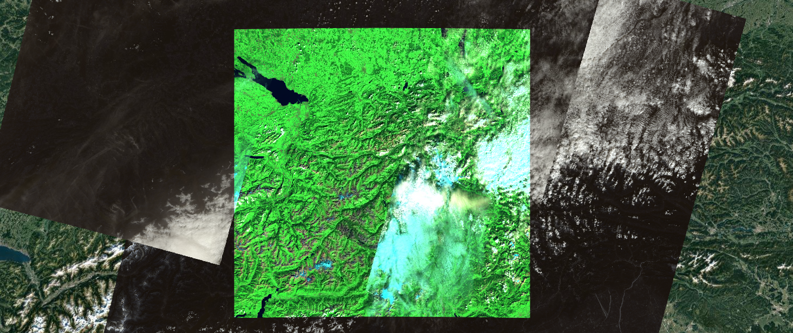

Note that there is significant overlap in the Landsat tiles in the previous example. The `mosaic()` method composites overlapping images according to their order in the collection (last on top). To control the source of pixels in a mosaic (or a composite), you can make use of `imageCollection.qualityMosaic()`to maximizes an arbitrary band in the collection. The `qualityMosaic()` method sets each pixel in the composite based on which image in the collection has a maximum value for the specified band. For example, the following code demonstrates making a greenest pixel composite and a recent value composite:

[Open in Code Editor](https://code.earthengine.google.com/?scriptPath=users%2Fwulf%2FGEO717%3AEE01_Introduction%2F15a%20-%20ImageCollection_Compositing%20example%202)

```javascript
// This function masks clouds in Landsat 8 imagery.
var maskClouds = function(image) {
  var scored = ee.Algorithms.Landsat.simpleCloudScore(image);
  return image.updateMask(scored.select(['cloud']).lt(20));
};

// This function masks clouds and adds quality bands to Landsat 8 images.
var addQualityBands = function(image) {
  return maskClouds(image)
    // NDVI
    .addBands(image.normalizedDifference(['B5', 'B4']).rename('ndvi'))
    // time in milliseconds since 1970
    .addBands(image.metadata('system:time_start'));
};

// Load a 2014 Landsat 8 ImageCollection.
// Map the cloud masking and quality band function over the collection.
var collection = ee.ImageCollection('LANDSAT/LC08/C02/T1_TOA')
  .filterDate(ee.Date(Date.now()).advance(-1,'year'), ee.Date(Date.now()))
  .map(addQualityBands);

// Create a cloud-free, most recent value composite.
var recentValueComposite = collection.qualityMosaic('system:time_start');

// Create a greenest pixel composite.
var greenestPixelComposite = collection.qualityMosaic('ndvi');

// Display the results.
Map.setCenter(10.0, 46.0, 6); // San Francisco Bay
var vizParams = {bands: ['B7', 'B5', 'B3'], min: 0, max: 0.4};
Map.addLayer(recentValueComposite, vizParams, 'recent value composite');
Map.addLayer(greenestPixelComposite, vizParams, 'greenest pixel composite');
```

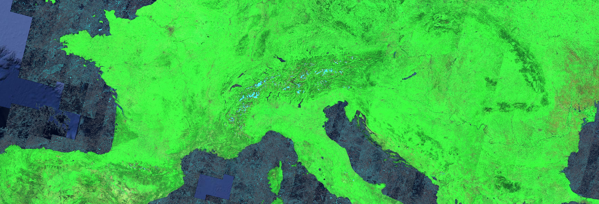

#### Playtime


Task: Generate a "whitest pixel composite" by maximizing snow cover using the NDSI ( .normalizedDifference(\['Green', 'SWIR1']) ).


[Use the Code Editor](https://code.earthengine.google.com/?scriptPath=users%2Fwulf%2FGEO717%3AEE01_Introduction%2F15b%20-%20ImageCollection_Compositing%20task)

## Geometry

Earth Engine handles vector data with the `Geometry` type. The [GeoJSON spec](http://geojson.org/geojson-spec.html) describes in detail the type of geometries supported by Earth Engine, including `Point` (a list of coordinates in some projection), `LineString` (a list of points), `LinearRing` (a closed `LineString`), and `Polygon` (a list of `LinearRing`s where the first is a shell and subsequent rings are holes). Earth Engine also supports `MultiPoint`, `MultiLineString`, and `MultiPolygon`. The GeoJSON GeometryCollection is also supported, although it has the name `MultiGeometry` within Earth Engine.

### Creating Geometries

You can create geometries interactively using the Code Editor geometry tools. To create geometries, use the geometry drawing tools in the upper left corner of the map display (the the Figure below). For drawing points, use the placemark icon , for drawing lines, use the line icon , for drawing polygons, use the polygon icon , for drawing rectangles use the rectangle icon . (Note that rectangles are planar geometries, so they cannot be placed on a layer with geodesic geometries like lines and polygons.)

Using any of the drawing tools will automatically create a new geometry layer and add an import for that layer to the Imports section. To add geometries to a new layer, hover on the Geometry Imports in the map display and click the **+new layer** link. You can also toggle visibility of the geometries from the Geometry Imports section.

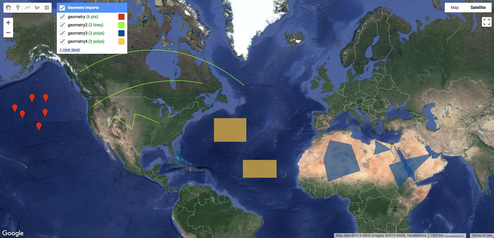

To configure the way geometries are imported to your script, click the settings icon next to the layer in the **Geometry Imports** section on the map or in the **Imports** section of the code editor. The geometry layer settings tool will be displayed in a dialog box which should look something like the Figure below. Note that you can import the drawn shapes as geometries, features or feature collections. The geometry import settings also allow you to change the color with which the layer is displayed, add properties to the layer (if it is imported as a `Feature` or `FeatureCollection`) or rename the layer.

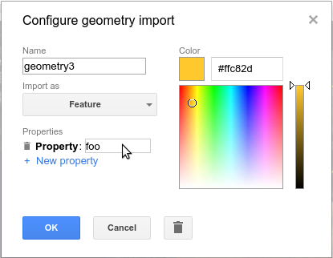

Finally, to prevent geometries in a layer from being edited, you can lock the layer by pressing the "lock\_open" icon next to the layer. This will prevent adding, deleting, or editing any geometries on the layer. To unlock the layer again, press the "lock" icon.

#### Playtime


Test the geometry tools, by playing with them.&#x20;

* Edit layer properties (e.g. rename them, adjust the colors, and lock the editing mode).&#x20;
* Adjust the geometries (e.g. move them, change the extent, delete them)


To create a `Geometry` programmatically, provide the constructor with the proper list(s) of coordinates. For example:

[Open in Code Editor](https://code.earthengine.google.com/?scriptPath=users%2Fwulf%2FGEO717%3AEE01_Introduction%2F16a%20-%20Geometry_Creating%20example%201)

```javascript
// Display various geometries
Map.setCenter(0.0, 0.0, 3)  // (lon, lat, zoom)
Map.setOptions('TERRAIN');  // "ROADMAP", "SATELLITE", "HYBRID" or "TERRAIN" 

var point = ee.Geometry.Point([0.0, 0.0]);
Map.addLayer(point, {color:'red'}, 'Point')  

var lineString = ee.Geometry.LineString(
  [[-30, -5], [0, -10], [30, -5]]);
Map.addLayer(lineString, {color:'black'}, 'LineString')  

var linearRing = ee.Geometry.LinearRing(
  [[20, 10], [10, 10], [10, 20], [20, 20], [20, 10]]);
Map.addLayer(linearRing, {color:'blue'}, 'LinearRing')  

var rectangle = ee.Geometry.Rectangle([-20, 10, -10, 20]);
Map.addLayer(rectangle, {color:'blue'}, 'Rectangle')  

var polygon = ee.Geometry.Polygon([
  [[-45, -15], [45, -15], [45, 25], [-45, 25], [-45, 25]]
]);
Map.addLayer(polygon, {color:'yellow'}, 'Polygon')  
```

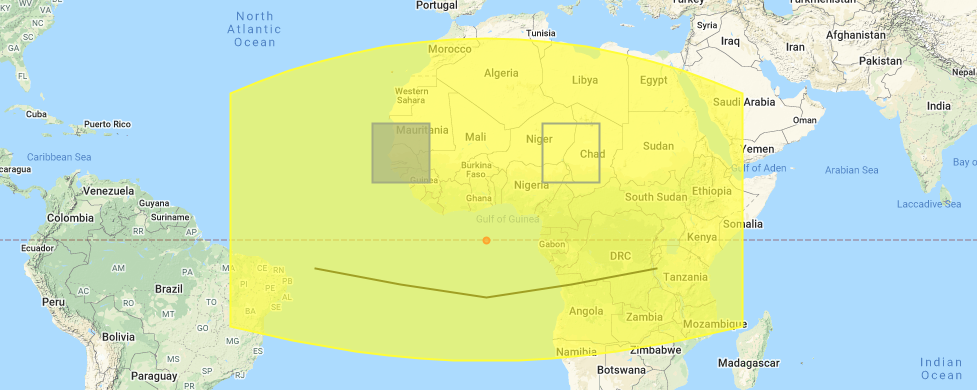

To display a geometry just by its outline without any fill color, you need to convert the geometry into an image and paint its margins.

[Open in Code Editor](https://code.earthengine.google.com/?scriptPath=users%2Fwulf%2FGEO717%3AEE01_Introduction%2F16a%20-%20Geometry_Creating%20example%202)

```javascript
// Display a polygon by its outline

// Define the polygon (edges are curved to follow the shortest path on the surface of the Earth)
var polygon_geodesic = ee.Geometry.Polygon(
  [[-50, -25], [50, -25], [50, 25], [-50, 25], [-50, 25]], null, true);

// Create an empty image and paint the polygon's outline onto it.
// - `byte()` sets the image type to 8-bit.
// - `paint()` draws the polygon with a line width of 3 pixels and color value 1.
var polygon_geodesic_outline = ee.Image().byte().paint({
  featureCollection: polygon_geodesic,
  color: 1,
  width: 3
});
// Display the outline
Map.setCenter(0, 0, 3)
Map.addLayer(polygon_geodesic_outline, {palette: ['red']}, 'Polygon Outline')

// Display a polygon by its outline as a linear Ring
var outline = ee.Geometry.LinearRing(polygon_geodesic.coordinates().get(0))
Map.addLayer(outline, {color: 'yellow'}, 'LinearRing Outline')
```


#### Playtime


Task: Create a circular geometry around Rio de Janeiro by buffering a point with a 100 km radius. Display the outline of the geometry.&#x20;


[Use the Code Editor](https://code.earthengine.google.com/?scriptPath=users%2Fwulf%2FGEO717%3AEE01_Introduction%2F16b%20-%20Geometry_Creating%20task)

### Geometry Information

To view information about a geometry, print it. To access the information programmatically, Earth Engine provides several methods. For example, to get information about a polygon, use:

[Open in Code Editor](https://code.earthengine.google.com/?scriptPath=users%2Fwulf%2FGEO717%3AEE01_Introduction%2F17a%20-%20Geometry_Information%20example)

```javascript
// Extract various geometry information and metadata
var country_name = 'Switzerland'; // 'Liechtenstein'; //
var countries = ee.FeatureCollection("USDOS/LSIB_SIMPLE/2017");  
// https://developers.google.com/earth-engine/datasets/catalog/USDOS_LSIB_SIMPLE_2017

var country = countries.filter(ee.Filter.eq('country_na', country_name));
var polygon = country.geometry(); 

print('Polygon printout: ', polygon);
Map.centerObject(polygon) 
Map.addLayer(polygon, {color:'red'}, 'Polygon')  

// Print polygon area in square kilometers.
print('Polygon area [km^2]: ', polygon.area().divide(1000 * 1000).round());

// Print polygon perimeter length in kilometers.
print('Polygon perimeter [km]: ', polygon.perimeter().divide(1000).round());

// Print the GeoJSON 'type'.
print('Geometry type: ', polygon.type());

// Print the coordinates as lists.
print('Polygon coordinates: ', polygon.coordinates());
```

Observe that the perimeter (or length) of a geometry is returned in meters and the area is returned in square meters unless a projection is specified. By default, the computation is performed on the WGS84 spheroid and the result is computed in meters or square meters.

#### Playtime


Task: Which country has the most/least compact shape?

A features compactness can be measured by using the [Polsby-Popper](https://en.wikipedia.org/wiki/Polsby%E2%80%93Popper_test) test. First you need to map functions that add the features area and perimeter as a property.


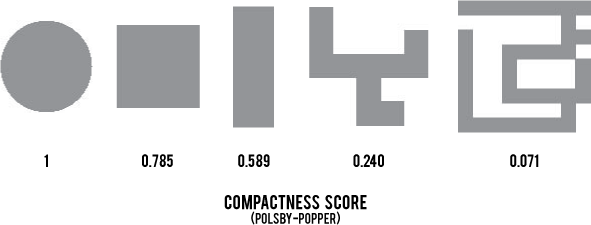

[Use the Code Editor](https://code.earthengine.google.com/?scriptPath=users%2Fwulf%2FGEO717%3AEE01_Introduction%2F17b%20-%20Geometry_Information_PPscore%20task)

### Geometric Operations

Earth Engine supports a wide variety of operations on `Geometry` objects. These include operations on individual geometries such as computing a buffer, centroid, bounding box, perimeter, convex hull, etc. For example:

```javascript
// Create a polygon.
var polygon = ee.Geometry.Polygon([
  [[-5, 40], [65, 40], [65, 60], [-5, 60], [-5, 60]]
]);

// Compute a 1000-km buffer of the polygon .
var buffer = polygon.buffer(1000000);

// Compute the centroid of the polygon.
var centroid = polygon.centroid();

// Display the results
Map.centerObject(buffer) 
Map.addLayer(buffer, {color:'blue'}, 'buffer');
Map.addLayer(polygon, {color:'red'}, 'polygon');
Map.addLayer(centroid, {color:'yellow'}, 'centroid');
```

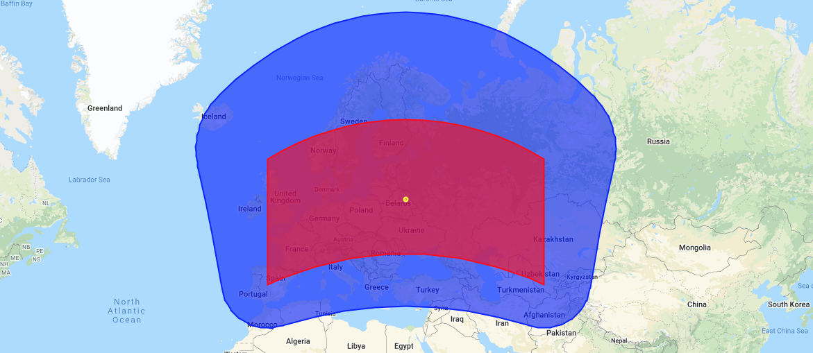

Observe from the previous example that the buffer distance is specified in meters.

Supported geometric operations also include relational computations between geometries such as intersection, union, difference, distance, contains, etc.

```javascript
// Create two circular geometries.
var poly1 = ee.Geometry.Point([-50, 30]).buffer(1e6);
var poly2 = ee.Geometry.Point([-40, 30]).buffer(1e6);

// Display polygon 1 in red and polygon 2 in blue.
Map.setCenter(-45, 30);
Map.addLayer(poly1, {color: 'FF0000'}, 'poly1');
Map.addLayer(poly2, {color: '0000FF'}, 'poly2');

// Compute the intersection, display it in green.
var intersection = poly1.intersection(poly2, ee.ErrorMargin(1));
Map.addLayer(intersection, {color: '00FF00'}, 'intersection');

// Compute the union, display it in magenta.
var union = poly1.union(poly2, ee.ErrorMargin(1));
Map.addLayer(union, {color: 'FF00FF'}, 'union');

// Compute the difference, display in yellow.
var diff1 = poly1.difference(poly2, ee.ErrorMargin(1));
Map.addLayer(diff1, {color: 'FFFF00'}, 'diff1');

// Compute symmetric difference, display in black.
var symDiff = poly1.symmetricDifference(poly2, ee.ErrorMargin(1));
Map.addLayer(symDiff, {color: '000000'}, 'symmetric difference');
```

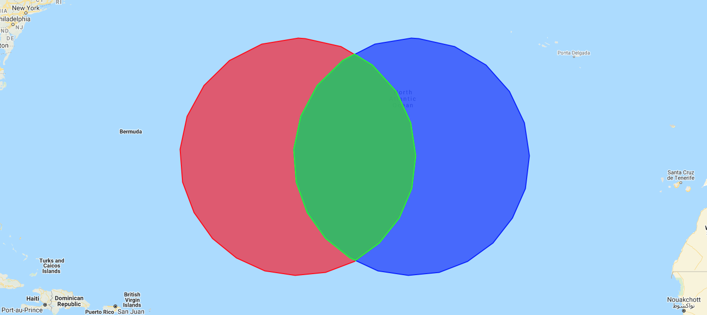

In these examples, note that that `maxError` parameter is set to one meter for the geometry operations. The `maxError` is the maximum allowable error, in meters, from transformations (such as projection or reprojection) that may alter the geometry. If one of the geometries is in a different projection from the other, Earth Engine will do the computation in a spherical coordinate system, with a projection precision given by `maxError`. You can also specify a specific projection in which to do the computation, if necessary.

## FeatureCollection

### Features

A `Feature` in Earth Engine is defined as a GeoJSON Feature. Specifically, a `Feature` is an object with a `geometry` property storing a `Geometry` object (or null) and a `properties` property storing a dictionary of other properties.

To create a `Feature`, provide the constructor with a `Geometry` and (optionally) a dictionary of other properties. For example:

[Open in Code Editor](https://code.earthengine.google.com/?scriptPath=users%2Fwulf%2FGEO717%3AEE01_Introduction%2F18a%20-%20Feature%20example)

```javascript
// Make a feature and set some properties.
var feature = ee.Feature(ee.Geometry.Point([-122.22599, 37.17605]))
  .set('genus', 'Sequoia').set('species', 'sempervirens');

// Get a property from the feature.
var species = feature.get('species');
print(species);

// Set a new property.
feature = feature.set('presence', 1);

// Overwrite the old properties with a new dictionary.
var newDict = {genus: 'Brachyramphus', species: 'marmoratus'};
var feature = feature.set(newDict);

// Check the result.
print(feature);
```

In the previous example, note that properties can be set with either a key: value pair, or with a dictionary as a JavaScript literal. Also note that `feature.set()` overwrites existing properties.

#### Playtime


Task: Define a feature for your hometown (place of birth) and set the properties '_name_', '_population_' and '_country_'. Calculate its distance to Campus Irchel.


[Use the Code Editor](https://code.earthengine.google.com/?scriptPath=users%2Fwulf%2FGEO717%3AEE01_Introduction%2F18b%20-%20Feature_Distance%20task)

### Collections

Groups of related features can be combined into a `FeatureCollection`, to enable additional operations on the entire set such as filtering, sorting and rendering. Besides just simple features (geometry + properties), feature collections can also contain other collections.

One way to create a `FeatureCollection` is to provide the constructor with a list of features. The features do not need to have the same geometry type or the same properties. For example

```javascript
// Make a list of Features.
var features = [
  ee.Feature(ee.Geometry.Rectangle(30.01, 59.80, 30.59, 60.15), {name: 'Voronoi'}),
  ee.Feature(ee.Geometry.Point(-73.96, 40.781), {name: 'Thiessen'}),
  ee.Feature(ee.Geometry.Point(6.4806, 50.8012), {name: 'Dirichlet'})
];

// Create a FeatureCollection from the list and print it.
var fromList = ee.FeatureCollection(features);
print(fromList);
```

Earth Engine hosts a variety of table datasets. To load a table dataset, provide the table ID to the `FeatureCollection` constructor. For example, to load TIGER roads data:

```javascript
var fc = ee.FeatureCollection('TIGER/2016/Roads');
Map.setCenter(-73.9596, 40.7688, 12);
Map.addLayer(fc, {}, 'US Census roads')
print(fc.limit(20))
```

To get a collection of random points in a specified region, you can use:

```javascript
// Define a region in which to compute random points.
var country_name = 'Latvia'; 
var countries = ee.FeatureCollection("USDOS/LSIB_SIMPLE/2017");  
var country = countries.filter(ee.Filter.eq('country_na', country_name));
var region = country.geometry(); 

// Create 500 random points in the region.
var randomPoints = ee.FeatureCollection.randomPoints(region, 500);

// Display the points.
Map.centerObject(region);
Map.addLayer(randomPoints, {color:'red'}, 'random points');
```

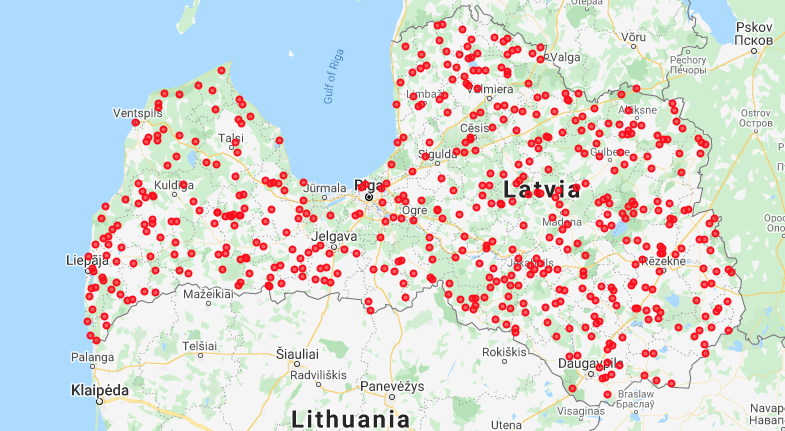

### Visualisation

As with images, geometries and features, feature collections can be added to the map directly with `Map.addLayer()`. The default visualisation will display the vectors with solid black lines and semi-opaque black fill. To render the vectors in color, specify the `color` parameter. For more control over how a `FeatureCollection` is displayed, use `image.paint()` with the `FeatureCollection` as an argument. Note that the empty image into which you paint the features needs to be cast prior to painting. Both the color and width with which the boundaries are drawn can be set with properties.

```javascript
///////////////////////////////////////////////////
// 1. LOAD DATA

// Load ecoregions from the RESOLVE dataset (2017 version)
// Dataset: https://developers.google.com/earth-engine/datasets/catalog/RESOLVE_ECOREGIONS_2017
var ecoregions = ee.FeatureCollection('RESOLVE/ECOREGIONS/2017');

///////////////////////////////////////////////////
// 2. MAP SETUP

// Center the map over Europe/Central Asia region
Map.setCenter(20, 50, 5);

///////////////////////////////////////////////////
// 3. DISPLAY BASE LAYER (DEFAULT STYLING)

// Add ecoregions with a single outline color (red)
Map.addLayer(ecoregions, {color: 'FF0000'}, 'Default Colored Display');

///////////////////////////////////////////////////
// 4. PAINT TO IMAGE (REQUIRED FOR MULTI-COLOR VISUALIZATION)

// Create an empty image to paint vector features into
var empty = ee.Image().byte();

///////////////////////////////////////////////////
// 5. OUTLINE FEATURES UNIFORMLY

// Paint all polygon edges with a single color and width
var outline = empty.paint({
  featureCollection: ecoregions,
  color: 1,       // fixed value for color
  width: 3        // fixed outline width
});
Map.addLayer(outline, {palette: ['black']}, 'Uniform Black Edges');

///////////////////////////////////////////////////
// 6. OUTLINE FEATURES BY ATTRIBUTE

// Paint outlines with attribute-based color and width
// - color is determined by 'BIOME_NUM' (unique biome ID)
// - width is determined by 'NNH' (number of non-highly fragmented patches?)
var outlines = empty.paint({
  featureCollection: ecoregions,
  color: 'BIOME_NUM',
  width: 'NNH'
});

// Define a palette (can be extended for more biomes)
var palette = ['FF0000', '00FF00', '0000FF'];  // red, green, blue
Map.addLayer(outlines, {palette: palette, max: 14}, 'Attribute-Based Edges');

///////////////////////////////////////////////////
// 7. FILL POLYGONS BY ATTRIBUTE

// Paint the interior (fill) of each polygon by biome number
var fills = empty.paint({
  featureCollection: ecoregions,
  color: 'BIOME_NUM'
});
Map.addLayer(fills, {palette: palette, max: 14}, 'Colored Polygon Fills');

///////////////////////////////////////////////////
// 8. FILL AND OUTLINE COMBINED

// Paint fill first, then paint edges on top
// - first paint uses 'BIOME_NUM' as fill color
// - second paint uses fixed value (0) for black edges (width = 2)
var filledOutlines = empty
  .paint(ecoregions, 'BIOME_NUM')
  .paint(ecoregions, 0, 2);  // black edges over top

// Use black (0) + biome palette for combined visualization
Map.addLayer(filledOutlines, {
  palette: ['000000'].concat(palette),  // black for outlines
  max: 14
}, 'Fills + Black Edges');
```

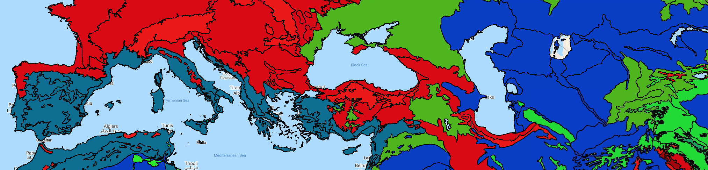

### Filtering

Methods for getting information from feature collection metadata are the same as those for image collections. Also, filtering a `FeatureCollection` is analogous to filtering an `ImageCollection`. (See the [Filtering an ImageCollection section](https://developers.google.com/earth-engine/guides/ic_filtering)). There are the `featureCollection.filterDate()`, and `featureCollection.filterBounds()` convenience methods and the `featureCollection.filter()` method for use with any applicable `ee.Filter`.

[Open in Code Editor](https://code.earthengine.google.com/?scriptPath=users%2Fwulf%2FGEO717%3AEE01_Introduction%2F19a%20-%20FeatureCollection_Filtering%20example)

```javascript
// Lake Analysis - HydroLakes Dataset

///////////////////////////////////////////////////
// 1. LOAD DATA

// Load global lake polygons from the HydroLakes v1.0 dataset
// Source: https://www.hydrosheds.org/products/hydrolakes
var lakes = ee.FeatureCollection("projects/sat-io/open-datasets/HydroLakes/lake_poly_v10");

// Inspect the first feature to see available attributes
print('Example lake feature:', lakes.first());

///////////////////////////////////////////////////
// 2. CONTINENTAL ANALYSIS

// Extract unique continent names from the dataset
var continents = lakes.distinct('Continent').aggregate_array('Continent');
// print('List of continents:', continents);

// Function to calculate the total lake area per continent
var computeContinentLakeArea = function(continent) {
  var lakesInContinent = lakes.filter(ee.Filter.eq('Continent', continent));
  var areaStats = lakesInContinent.reduceColumns(ee.Reducer.sum(), ['Lake_area']);
  var roundedArea = ee.Number(areaStats.get('sum')).round();
  return roundedArea;
};

// Apply function to all continents
var lakeAreasByContinent = continents.map(computeContinentLakeArea);
// print('Total lake area per continent (km²):', lakeAreasByContinent);

// Combine continent names and lake area totals into a dictionary
var lakeAreaDict = ee.Dictionary.fromLists(continents, lakeAreasByContinent);
print('Total Lake Area per Continent (km²):', lakeAreaDict);

///////////////////////////////////////////////////
// 3. DISPLAY: Lakes in Europe

var lakesEurope = lakes.filter(ee.Filter.eq('Continent', 'Europe'));
Map.addLayer(lakesEurope, {color: 'blue'}, 'Lakes in Europe');

// Center the map on Europe
Map.setCenter(10, 50, 4);

///////////////////////////////////////////////////
// 4. BASIC STATS

// Count total number of lakes
print('Total number of lakes in dataset:', lakes.size());

// Summarize stats for the 'Lake_area' property
var areaStats = lakes.aggregate_stats('Lake_area');
print('Lake area statistics (km²):', areaStats);

///////////////////////////////////////////////////
// 5. LARGEST AND DEEPEST LAKES

// Find the largest lake by area
var largestLake = lakes.filter(
  ee.Filter.eq('Lake_area', ee.Number(areaStats.get('max')))
);
print('Largest lake:', largestLake.first().get('Lake_name'));

// Sort and list the top 2 deepest lakes by average depth
var deepestLakes = lakes.sort('Depth_avg', false).limit(2);
var deepestLakeNames = deepestLakes.aggregate_array('Lake_name');
print('Names of Top 2 Deepest Lakes:', deepestLakeNames);

```


#### Playtime


Task: Filter the global river dataset to show rivers in India with an upstream watershed area (UPLAND\_SKM) larger than 10 km².


[Use the Code Editor](https://code.earthengine.google.com/?scriptPath=users%2Fwulf%2FGEO717%3AEE01_Introduction%2F19b%20-%20FeatureCollection_Filtering%20task)

### Mapping

To apply the same operation to every `Feature` in a `FeatureCollection`, use `featureCollection.map()`. For example, to add another area attribute to every feature in a watersheds `FeatureCollection` and to generate an entirely new `FeatureCollection` , use:

```javascript
// Geometry operations on lakes: perimeter and centroid extraction

///////////////////////////////////////////////////
// 1. LOAD DATA

// Load the global HydroLakes dataset
var lakes = ee.FeatureCollection("projects/sat-io/open-datasets/HydroLakes/lake_poly_v10");
print('Example lake feature:', lakes.first());

///////////////////////////////////////////////////
// 2. FILTER TO EUROPE

// Select only lakes located in Europe
var lakesEurope = lakes.filter(ee.Filter.eq('Continent', 'Europe'));
Map.addLayer(lakesEurope, {color: 'blue'}, 'Lakes in Europe');

// Optionally zoom to Europe
Map.setCenter(10, 50, 4);

///////////////////////////////////////////////////
// 3. CALCULATE PERIMETER FOR EACH LAKE

// Function to add perimeter (in meters) to each feature
var addPerimeter = function(feature) {
  var perimeter = feature.perimeter(100);  // 100m geodesic resolution
  return feature.set('perimeter_m', perimeter);
};

// Apply perimeter calculation to European lakes
var lakesEuropeWithPerimeter = lakesEurope.map(addPerimeter);

// Print one feature to see the new property
print('First feature with perimeter:', lakesEuropeWithPerimeter.first());

// Optionally, list all available properties for inspection
print('Properties:', lakesEuropeWithPerimeter.first().propertyNames());

///////////////////////////////////////////////////
// 4. COMPUTE CENTROIDS FOR VISUALIZATION OR ANALYSIS

// Function to convert lake polygons to centroids
var computeCentroid = function(feature) {
  var centroid = feature.geometry().centroid();  // Get the geometry center
  return ee.Feature(centroid).copyProperties(feature);  // Copy all properties
};

// Apply the centroid function
var lakeCentroids = lakesEuropeWithPerimeter.map(computeCentroid);

// Print a sample of the results
print('Centroid of first lake:', lakeCentroids.first());

// Add centroids to the map
Map.addLayer(lakeCentroids, {color: 'red'}, 'Lake Centroids');

```


In the previous example, note that a new property is set based on a computation with the feature’s geometry. Properties can also be set using a computation involving existing properties. Note further that all selected properties are propagated to the features in the new collection.

### Reducing

Which is the wettest or driest country in the world?

To aggregate data in the properties of a `FeatureCollection`, use `featureCollection.reduceColumns()`.

[Open in Code Editor](https://code.earthengine.google.com/?scriptPath=users%2Fwulf%2FGEO717%3AEE01_Introduction%2F20a%20-%20FeatureCollection_Reducing%20example)

```javascript
///////////////////////////////////////////////////
// 1. LOAD AND PREPARE DATA

// Load TerraClimate monthly data and filter to time
var dataset = ee.ImageCollection('IDAHO_EPSCOR/TERRACLIMATE')
                .filterDate('2014-01-01', '2024-01-01');

// Compute mean precipitation (band: 'pr') in mm
var precip = dataset.select('pr').mean();  // returns single-band image

///////////////////////////////////////////////////
// 2. VISUALIZATION

var palettes = require('users/gena/packages:palettes');
var palette = palettes.crameri.devon[25].reverse(); 

// Visualization parameters and palette
var precipVis = {
  min: 0.0,
  max: 400.0,
  palette: palette
};

// Add precipitation layer to map
Map.addLayer(precip, precipVis, 'Mean Precipitation');

///////////////////////////////////////////////////
// 3. ADMINISTRATIVE UNITS

// Load global country boundaries
var countries = ee.FeatureCollection("USDOS/LSIB/2017")
  .filter(ee.Filter.gt('Shape_Area', 1))  // remove very small polygons
  .map(function(f) {
    // Clean and simplify geometry (otherwise the computation fails)
    return f.setGeometry(f.geometry().simplify(10000).buffer(100, 100));
  });
  
// Add styled vector layer (optional)
var countryStyle = countries.style({
  color: 'white',
  width: 1.0
});
Map.addLayer(countryStyle, {}, 'Administrative Units');

///////////////////////////////////////////////////
// 4. REDUCE IMAGE TO COUNTRY MEANS

// Compute average precipitation per country
var countriesWithPrecip = precip.reduceRegions({
  collection: countries,
  reducer: ee.Reducer.mean(),
  scale: 10000  // use same resolution as visualization
});

///////////////////////////////////////////////////
// 5. SORT AND PRINT RESULTS

// Wettest 5 countries (highest mean precip)
var wettest5 = countriesWithPrecip
  .sort('mean', false)
  .limit(5)
  .reduceColumns(ee.Reducer.toList(), ['COUNTRY_NA'])
  .get('list');
print('🌧️ Top 5 Wettest Countries:', wettest5);

// Driest 5 countries (lowest mean precip)
var driest5 = countriesWithPrecip
  .sort('mean', true)
  .limit(5)
  .reduceColumns(ee.Reducer.toList(), ['COUNTRY_NA'])
  .get('list');
print('🌵 Top 5 Driest Countries:', driest5);

```


#### Playtime


Task: Which is the windiest / calmest country on Earth?


[Use the Code Editor](https://code.earthengine.google.com/?scriptPath=users%2Fwulf%2FGEO717%3AEE01_Introduction%2F20b%20-%20FeatureCollection_Reducing%20task)

## Reducer

Reducers are the way to aggregate data over time, space, bands, arrays and other data structures in Earth Engine. The `ee.Reducer` class specifies how data is aggregated. The reducers in this class can specify a simple statistic to use for the aggregation (e.g. minimum, maximum, mean, median, standard deviation, etc.), or a more complex summary of the input data (e.g. histogram, linear regression, list). Reductions may occur over time (`imageCollection.reduce()`), space (`image.reduceRegion()`, `image.reduceNeighborhood()`), bands (`image.reduce()`), or the attribute space of a `FeatureCollection` (`featureCollection.reduceColumns()` or `FeatureCollection` methods that start with `aggregate_`).

Reducers take an input dataset and produce a single output. When a single input reducer is applied to a multi-band image, Earth Engine automatically replicates the reducer and applies it separately to each band. As a result, the output image has the same number of bands as the input image; each band in the output is the reduction of pixels from the corresponding band in the input data. Some reducers take tuples of input datasets. These reducers will not be automatically replicated for each band. For example, `ee.Reducer.LinearRegression()` takes multiple predictor datasets (representing independent variables in the regression) in a particular order.

### ImageCollection Reductions

Consider the example of needing to take the median over a time series of images represented by an `ImageCollection`. To reduce an `ImageCollection`, use `imageCollection.reduce()`. This reduces the collection of images to an individual image as illustrated in Figure below. Specifically, the output is computed pixel-wise, such that each pixel in the output is composed of the median value of all the images in the collection at that location. To get other statistics, such as mean, sum, variance, an arbitrary percentile, etc., the appropriate reducer should be selected and applied. For basic statistics like min, max, mean, etc., `ImageCollection` has shortcut methods like `min()`, `max()`, `mean()`, etc. They function in exactly the same way as calling `reduce()`, except the resultant band names will not have the name of the reducer appended.

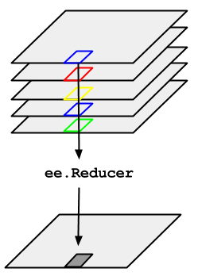

For an example of reducing an `ImageCollection`, consider a collection of Landsat 8 images, filtered for cloud cover.

```javascript
// Load a Landsat 8 collection for a single path-row.
var collection = ee.ImageCollection('LANDSAT/LC08/C01/T1_TOA')
  .filterDate('2018-01-01', '2020-01-01')
  .filterBounds(ee.Geometry.Point(-4.441, 57.336)) // Scotland

// This function masks clouds in Landsat 8 imagery.
var maskClouds = function(image) {
  var scored = ee.Algorithms.Landsat.simpleCloudScore(image);
  return image.updateMask(scored.select(['cloud']).lt(20));
};

// Map the cloud masking function over the collection.
var collection_cloudfree = collection.map(maskClouds);

// Compute a cloud-filtered median image and display.
var median_cloudfree = collection_cloudfree.median();
Map.addLayer(median_cloudfree, {bands: ['B7', 'B5', 'B3'], max: 0.4}, 'median cloudfree');
```

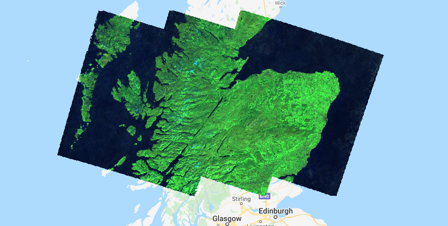

### Image Reductions

To reduce an `Image`, use `image.reduce()`. Reducing an image functions in an analogous way to `imageCollection.reduce()`, except the bands of the image are input to the reducer rather than the images in the collection. The output is also an image with number of bands equal to number of reducer outputs. For example:

[Open in Code Editor](https://code.earthengine.google.com/be7c631e684c0ccb48f3babc27849441)

```javascript
// Load an image.
var image = ee.Image("UMD/hansen/global_forest_change_2023_v1_11")
              .select(['last_b70', 'last_b50', 'last_b40']);

// Reduce the image to get a one-band maximum value image.
var maxValue = image.reduce(ee.Reducer.max());

// Display the result.
Map.setCenter(172.78, -43.74, 11);
Map.addLayer(maxValue, {min: 0, max: 120}, 'Maximum value image');
```


#### Playtime


Task: Provide the mean annual cloud probability for Zurich.


[Use the Code Editor](https://code.earthengine.google.com/?scriptPath=users%2Fwulf%2FGEO717%3AEE01_Introduction%2F21b%20-%20Reducer_ImageReductions%20task)

### Statistics of an Image Region

To get statistics of pixel values in a region of an `ee.Image`, use [`image.reduceRegion()`](https://developers.google.com/earth-engine/guides/api_docs#eeimagereduceregion). This reduces all the pixels in the region(s) to a statistic or other compact representation of the pixel data in the region (e.g. histogram). The region is represented as a `Geometry`, which might be a polygon, containing many pixels, or it might be a single point, in which case there will only be one pixel in the region. In either case, as illustrated in the Figure below, the output is a statistic derived from the pixels in the region.

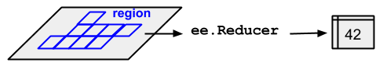

For an example of getting pixel statistics in a region of an image using `reduceRegion()`, consider finding the mean spectral values of a 5-year Landsat composite within the boundaries of the Sierra Nevada Coniferous Forest

[Open in Code Editor](https://code.earthengine.google.com/a41d0f174d257af75a2c3e22a0ea65ab)

```javascript
// Landsat 8 image
var image = ee.Image('LANDSAT/LC08/C02/T1_TOA/LC08_194028_20190701')
Map.addLayer(image, {bands: ['B7', 'B5', 'B4'], max: [0.3, 0.5, 0.6], min: [0.05]}, 
'Landsat 8 - before cloud mask')

// Randolf glacier inventory
var RGI = ee.FeatureCollection("projects/sat-io/open-datasets/RGI/RGI_VECTOR_MERGED_V7");

// filter the RGI for the Aletsch glacier
var Aletsch = RGI.filter(ee.Filter.eq('glims_id', 'G008032E46504N'));   

// Display the region.
var Aletsch_outline = ee.Image().byte().paint({
  featureCollection: Aletsch,
  color: 1,
  width: 3
});
Map.addLayer(Aletsch_outline, {palette: '#ffffff'}, 'Aletsch glacier')  

// extract the glacier geometry
var aoi = Aletsch.first().geometry();                                 

// Reduce the region. The region parameter is the Feature geometry.
var meanDictionary = image.reduceRegion({
  reducer: ee.Reducer.mean(),
  geometry: aoi,
  scale: 30,
  maxPixels: 1e9
});

// The result is a Dictionary.  Print it.
print(meanDictionary);
```


Note that in this example the reduction is specified by providing the `reducer` (`ee.Reducer.mean()`), the `geometry` (`Aletsch.first().geometry()`), the `scale` (30 meters) and `maxPixels` for the maximum number of pixels to input to the reducer. A scale should always be specified in `reduceRegion()` calls. See [this page](https://developers.google.com/earth-engine/guides/scale) for more information about how Earth Engine handles scale.

#### Area calculation

To calculate the area covered by raster images, you can also use image.reduceRegion(). You can calculate areas for any geometry using the .area() function. You can calculate the area within a geometry covered by a raster image using the pixelArea() function. See the example below for the Aletsch Glacier.

[Open in Code Editor](https://code.earthengine.google.com/c7b42f5b3d0d0b172cfb9752b693bf92)

```javascript
// Area Calculation: Vector vs. Raster Methods

///////////////////////////////////////////////////
// 1. LOAD SATELLITE IMAGE

// Load a Landsat 8 TOA image
var image = ee.Image('LANDSAT/LC08/C02/T1_TOA/LC08_194028_20190701');

// Display unmasked image
Map.addLayer(image, {
  bands: ['B7', 'B5', 'B4'],
  min: [0.05],
  max: [0.3, 0.5, 0.6]
}, 'Landsat 8 - Original');

///////////////////////////////////////////////////
// 2. LOAD GLACIER SHAPE: ALETSCH (Switzerland)

// Load Randolph Glacier Inventory (RGI v7)
var RGI = ee.FeatureCollection("projects/sat-io/open-datasets/RGI/RGI_VECTOR_MERGED_V7");

// Filter for Aletsch Glacier using its GLIMS ID
var Aletsch = RGI.filter(ee.Filter.eq('glims_id', 'G008032E46504N'));

// Extract the glacier geometry
var aoi = Aletsch.first().geometry();

// Zoom to glacier
Map.centerObject(aoi, 10);

///////////////////////////////////////////////////
// 3. AREA CALCULATIONS

// a) Area from existing feature property (pre-calculated)
var areaProperty = ee.Number(Aletsch.first().get('area_km2'))
  .multiply(100).round().divide(100);  // round to 2 decimal places
print('Glacier area from property (km²):', areaProperty);

// b) Area calculated from geometry (vector-based)
var areaVector = aoi.area().divide(1e6).multiply(100).round().divide(100);  // m² to km²
print('Glacier area from geometry (km²):', areaVector);

// c) Area from raster footprint (pixels with data in Band 2)
var areaImage = ee.Image.pixelArea()
  .updateMask(image.select('B2').gte(0));  // include all valid pixels

var areaStats = areaImage.reduceRegion({
  reducer: ee.Reducer.sum(),
  geometry: aoi,
  scale: 100,
  maxPixels: 1e10,
  tileScale: 16
});

var areaRaster = ee.Number(areaStats.get('area')).divide(1e6).multiply(100).round().divide(100);
print('Glacier area from raster pixels (km²):', areaRaster);

///////////////////////////////////////////////////
// 4. COMPARE: RASTER COVERAGE AS % OF PROPERTY AREA

var rasterCoveragePercent = areaRaster.divide(areaProperty)
  .multiply(10000).round().divide(100);  // round to 2 decimal places
print('Raster coverage (% of property area):', rasterCoveragePercent);

///////////////////////////////////////////////////
// 5. ADD RESULTS AS NEW PROPERTIES TO FEATURE

Aletsch = Aletsch.set({
  'area_km2_property': areaProperty,
  'area_km2_vector': areaVector,
  'area_km2_raster': areaRaster,
  'raster_coverage_percent': rasterCoveragePercent
});

print('Aletsch Glacier with area metrics:', Aletsch);
```

### Statistics of Image Regions

To get image statistics in multiple regions stored in a `FeatureCollection`, you can use `image.reduceRegions()` to reduce multiple regions at once. The input to `reduceRegions()` is an `Image` and a `FeatureCollection`. The output is another `FeatureCollection` with the `reduceRegions()` output set as properties on each `Feature`. In this example, means of the Landsat 7 annual composite NDVI in each feature geometry will be added as properties to the input features:

```javascript
// Is Greenland the greenest country in Europe?

/*-------------------------------------
| 1. LOAD MODIS EVI IMAGE COLLECTION |
-------------------------------------*/
// MOD13Q1 provides 16-day EVI at 250 m resolution
var dataset = ee.ImageCollection('MODIS/061/MOD13Q1')
  .filterDate('2020-01-01', '2025-01-01');

// Get mean EVI 
var evi = dataset.select('EVI').mean();

// Visualization parameters (MODIS EVI scaled by 0.0001)
var eviVis = {
  min: 0,
  max: 6000,
  palette: ['ffffff', 'ce7e45', 'df923d', 'f1b555', 'fcd163', '99b718',
            '74a901', '66a000', '529400', '3e8601', '207401', '056201',
            '004c00', '023b01', '012e01', '011d01', '011301']
};

// Center the map over Europe
Map.setCenter(6.746, 46.529, 4);
Map.addLayer(evi, eviVis, 'Mean EVI');

/*-------------------------------
| 2. LOAD COUNTRY GEOMETRIES   |
-------------------------------*/
// Define area of interest: Europe bounding box
var aoi = ee.Geometry.Rectangle([-30, 38, 27, 70], null, false);
Map.addLayer(aoi, {}, 'Europe AOI', false);

// Load global country boundaries and filter by AOI
var countries = ee.FeatureCollection("USDOS/LSIB_SIMPLE/2017")
  .filterBounds(aoi);

// Display borders
var outline = ee.Image().byte().paint({
  featureCollection: countries,
  color: 1,
  width: 1
});
Map.addLayer(outline, {palette: 'white'}, 'Country Borders');

/*------------------------------------------
| 3. CALCULATE MEAN EVI PER COUNTRY       |
------------------------------------------*/
var countryMeans = evi.reduceRegions({
  collection: countries,
  reducer: ee.Reducer.mean(),
  scale: 1000,      // MODIS native resolution: 250m, but 1000m is more efficient
  tileScale: 16
});

/*------------------------------------------
| 4. SORT & PRINT GREENEST / BROWNST      |
------------------------------------------*/
// Top 5 "greenest" countries
var greenest5 = countryMeans.sort('mean', false)
  .limit(5)
  .reduceColumns(ee.Reducer.toList(2), ['country_na', 'mean'])
  .get('list');
print('Top 5 Greenest Countries (EVI):', greenest5);

// Bottom 5 "brownest" countries
var brownest5 = countryMeans.sort('mean', true)
  .limit(5)
  .reduceColumns(ee.Reducer.toList(2), ['country_na', 'mean'])
  .get('list');
print('Bottom 5 Least Green Countries (EVI):', brownest5);

/*------------------------------------------------
| 5. CHECK IF GREENLAND IS IN THE GREENEST 5    |
------------------------------------------------*/
// Optional: Find Greenland's mean EVI
var greenland = countryMeans.filter(ee.Filter.eq('country_na', 'Greenland'));
print('Greenland EVI:', greenland.first().get('mean'));

```


### Linear Regressions

Earth Engine has several methods for performing linear regression using reducers: The simplest linear regression reducer is `linearFit()` which computes the least squares estimate of a linear function of one variable with a constant term. For a more flexible approach to linear modelling, use one of the linear regression reducers which allow for a variable number of independent and dependent variables. `linearRegression()` implements ordinary least squares regression(OLS). `robustLinearRegression()` uses a cost function based on regression residuals to iteratively de-weight outliers in the data ([O’Leary, 1990](http://epubs.siam.org/doi/abs/10.1137/0611032)). `ridgeRegression()` does linear regression with L2 regularization.

Regression analysis with these methods is suitable for reducing `ee.ImageCollection`, `ee.Image`, `ee.FeatureCollection`, and `ee.List` objects. The following examples demonstrate an application for each. Note that `linearRegression()`, `robustLinearRegression()`, and `ridgeRegression()` all have the same input and output structures, but `linearFit()` expects a two-band input (X followed by Y) and `ridgeRegression()` has an additional parameter (`lambda`, _optional_) and output (`pValue`).

#### linearFit()

The data should be set up as a two-band input image, where the first band is the independent variable and the second band is the dependent variable. The following example shows the estimation of the linear trend of climate reanalysis data ([ERA5-Land](https://developers.google.com/earth-engine/datasets/catalog/ECMWF_ERA5_LAND_DAILY_AGGR#bands)) for air temperatures over the last decades. The dependent variable is air-temperature and the independent variable is time (years), added prior to calling `linearFit()`:

[Open in Code Editor](https://code.earthengine.google.com/fe0f89bc2a06bbe14a8707fe64e6a880)

```javascript
// ERA5-Land: Annual Temperature Trend

///////////////////////////////////////////////////
// 1. SETTINGS

var variable = 'temperature_2m';  // ERA5 variable
var startYear = 1990;
var endYear = 2024;
var years = ee.List.sequence(startYear, endYear);

///////////////////////////////////////////////////
// 2. LOAD AND AGGREGATE ERA5 DAILY TO ANNUAL MEANS

var ERA5_daily = ee.ImageCollection("ECMWF/ERA5_LAND/DAILY_AGGR")
                    .select(variable);

// Map over years to compute annual means (convert to °C)
var ERA5_annual = ee.ImageCollection.fromImages(
  years.map(function(y) {
    return ERA5_daily
      .filter(ee.Filter.calendarRange(y, y, 'year'))
      .mean()
      .subtract(273.15)  // Convert Kelvin to Celsius
      .set('year', y)
      .set('system:time_start', ee.Date.fromYMD(y, 1, 1).millis());
  })
);

///////////////////////////////////////////////////
// 3. ADD TIME BAND (YEAR)

var ERA5_withTime = ERA5_annual.map(function(img) {
  var year = ee.Number(img.date().get('year'));
  var timeBand = ee.Image.constant(year).rename('time').toFloat();
  return img.addBands(timeBand);
});

///////////////////////////////////////////////////
// 4. LINEAR REGRESSION: temperature_2m ~ year

var trend = ERA5_withTime
  .select(['time', variable])
  .reduce(ee.Reducer.linearFit());  // Returns slope (scale), intercept (offset)


// Convert trend from °C/year to °C/decade
var trendDecade = trend.select('scale')
  .multiply(10)
  .rename('trend_per_decade');

///////////////////////////////////////////////////
// 5. VISUALIZATION

// Load palettes
var palettes = require('users/gena/packages:palettes');
var vik = palettes.crameri.vik[25];         // diverging palette
var lajolla = palettes.crameri.lajolla[25].reverse(); // warming palette

// Show full trend (°C/decade)
Map.addLayer(trendDecade, {
  min: 0, max: 1, palette: lajolla
}, 'Temp Trend (°C/decade)');

// Regression offset (intercept)
Map.addLayer(trend.select('offset'), {
  min: -100, max: 100, palette: vik
}, 'Regression Offset (°C)', false);
```

Observe that the output contains two bands, the ‘offset’ (intercept) and the ‘scale’ ('scale' in this context refers to the slope of the line and is not to be confused with the scale parameter input to many reducers, which is the spatial scale). The scale is given in two different colour ramps. Look at the range of values to interpret the colours accordingly. A value of 0.8 refers to 0.8°C warming per decade. Over four decades, this equates to 3.6°C of warming.

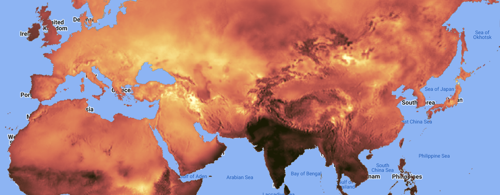

#### Playtime


Task 1: Use the same 'ECMWF/ERA5\_LAND/DAILY\_AGGR' dataset to analyse the global precipitations trends since 1990.


[Use the Code Editor](https://code.earthengine.google.com/323bde1cbe0f3356ae197a239d212a3b)


Task 2: Use the 'MODIS/006/MOD13A1' (16-day vegetation indices) dataset to analyse the global vegetation trends by the EVI since 2000.


[Use the Code Editor](https://code.earthengine.google.com/b929b77e9743ec5d2b466f5ede66027c)

#### linearRegression()

In this example, we aim to model how two climate variables — temperature and precipitation — have changed over time using multivariate linear regression.

The regression includes:

* Two independent (explanatory) variables:
  * A constant term (for the intercept)
  * Time (year)
* Two dependent (response) variables:
  * 2-meter air temperature
  * Total annual precipitation

To prepare the dataset for regression:

* We compute annual means of each variable from the ERA5-Land daily data.
* A time band and a constant band are added to each image.
* The `linearRegression()` reducer is used to estimate the slope and intercept for each response variable simultaneously.

Since `linearRegression()` returns the coefficients in a 2D array (X × Y), we flatten the array to retrieve named bands like `slope_temperature_2m` and `intercept_total_precipitation_sum`.

This allows us to inspect and compare trends across both variables at each pixel.

[Open in Code Editor](https://code.earthengine.google.com/13059a8db3c5168b4837e66f7126e04a)

```javascript
// GEO717 - Introduction to Earth Engine - Reducer - LinearRegressions - Example 2
// ERA5 Linear Regression Example (Temperature & Precipitation Trends)

///////////////////////////////////////////////////
// 1. SETTINGS

var variables = ['temperature_2m', 'total_precipitation_sum'];  // Response variables
var startYear = 1990;
var endYear = 2024;
var years = ee.List.sequence(startYear, endYear);

// Load color palettes
var palettes = require('users/gena/packages:palettes');
var lajolla = palettes.crameri.lajolla[25].reverse();  // Sequential (for warming)
var vik = palettes.crameri.vik[25];                    // Diverging (for intercepts)


///////////////////////////////////////////////////
// 2. LOAD ERA5 DAILY AND AGGREGATE TO ANNUAL MEANS

var ERA5 = ee.ImageCollection("ECMWF/ERA5_LAND/DAILY_AGGR")
  .select(variables);

// Create annual average composites and convert temperature to °C
var ERA5_yearly = ee.ImageCollection.fromImages(
  years.map(function(year) {
    var annual = ERA5
      .filter(ee.Filter.calendarRange(year, year, 'year'))
      .mean()
      .set('year', year)
      .set('system:time_start', ee.Date.fromYMD(year, 1, 1).millis());

    // Convert temperature to Celsius
    var tempC = annual.select('temperature_2m').subtract(273.15).rename('temperature_2m');
    var precip = annual.select('total_precipitation_sum');
    
    return tempC.addBands(precip)
                .copyProperties(annual);
  })
);


///////////////////////////////////////////////////
// 3. ADD TIME & CONSTANT BANDS FOR REGRESSION

// Add 'year' as a numeric predictor band
var addTimeBand = function(image) {
  var year = ee.Number(image.get('year'));
  return image.addBands(ee.Image.constant(year).rename('year').toFloat());
};

// Add constant predictor (for intercept)
var addConstantBand = function(image) {
  return ee.Image.constant(1).rename('constant').addBands(image);
};

// Apply to the collection
ERA5_yearly = ERA5_yearly.map(addTimeBand).map(addConstantBand);

// Final selection: predictors (X) and responses (Y)
ERA5_yearly = ERA5_yearly.select(['constant', 'year'].concat(variables));


///////////////////////////////////////////////////
// 4. MULTIVARIATE LINEAR REGRESSION

// Ordinary least squares (OLS)
var ols = ERA5_yearly.reduce(ee.Reducer.linearRegression({
  numX: 2,  // constant + year
  numY: variables.length
}));

// Robust linear regression (RLR)
var rlr = ERA5_yearly.reduce(ee.Reducer.robustLinearRegression({
  numX: 2,
  numY: variables.length
}));


// Define axis labels for flattening the coefficient array
var bandLabels = [['intercept', 'slope'], variables];

// Flatten arrays to named bands
var ols_flat = ols.select('coefficients').arrayFlatten(bandLabels);
var rlr_flat = rlr.select('coefficients').arrayFlatten(bandLabels);

print('OLS Coefficients', ols_flat);
print('Robust Coefficients', rlr_flat);


///////////////////////////////////////////////////
// 5. VISUALIZATION

// Slope = trend per year. Multiply by 10 to get trend per decade if desired.

// OLS – Temperature Trend
Map.addLayer(ols_flat.select('slope_temperature_2m'), {
  min: 0, max: 0.08, palette: lajolla
}, 'OLS Trend – Temp (°C/year)', true);

// OLS – Temperature Intercept
Map.addLayer(ols_flat.select('intercept_temperature_2m'), {
  min: -100, max: 100, palette: vik
}, 'OLS Offset – Temp (°C)', true);

// RLR – Temperature Trend
Map.addLayer(rlr_flat.select('slope_temperature_2m'), {
  min: 0, max: 0.08, palette: lajolla
}, 'RLR Trend – Temp (°C/year)', false);

// RLR – Temperature Intercept
Map.addLayer(rlr_flat.select('intercept_temperature_2m'), {
  min: -100, max: 100, palette: vik
}, 'RLR Offset – Temp (°C)', false);
```

<figure>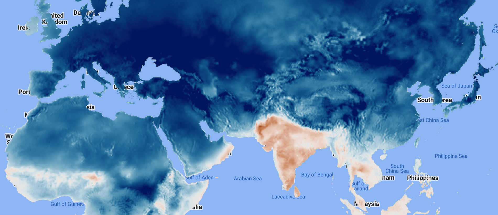<figcaption><p>The output of linearRegression() offset applied to air temperatures.</p></figcaption></figure>

After running the regression, you’ll see that:

* The output of `linearRegression()` for temperature closely matches the slope and intercept you'd get from `linearFit()` — this confirms the consistency between univariate and multivariate regressions.
* However, `linearRegression()` provides additional coefficients for precipitation, allowing joint modeling of multiple response variables.
* The output of `robustLinearRegression()` differs slightly. It is less sensitive to outliers and provides a more stable estimate in areas with noisy or sparse observations.

You can compare the temperature and precipitation trends using both methods visually, or explore their values numerically by clicking on points in the map viewer. This is a powerful tool for detecting climate trends with multiple interacting variables.

[This simple 1-dimensional example](https://code.earthengine.google.com/b84798cc24e6b38447f11403c6eba504) highlights the difference between  the linear regression and the robust linear regression.

## Charts

The Earth Engine JavaScript [Code Editor](https://developers.google.com/earth-engine/guides/playground) seamlessly integrates with [Google Charts](https://developers.google.com/chart/interactive/docs/gallery) for convenient tabular data visualization via `ui.Chart` functions. Charts can be displayed interactively in the Code Editor console, `ui.Panel` widgets, and in stand-alone browser tabs.

### Chart overview

A variety of chart types can be produced; for example: scatter, line, bar, pie, and histogram. Specifically, any chart type that is available in the Google Charts [corechart](https://developers.google.com/chart/interactive/docs/basic_load_libs#basic-library-loading) package can be generated. Use the `ui.Chart.setChartType()` method to set chart type. Each page linked to in the [Earth Engine object charts](https://developers.google.com/earth-engine/guides/charts_overview#earth_engine_object_charts) and [`DataTable` charts](https://developers.google.com/earth-engine/guides/charts_overview#datatable_charts) sections include examples for generating several chart types.

```javascript
// 1. INPUT DATA

var yValues = ee.List([2, 5, 6, 2, 7]);
var xValues = ee.List([1, 2, 3, 3.5, 5]);

// 2. CREATE A SCATTER CHART

var chart = ui.Chart.array.values({
  array: yValues,
  axis: 0,
  xLabels: xValues
})
.setChartType('ScatterChart')  // Try also: 'LineChart', 'ColumnChart', 'Histogram'
.setOptions({
  title: 'Example: Scatter Chart of y vs. x',
  hAxis: { title: 'x values' },
  vAxis: { title: 'y values' },
  pointSize: 6,
  legend: { position: 'none' }
});

print(chart);
```


#### Interactivity

Charts are interactive by default. Hover over points, lines, bars, etc. to see respective x, y, and series values. Axis zooming and panning are optionally permitted by [activating a chart's "explorer" functionality](https://developers.google.com/earth-engine/guides/charts_style#zoom_and_pan_chart_axes).

#### Styling

Google Charts are highly customizable via styling properties. Use the `ui.Chart.setOptions()` method to set chart style properties. See the [Chart Styling](https://developers.google.com/earth-engine/guides/charts_style) guide for full details.

#### Limitations

`ui.Chart` functions will only render 5,000 features. If your `FeatureCollection`, `ImageCollection`, `Array` or `List` has more elements, consider ways you might limit the data. If you have a long time series with a high cadence rate, try using a shorter time period, temporal sampling, or generate temporal composites.

### DataTable Charts

The `ui.Chart` function is essentially a 2-D table with rows that represent observations and columns that represent observation attributes. It is a good option when a high degree of chart customization is required.

Suppose you have a small amount of static data you want to display to a chart. Use either the JavaScript [array](https://developers.google.com/earth-engine/guides/charts_datatable#javascript_array) or [object](https://developers.google.com/earth-engine/guides/charts_datatable#javascript_object) specifications to construct an input to pass to the `ui.Chart` function. Here, the top five asian populations from a 2022 census are encoded as a JavaScript array with column header objects that define column properties.

```javascript
// DEFINE DATA TABLE
// The first row defines column headers and roles.
var dataTable = [
  [
    {label: 'Country', role: 'domain', type: 'string'},
    {label: 'Population', role: 'data', type: 'number'},
    {label: 'World Share', role: 'annotation', type: 'string'}
  ],
  ['CN', 1439323776, '18.4%'],   // China
  ['IN', 1380004385, '17.7%'],   // India
  ['ID',  273523615, '3.5%'],    // Indonesia
  ['PK',  220892340, '2.8%'],    // Pakistan
  ['BD',  164689383, '2.1%']     // Bangladesh
];

// CREATE, STYLE AND PRINT THE CHART
var chart = ui.Chart(dataTable)
  .setChartType('ColumnChart')  // Other options: LineChart, PieChart, etc.
  .setOptions({
    title: 'Asian Countries by population (2022)',
    titleTextStyle: {bold: true, fontSize: 16},
    legend: {position: 'none'},
    hAxis: {
      title: 'Country',
      titleTextStyle: {italic: false, bold: true}
    },
    vAxis: {
      title: 'Population',
      format: 'short',  // e.g., 1.4B instead of 1400000000
      titleTextStyle: {italic: false, bold: true}
    },
    colors: ['#1d6b99'],  // Optional: use a custom HEX color
    bar: {groupWidth: '75%'}
  });

print(chart);
```

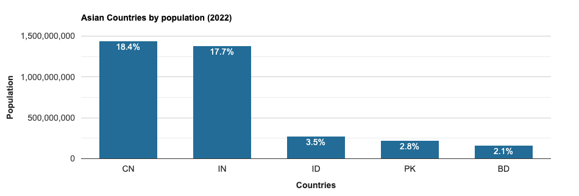

### Image Charts

The `ui.Chart.image` module contains a set of functions for reducing `Image` objects by region(s) and rendering charts from the results. The choice of function dictates the arrangement of data in the chart, i.e., what defines x- and y-axis values and what defines the series. See the respective website on [Image Charts](https://developers.google.com/earth-engine/guides/charts_image#chart_functions) to get a more comprehensive overview of chart functions and respective examples. We will focus on two chart functions:  `ui.Chart.image.regions` and  `ui.Chart.image.histogram`&#x20;

#### ui.Chart.image.regions

The `ui.Chart.image.regions` function accepts a list that allows you to plot data from multiple regions of your image. The following example displays a spectral profiler.&#x20;

[Open in Code Editor](https://code.earthengine.google.com/?scriptPath=users%2Fwulf%2FGEO717%3AEE01_Introduction%2F23a%20-%20Charts_ImageCharts%20example)

```javascript
///////////////////////////////////////////////////
// 1. LOAD IMAGE (Collection 2: Surface Reflectance)

var image = ee.Image("LANDSAT/LC08/C02/T1_L2/LC08_196030_20190629");

///////////////////////////////////////////////////
// 2. DEFINE SAMPLE LOCATIONS

var samples = ee.FeatureCollection([
  ee.Feature(ee.Geometry.Point(5.4789, 43.168).buffer(200), {name: 'Water'}),
  ee.Feature(ee.Geometry.Point(5.47025, 43.24038).buffer(200), {name: 'Forest'}),
  ee.Feature(ee.Geometry.Point(5.3788, 43.288).buffer(200), {name: 'Urban'})
]);

///////////////////////////////////////////////////
// 3. MAP SETTINGS

Map.setOptions('SATELLITE');
Map.centerObject(samples, 11);  // Camargue region, France
Map.addLayer(samples, {color: 'red'}, 'Sample Locations');

///////////////////////////////////////////////////
// 4. SCALE AND SELECT REFLECTANCE BANDS

// Band scaling constants for SR bands
var scaleFactor = 0.0000275;
var offset = -0.2;

// Surface reflectance bands
var srBands = ['SR_B1', 'SR_B2', 'SR_B3', 'SR_B4', 'SR_B5', 'SR_B6', 'SR_B7'];
var renamedBands = ['B1', 'B2', 'B3', 'B4', 'B5', 'B6', 'B7'];  // For charting
var wavelengths = [0.44, 0.48, 0.56, 0.65, 0.86, 1.61, 2.2];    // In µm

// Create reflectance image with proper scaling and renaming
var opticalImage = image.select(srBands)
  .multiply(scaleFactor)
  .add(offset)
  .multiply(100)
  .rename(renamedBands);

Map.addLayer(opticalImage, {
  bands: ['B7', 'B5', 'B3'],
  min: 0,
  max: 30
}, 'False Color Image');

///////////////////////////////////////////////////
// 5. CREATE REFLECTANCE PROFILE CHART

var chart = ui.Chart.image.regions({
  image: opticalImage,
  regions: samples,
  reducer: ee.Reducer.mean(),
  scale: 30,
  seriesProperty: 'name',
  xLabels: wavelengths
})
.setChartType('LineChart')
.setOptions({
  title: 'Surface Reflectance by Land Cover Type (Landsat 8)',
  hAxis: {
    title: 'Wavelength [µm]',
    titleTextStyle: {italic: false, bold: false}
  },
  vAxis: {
    title: 'Reflectance [%]',
    titleTextStyle: {italic: false, bold: false}
  },
  colors: ['blue', 'green', 'red'],
  lineWidth: 2,
  pointSize: 5
});

print(chart);
```

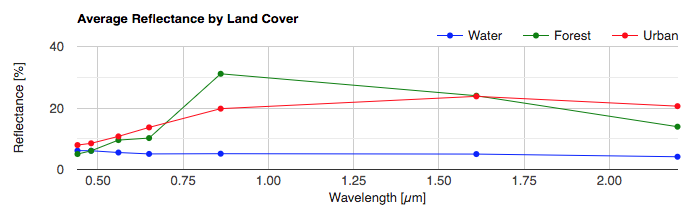

#### Playtime


Task: Create a dynamic spectral profiler, which samples the spectra based on placemark icons .


[Use the Code Editor](https://code.earthengine.google.com/?scriptPath=users%2Fwulf%2FGEO717%3AEE01_Introduction%2F23b%20-%20Charts_ImageCharts%20task%20spectral%20sampler)

#### ui.Chart.image.histogram

Imagine you want to identify a suitable threshold for the normalized difference water index (NDWI) to distinguish water from land. Displaying the histogram of the respetive index image is a suitable way to identify the target region.

[Open in Code Editor](https://code.earthengine.google.com/?scriptPath=users%2Fwulf%2FGEO717%3AEE01_Introduction%2F24a%20-%20Charts_ImageCharts_Histogram%20example)

```javascript
// NDWI Histogram 

///////////////////////////////////////////////////
// 1. LOAD AND DISPLAY IMAGE, DEFINE AOI

var image = ee.Image("LANDSAT/LC08/C02/T1_TOA/LC08_196030_20190629");

Map.centerObject(image, 10);
Map.addLayer(image, {bands: ['B7', 'B5', 'B3'], min: 0.05, max: 0.3, gamma: 1.1}, 
  'False Color (SWIR-NIR-Green)', false);

var aoi = image.geometry();  // use the image footprint

///////////////////////////////////////////////////
// 2. COMPUTE NDWI (Green - NIR) / (Green + NIR)

var ndwi = image.normalizedDifference(['B3', 'B5']).rename('NDWI');

Map.addLayer(ndwi, {min: -1, max: 1, palette: ['green', 'white', 'blue']}, 'NDWI');


///////////////////////////////////////////////////
// 3. CREATE NDWI HISTOGRAM

var chart = ui.Chart.image.histogram({
  image: ndwi,
  region: aoi,
  scale: 100,
  maxBuckets: 50
})
.setSeriesNames(['NDWI'])
.setOptions({
  title: 'NDWI Histogram',
  hAxis: {
    title: 'NDWI Value',
    titleTextStyle: {italic: false, bold: false}
  },
  vAxis: {
    title: 'Pixel Count',
    titleTextStyle: {italic: false, bold: false}
  },
  colors: ['steelblue']
});
print(chart);


///////////////////////////////////////////////////
// 4. MASK LAND (ASSUME NDWI > 0 IS WATER)

var waterMask = ndwi.gt(0).selfMask();  // mask everything else
Map.addLayer(waterMask, {palette: 'blue'}, 'Water Mask');
```

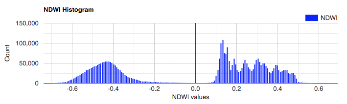

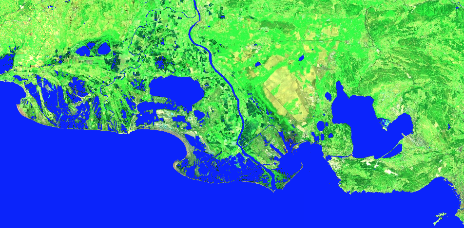

#### Playtime


Task: Load the DEM dataset "USGS/SRTMGL1\_003", clip it to the image geometry (see given example) and display its histogram. Adjust the number of buckets/bins to 300.


[Use the Code Editor](https://code.earthengine.google.com/?scriptPath=users%2Fwulf%2FGEO717%3AEE01_Introduction%2F24b%20-%20Charts_ImageCharts_Histogram%20task)

### ImageCollection Charts

The `ui.Chart.image` module contains a set of functions for rendering charts from the results of spatiotemporal reduction of images within an `ImageCollection`. The choice of function dictates the arrangement of data in the chart, i.e., what defines x- and y-axis values and what defines the series. Use the [function descriptions and examples](https://developers.google.com/earth-engine/guides/charts_image_collection) to determine the best function for your purpose.

In this following example we will compare two charts on the same dataset.

Use `ui.Chart.image.doySeriesByRegion` to display a single image band day-of-year time series for multiple regions, where each distinct region is presented as a unique series. It is useful for comparing annual single-band time series among regions. For instance, in this example, annual MODIS-derived EVI profiles for three forest regions are plotted, providing a convenient comparison of EVI response by region. Note that intra-annual observations occurring on the same day-of-year are reduced by their mean.

Use `ui.Chart.image.series` to display an image time series for a given region; each image band is presented as a unique series. It is useful for comparing the time series of individual image bands. Here, a MODIS image collection with bands representing NDVI and EVI vegetation indices are plotted. The date of every image observation is included along the x-axis, while the mean reduction of pixels intersecting the forest ecoregion defines the y-axis.

[Open in Code Editor](https://code.earthengine.google.com/ce7fc88a74d9374bec1cb85ee53a8881)

```javascript
// MODIS Vegetation Time Series Reduction (Region + Year examples)

///////////////////////////////////////////////////
// 1. SAMPLE LOCATIONS – Swiss forest regions

var samples = ee.FeatureCollection([
  ee.Feature(ee.Geometry.Point(8.54749, 47.26468).buffer(1000), {name: 'Sihlwald'}),
  ee.Feature(ee.Geometry.Point(6.99366, 47.37159).buffer(1000), {name: 'Jura'}),
  ee.Feature(ee.Geometry.Point(8.63704, 46.30030).buffer(1000), {name: 'Ticino'})
]);

var snazzy = require("users/aazuspan/snazzy:styles");
snazzy.addStyleFromName("Google Maps Clean");

Map.centerObject(samples, 8);
Map.addLayer(samples, {color: 'red'}, 'Sample Locations');


///////////////////////////////////////////////////
// 2. LOAD MODIS VEGETATION INDEX DATA

var vegIndices = ee.ImageCollection('MODIS/006/MOD13A1')
  .filterDate('2017-01-01', '2020-01-01')
  .select(['NDVI', 'EVI']);  // scaled by 1e4

// Visualize the first image (optional)
var ndviViz = {
  bands: 'NDVI',
  min: 0,
  max: 10000,
  palette: ['befff7', '009b3a', '004b23']
};
Map.addLayer(vegIndices.first(), ndviViz, 'NDVI - First Image', false);


///////////////////////////////////////////////////
// 3. CHART 1: EVI Seasonal Profile by Region (DOY Mean)

var chartByRegion = ui.Chart.image.doySeriesByRegion({
  imageCollection: vegIndices,
  bandName: 'EVI',
  regions: samples,
  regionReducer: ee.Reducer.mean(),
  scale: 500,
  yearReducer: ee.Reducer.mean(),  // average across years
  seriesProperty: 'name',
  startDay: 1,
  endDay: 365
})
.setChartType('LineChart')
.setOptions({
  title: 'Mean EVI Seasonal Profile (2017–2019)',
  hAxis: {
    title: 'Day of Year (DOY)',
    titleTextStyle: {italic: false, bold: true}
  },
  vAxis: {
    title: 'EVI ×10⁻⁴',
    titleTextStyle: {italic: false, bold: true}
  },
  lineWidth: 2,
  colors: ['f0af07', '0f8755', '76b349']
});

print(chartByRegion);


///////////////////////////////////////////////////
// 4. CHART 2: EVI & NDVI Time Series Across All Regions

var chartByTime = ui.Chart.image.series({
  imageCollection: vegIndices,
  region: samples.geometry(),  // merged region
  reducer: ee.Reducer.mean(),
  scale: 500,
  xProperty: 'system:time_start'
})
.setChartType('LineChart')
.setSeriesNames(['EVI', 'NDVI'])
.setOptions({
  title: 'Average Vegetation Index Time Series (2017–2019)',
  hAxis: {
    title: 'Date',
    titleTextStyle: {italic: false, bold: true}
  },
  vAxis: {
    title: 'Index Value ×10⁻⁴',
    titleTextStyle: {italic: false, bold: true}
  },
  lineWidth: 2,
  colors: ['e37d05', '1d6b99'],
  curveType: 'function'  // smooth lines
});

print(chartByTime);

```

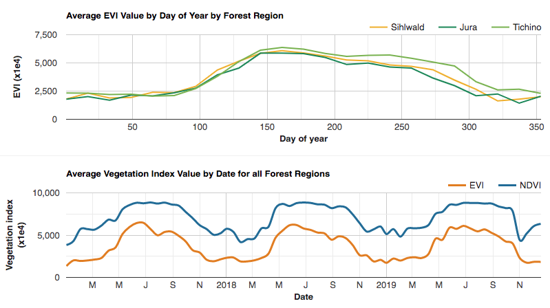

## Importing & exporting data

### Importing and Managing Assets

To upload and manage geospatial datasets, use the Asset Manager in the Code Editor. The Asset Manager is on the **Assets** tab at the left side of the Code Editor (Figure below. See [Importing Raster Data](https://developers.google.com/earth-engine/guides/image_upload) for instructions on uploading raster (image) data and [Importing Table Data](https://developers.google.com/earth-engine/guides/table_upload) for instructions on uploading table data. Your assets are initially private, but may be shared with others. See the [Sharing Assets section](https://developers.google.com/earth-engine/guides/asset_manager#sharing-assets) for details.

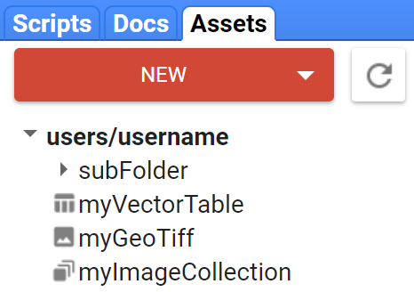

### Exporting Data

You can export images, map tiles, tables and video from Earth Engine. Most commonly, vector data are exported as a `CSV` or a `Shapefile`, while Rasters are exported as `GeoTIFF` files. The exports can be sent to your Google Drive account, to Google Cloud Storage (a fee-based service) or to a new Earth Engine asset.

#### Exporting raster data to Google Drive

To export an image to your Drive account, use `Export.image.toDrive()`. For example, to export our previously defined Landsat median image of Scotland, define the export parameters, then call `Export.image.toDrive()`:

[Open in Code Editor](https://code.earthengine.google.com/?scriptPath=users%2Fwulf%2FGEO717%3AEE01_Introduction%2F25a%20-%20Export_GeoTiff2Drive%20example)

```javascript
// Exporting a Median Landsat Composite to Google Drive

///////////////////////////////////////////////////
// 1. SETTINGS

// Time range
var startDate = '2018-01-01';
var endDate = '2020-01-01';

// Area of interest: Scotland (Inverness region)
var aoi = ee.Geometry.Rectangle([-6.82, 56.53, -1.76, 57.75]); 
Map.centerObject(aoi, 8);
Map.setOptions('SATELLITE');


///////////////////////////////////////////////////
// 2. LOAD LANDSAT 8 COLLECTION (TOA, C2)

var l8 = ee.ImageCollection('LANDSAT/LC08/C02/T1_TOA')
  .filterDate(startDate, endDate)
  .filterBounds(aoi);

// 3. CLOUD MASKING FUNCTION – Simple Cloud Score
var maskClouds = function(image) {
  var scored = ee.Algorithms.Landsat.simpleCloudScore(image);
  var cloudMask = scored.select('cloud').lt(20);  // keep pixels < 20% cloud score
  return image.updateMask(cloudMask);
};

// 4. APPLY MASKING + MEDIAN COMPOSITE
var l8_cloudfree = l8.map(maskClouds);
var l8_median = l8_cloudfree.median().clip(aoi);

// 5. VISUALIZATION
var falseColorViz = {bands: ['B7', 'B5', 'B3'], min: 0.05,  max: 0.4};
Map.addLayer(l8_median, falseColorViz, 'L8 TOA Median (Cloud-free)');


///////////////////////////////////////////////////
// 6. EXPORT TO GOOGLE DRIVE

Export.image.toDrive({
  image: l8_median.multiply(10000).uint16(),  // scale reflectance to int
  description: 'L8_TOA_Scotland_2018-2020_CloudFree_Median',
  folder: 'EE_exports',
  fileFormat: 'GeoTIFF',
  region: aoi,
  scale: 30,
  maxPixels: 1e13,
  crs: 'EPSG:32630'  // UTM zone for Scotland
});
```

#### Exporting vector data to Google Drive

You can export a `FeatureCollection` as CSV, SHP (shapefile), GeoJSON, KML, KMZ or TFRecord using `Export.table`. The `FeatureCollection` may represent vectors or simply a table of data. In the latter case, the features in the collection will have null geometry.

To export a `FeatureCollection` to your Drive account, use `Export.table.toDrive()`. For example:

```javascript
// Make a collection of points.
var features = ee.FeatureCollection([
  ee.Feature(ee.Geometry.Point(30.41, 59.933), {name: 'Voronoi'}),
  ee.Feature(ee.Geometry.Point(-73.96, 40.781), {name: 'Thiessen'}),
  ee.Feature(ee.Geometry.Point(6.4806, 50.8012), {name: 'Dirichlet'})
]);

// Export the FeatureCollection to a KML file.
Export.table.toDrive({
  collection: features,
  description:'vectorsToDriveExample',
  fileFormat: 'SHP'
});
```

Note that the output format is specified as SHP to handle geographic data. To export just a table of data, without any geographic information, export features with null geometry in CSV format.&#x20;

The following demonstrates using `Export.table.toDrive()` to get the results of a potentially long running reduction:

```javascript
///////////////////////////////////////////////////
// 1. LOAD IMAGE AND DEFINE REGION

// Load a Landsat 8 TOA (Top-of-Atmosphere Reflectance) image
var image = ee.Image('LANDSAT/LC08/C02/T1_TOA/LC08_044034_20140318');

// Define a rectangular region over California
var region = ee.Geometry.Rectangle([-122.2806, 37.1209, -122.0554, 37.2413]);

Map.centerObject(region, 11);
Map.addLayer(image, {bands: ['B4', 'B3', 'B2'], max: 0.4}, 'Landsat 8 RGB');
Map.addLayer(region, {color: 'red'}, 'Region');


///////////////////////////////////////////////////
// 2. REDUCE IMAGE REGION (Mean Value per Band)

var means = image.reduceRegion({
  reducer: ee.Reducer.mean(),
  geometry: region,
  scale: 30,              // native Landsat resolution
  maxPixels: 1e9
});
print('Mean band values:', means);


///////////////////////////////////////////////////
// 3. CONVERT TO FEATURE FOR EXPORT

// Create a single feature with the mean values as properties (no geometry)
var feature = ee.Feature(null, means);

// Wrap it in a FeatureCollection (required for export.table.toDrive)
var featureCollection = ee.FeatureCollection([feature]);


///////////////////////////////////////////////////
// 4. EXPORT TO GOOGLE DRIVE (as CSV)

Export.table.toDrive({
  collection: featureCollection,
  description: 'L8_TOA_MeanValues_Region',
  fileFormat: 'CSV'
});
```

By now you have learned quite a bit about the possibilities of the Earth Engine. In the next chapter we will focus more on time series analysis.&#x20;
