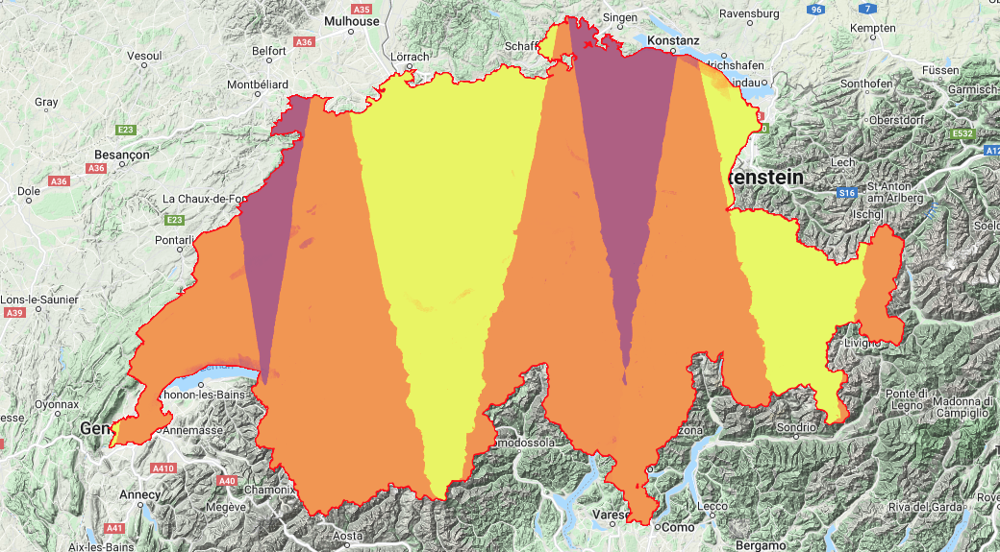
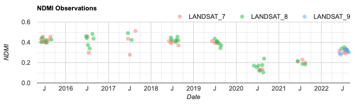
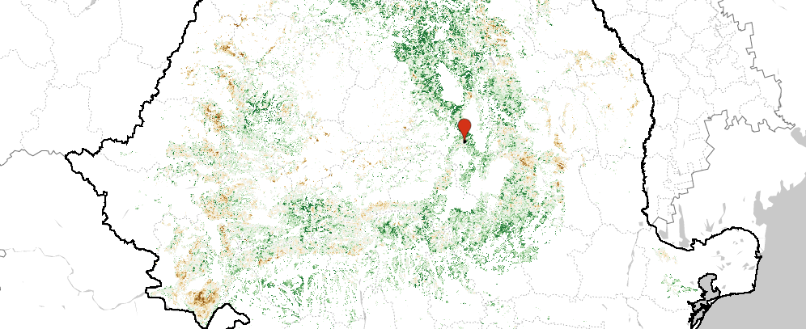
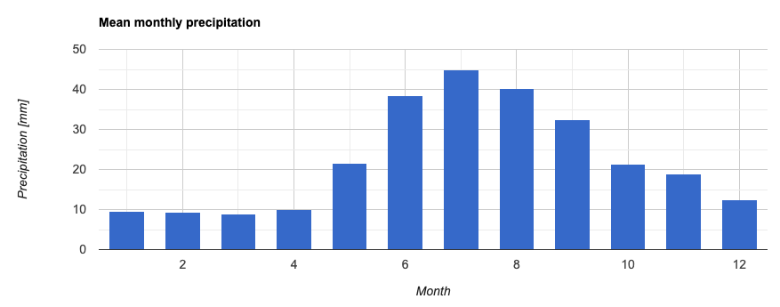
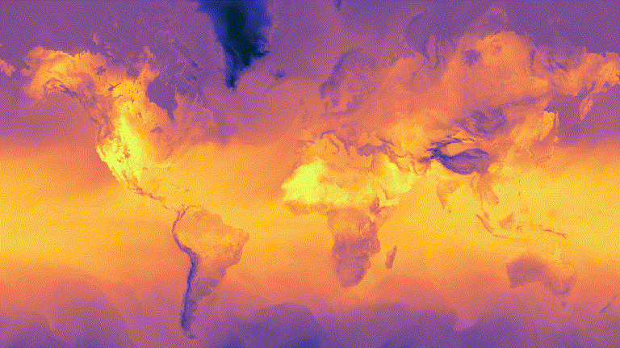
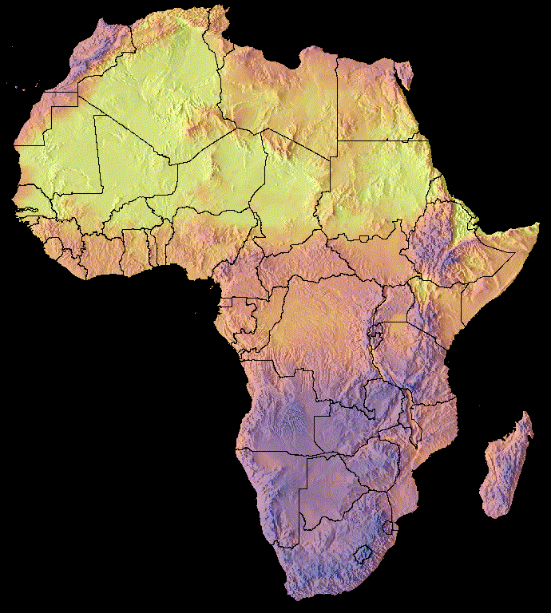

# 2. Time-series analysis

## Objective

The objective of today's session is to provide you with the critical skills needed to analyze image collections. In optical image processing, cloud masking is an important first step. Based on this pre-processing operation, we can create data statistics, visualizations and analysis.&#x20;

## Cloud masking

Reliable identification of clouds is necessary for many types of optical remote sensing image analysis.

### Landsat

Landsat, a joint program of the USGS and NASA, has been observing the Earth continuously from 1972 through the present day. Today the Landsat satellites image the entire Earth's surface at a 30-meter resolution about once every two weeks, including multispectral and thermal data.

#### Simple cloud score <a href="#simple-cloud-score" id="simple-cloud-score"></a>

For scoring Landsat pixels by their relative cloudiness, Earth Engine provides a rudimentary cloud scoring algorithm in the `ee.Algorithms.Landsat.simpleCloudScore()` method. (For details on the implementation, see [this Code Editor sample script](https://code.earthengine.google.com/c96c86cb24c6a297e892ba72708ac4c2)). The following example uses the cloud scoring algorithm to mask clouds in a Landsat 8 image:

[Open in Code Editor](https://code.earthengine.google.com/?scriptPath=users%2Fwulf%2FGEO717%3AEE02_TimeSeries%2F01a_CloudMasking_Landsat_simpleCloudScore%20example)

```javascript
///////////////////////////////////////////////////
// 1. LOAD AND FILTER LANDSAT 8 COLLECTION

var L8_toa_ic = ee.ImageCollection("LANDSAT/LC08/C02/T1_TOA")
  .filterDate('2018-06-01', '2019-06-01')
  .filterBounds(ee.Geometry.Point(23.6, 37.9))  // Athens, Greece
  .filter('CLOUD_COVER < 70')
  .filter('CLOUD_COVER > 20');  // Keep moderately cloudy images

// Select one image from the collection for analysis
var image = ee.Image(L8_toa_ic.first());
print('Selected image:', image);


///////////////////////////////////////////////////
// 2. VISUALIZE ORIGINAL IMAGE (with clouds)

var vizParams = {
  bands: ['B7', 'B5', 'B3'],  // False-color (SWIR-NIR-Green)
  min: 0.05,
  max: 0.3
};

Map.setOptions('SATELLITE');
Map.centerObject(image, 9);
Map.addLayer(image, vizParams, 'Original (Cloudy) Image');


///////////////////////////////////////////////////
// 3. APPLY CLOUD MASK (Simple Cloud Score)

var scored = ee.Algorithms.Landsat.simpleCloudScore(image);
var cloudMask = scored.select('cloud').lte(20);  // Keep only low-cloud pixels

var imageMasked = image.updateMask(cloudMask);
Map.addLayer(imageMasked, vizParams, 'Masked Image (clouds removed)');

Map.addLayer(scored.select('cloud'), {min: 0, max: 100, palette: ['white', 'blue']}, 
'Cloud Score (0–100)', false);
```

If you run this example in the Code Editor, try toggling the visibility of the TOA layers to compare the difference between the masked and unmasked imagery. Observe that the input to [`simpleCloudScore()`](https://code.earthengine.google.com/4e89fc63ef40369576ecb588b4138ec6) is a single Landsat TOA scene. Also note that `simpleCloudScore()` adds a band called `‘cloud’` to the input image. The cloud band contains the cloud score from 0 (not cloudy) to 100 (most cloudy). The previous example uses an arbitrary threshold (20) on the cloud score to mask cloudy pixels.&#x20;

We can use this algorithm to wrap it into a function and map it over a Landsat image collection.

[Open in Code Editor](https://code.earthengine.google.com/?scriptPath=users%2Fwulf%2FGEO717%3AEE02_TimeSeries%2F01a_CloudMasking_Landsat_simpleCloudScore%20function%20example%20\(copy\))

```javascript
///////////////////////////////////////////////////
// 1. LOAD LANDSAT 8 TOA IMAGE COLLECTION

var L8_toa_ic = ee.ImageCollection("LANDSAT/LC08/C02/T1_TOA")
  .filterDate('2018-06-01', '2019-06-01')
  .filterBounds(ee.Geometry.Point(23.6, 37.9));  // Athens, Greece
print('Initial image collection:', L8_toa_ic);


///////////////////////////////////////////////////
// 2. CLOUD MASKING FUNCTION

var maskClouds = function(image) {
  // Apply simple cloud score algorithm
  var scored = ee.Algorithms.Landsat.simpleCloudScore(image);
  // Create cloud mask (threshold: cloud score < 20)
  var mask = scored.select('cloud').lt(20);
  // Apply cloud mask and return masked image
  return image.updateMask(mask);
};


///////////////////////////////////////////////////
// 3. APPLY MASKING TO COLLECTION

var L8_toa_ic_cloudfree = L8_toa_ic.map(maskClouds);
print('Cloud-masked image collection:', L8_toa_ic_cloudfree);


///////////////////////////////////////////////////
// 4. CREATE A MEDIAN COMPOSITE

var L8_toa_median = L8_toa_ic_cloudfree.median();

var visParams = {
  bands: ['B7', 'B5', 'B3'],  // SWIR-NIR-Green (False color)
  min: 0.05,
  max: 0.4
};


///////////////////////////////////////////////////
// 5. VISUALIZATION

Map.setOptions('SATELLITE');
Map.centerObject(ee.Geometry.Point(23.6, 37.9), 9);  // Center over Athens
Map.addLayer(L8_toa_median, visParams, 'Cloud-free Median Composite');
```

#### Fmask

The ImageCollection Landsat 8 Surface Reflectance Tier 1 have been atmospherically corrected using [LaSRC](https://prd-wret.s3.us-west-2.amazonaws.com/assets/palladium/production/atoms/files/LSDS-1368_L8_C1-LandSurfaceReflectanceCode-LASRC_ProductGuide-v3.pdf) and includes a cloud, shadow, water and snow mask produced using [CFMASK](https://www.usgs.gov/core-science-systems/nli/landsat/cfmask-algorithm), as well as a per-pixel saturation mask.&#x20;

[Open in Code Editor](https://code.earthengine.google.com/?scriptPath=users%2Fwulf%2FGEO717%3AEE02_TimeSeries%2F01b_CloudMasking_Landsat_Fmask%20example)

```javascript
// Landsat 8 Collection 2, Level 2 – QA Masking & Scaling

///////////////////////////////////////////////////
// 1. FUNCTION TO MASK CLOUDS AND APPLY SCALING

function maskL8sr(image) {
  // Extract QA_PIXEL bitmask:
  // Bit 0: Fill
  // Bit 1: Dilated Cloud
  // Bit 2: Cirrus
  // Bit 3: Cloud
  // Bit 4: Cloud Shadow
  var qaMask = image.select('QA_PIXEL')
    .bitwiseAnd(parseInt('11111', 2))  // Mask bits 0–4
    .eq(0);  // Keep only pixels where all bits are zero (clear)

  // Exclude saturated pixels
  var satMask = image.select('QA_RADSAT').eq(0);

  // Apply scale factors (from USGS documentation)
  var optical = image.select('SR_B.').multiply(0.0000275).add(-0.2);
  var thermal = image.select('ST_B.*').multiply(0.00341802).add(149.0);

  // Return masked, scaled image
  return image
    .addBands(optical, null, true)
    .addBands(thermal, null, true)
    .updateMask(qaMask)
    .updateMask(satMask);
}


///////////////////////////////////////////////////
// 2. LOAD AND PROCESS IMAGE COLLECTION

var L8_sr = ee.ImageCollection('LANDSAT/LC08/C02/T1_L2')
  .filterDate('2020-01-01', '2021-01-01')  // Select year
  .map(maskL8sr);  // Apply cloud & saturation mask


///////////////////////////////////////////////////
// 3. COMPOSITE & VISUALIZATION

var composite = L8_sr.median();  // Cloud-free median composite

var visParams = {
  bands: ['SR_B7', 'SR_B5', 'SR_B4'],  // False-color infrared
  min: 0,
  max: 0.3
};

Map.setOptions('SATELLITE');
Map.setCenter(114.12466, -21.93527, 7);  // Exmouth, Australia
Map.addLayer(composite, visParams, 'Cloud-free L8 SR Composite');

```

### MODIS

The MODIS (Moderate Resolution Imaging Spectroradiometer) program offers a large collection of [Earth observation products](https://developers.google.com/earth-engine/datasets/catalog/modis). The foundation for many of these derivatives is the MODIS Surface Reflectance product MOD09GA. The MODIS Surface Reflectance products provide an estimate of the surface spectral reflectance as it would be measured at ground level in the absence of atmospheric scattering or absorption. Low-level data are corrected for atmospheric gases and aerosols. MOD09GA version 6 provides bands 1-7 in a daily gridded L2G product in the sinusoidal projection, including 500m reflectance values and 1km observation and geolocation statistics.

[Open in Code Editor](https://code.earthengine.google.com/fb033d7558f592125189f7552cb040c3)

```javascript
// MODIS Cloud Masking Example
// Purpose: Compute the frequency of clear-sky observations from MODIS QA flags.

///////////////////////////////////////////////////
// 1. DEFINE MASKING FUNCTIONS

// Mask pixels without any observations
function maskEmptyPixels(img) {
  return img.updateMask(img.select('num_observations_1km').gt(0));
}

// Mask cloudy pixels based on the internal cloud algorithm flag (bit 10)
function maskClouds(img) {
  var QA = img.select('state_1km');
  var cloudBitMask = 1 << 10;  // Bit 10 = internal cloud flag
  return img.updateMask(QA.bitwiseAnd(cloudBitMask).eq(0));
}

///////////////////////////////////////////////////
// 2. LOAD COLLECTION & APPLY MASKING

// Define time period
var startDate = '2010-01-01';
var endDate = '2011-01-01';

// Load MODIS surface reflectance data
var modis = ee.ImageCollection('MODIS/061/MOD09GA')
  .filterDate(startDate, endDate)
  .map(maskEmptyPixels);

// Count number of total valid observations
var totalObs = modis
  .select('num_observations_1km')
  .count();

// Apply cloud mask
var modisClear = modis.map(maskClouds);

// Count number of cloud-free observations
var clearObs = modisClear
  .select('num_observations_1km')
  .count()
  .unmask(0);  // Fill no-data with 0 for ratio calculation

// Compute clear observation ratio
var clearRatio = clearObs.toFloat().divide(totalObs)
  .rename('clear_ratio');

///////////////////////////////////////////////////
// 3. VISUALIZATION

// Center map over Europe (optional)
Map.setCenter(10, 50, 4);

// Load Gennadii Donchyts' palettes package from the Earth Engine community
var palettes = require('users/gena/packages:palettes');
var devon = palettes.crameri.devon[25].reverse();   

// RGB Composite of median surface reflectance
Map.addLayer(modisClear.median(),
  {bands: ['sur_refl_b01', 'sur_refl_b04', 'sur_refl_b03'], gain: 0.07, gamma: 1.4},
  'MODIS Median (Cloud Masked)', false);

// Total number of observations
Map.addLayer(totalObs, {min: 300, max: 365}, 'Total Observations', false);

// Number of clear observations
Map.addLayer(clearObs, {min: 0, max: 365}, 'Clear Observations', false);

// Ratio of clear to total observations
Map.addLayer(clearRatio, {min: 0, max: 1, palette: devon}, 'Clear-Sky Frequency');

```

#### Playtime


Task: Find the sunniest place on Earth \[make us of ee.Image.pixelLonLat() and reduceRegion()].


[Use the Code Editor](https://code.earthengine.google.com/7d27b2da625b7916b0beefbe27148ae2)

### Sentinel-2

Sentinel-2 is a wide-swath, high-resolution, multi-spectral imaging mission supporting Copernicus Land Monitoring studies, including the monitoring of vegetation, soil and water cover, as well as observation of inland waterways and coastal areas.

#### Cloud probability

The S2 cloud probability is created with the [sentinel2-cloud-detector](https://github.com/sentinel-hub/sentinel2-cloud-detector) library (using [LightGBM](https://github.com/microsoft/LightGBM)). All bands are upsampled using bilinear interpolation to 10m resolution before the gradient boost base algorithm is applied. The resulting `0..1` floating point probability is scaled to `0..100` and stored as a UINT8. Areas missing any or all of the bands are masked out. Higher values are more likely to be clouds or highly reflective surfaces (e.g. roof tops or snow).

[Open in Code Editor](https://code.earthengine.google.com/?scriptPath=users%2Fwulf%2FGEO717%3AEE02_TimeSeries%2F01d_CloudMasking_Sentinel-2_S2cloudless%20example)

```javascript
////////////////////////////////////////////////////////////
// 1. LOAD INPUT DATA

// Sentinel-2 Surface Reflectance (Level-2A)
var s2SR = ee.ImageCollection('COPERNICUS/S2_SR_HARMONIZED');

// Sentinel-2 Cloud Probability dataset
var s2CloudProb = ee.ImageCollection('COPERNICUS/S2_CLOUD_PROBABILITY');

////////////////////////////////////////////////////////////
// 2. SETTINGS

// Date range and cloud threshold
var startDate = '2018-01-01';
var endDate = '2020-01-01';
var maxCloudProb = 40;

// Area of interest: a rectangle over part of Colombia
var region = ee.Geometry.Rectangle([-76.5, 2.0, -74, 4.0]);

// Visualization: Shortwave IR, NIR, Red (good for vegetation & moisture)
var rgbVis = {
  min: 0,
  max: [3000, 4000, 2500],
  bands: ['B12', 'B8', 'B4']
};

////////////////////////////////////////////////////////////
// 3. FUNCTIONS

// Cloud masking function using the 'probability' band from cloud probability dataset
function maskClouds(image) {
  var cloudProb = image.select('probability');
  var mask = cloudProb.lt(maxCloudProb);
  return image.updateMask(mask);
}

// Edge masking to avoid artifacts from invalid pixels (common in S2 data)
function maskSceneEdges(image) {
  var mask = image.select('B8A').mask().updateMask(image.select('B9').mask());
  return image.updateMask(mask);
}

////////////////////////////////////////////////////////////
// 4. FILTER AND PREPARE COLLECTIONS

// Common filter: by region and date
var filter = ee.Filter.and(
  ee.Filter.bounds(region),
  ee.Filter.date(startDate, endDate)
);

// Filter surface reflectance and cloud probability collections
var s2SR_filtered = s2SR.filter(filter).map(maskSceneEdges);
var s2CloudProb_filtered = s2CloudProb.filter(filter);

////////////////////////////////////////////////////////////
// 5. LINK CLOUD PROBABILITY + MASK CLOUDS

// Link corresponding cloud probability image to each S2 SR image
var s2_cloudMasked = s2SR_filtered
  .linkCollection(s2CloudProb_filtered, ['probability'])
  .map(maskClouds)
  .median();  // Reduce time series to median composite

print('Cloud-masked composite image', s2_cloudMasked);

////////////////////////////////////////////////////////////
// 6. VISUALIZATION

Map.setCenter(-75.4, 2.6, 12);  // Center on the area of interest
Map.addLayer(s2_cloudMasked, rgbVis, 'Sentinel-2 SR (Masked, ' + maxCloudProb + '% CloudThreshold)');

```

#### Cloud Score+

Cloud Score+ is a quality assessment (QA) processor for medium-to-high resolution optical satellite imagery. It includes two QA bands, "cs" and "cs\_cdf", that both grade the usability of individual pixels with respect to surface visibility on a continuous scale between 0 and 1, where 0 represents "not clear" (occluded), while 1 represents "clear" (unoccluded) observations. For more information about the Cloud Score+ dataset and modelling approach, see [this Medium post](https://medium.com/google-earth/all-clear-with-cloud-score-bd6ee2e2235e).

[Open in Code Editor](https://code.earthengine.google.com/afd709e9c4d994dd7bbd07f56d1a736e)

```javascript
////////////////////////////////////////////////////////////
// 1. DATASETS
// Sentinel-2 Surface Reflectance
var s2Sr = ee.ImageCollection('COPERNICUS/S2_SR_HARMONIZED');
// Cloud Score+  
var s2Csp = ee.ImageCollection('GOOGLE/CLOUD_SCORE_PLUS/V1/S2_HARMONIZED');  

////////////////////////////////////////////////////////////
// 2. USER PARAMETERS

var startDate = ee.Date('2018-01-01');
var endDate = ee.Date('2020-01-01');
var minClearProbability = 0.6;

var region = ee.Geometry.Rectangle([-76.5, 2.0, -74, 4.0], null, false);  // Colombia

////////////////////////////////////////////////////////////
// 3. FUNCTIONS

// Cloud masking using Cloud Score+ cumulative density function (cs_cdf)
function maskClouds(image) {
  var clearSkyProb = image.select('cs_cdf');
  return image.updateMask(clearSkyProb.gte(minClearProbability));
}

// Edge masking: mask pixels based on invalid 20m and 60m band masks
function maskEdges(image) {
  return image.updateMask(
    image.select('B8A').mask().updateMask(image.select('B9').mask())
  );
}

////////////////////////////////////////////////////////////
// 4. PROCESSING

// Filter both collections by date and region
var filter = ee.Filter.and(
  ee.Filter.bounds(region),
  ee.Filter.date(startDate, endDate)
);

var s2SrFiltered = s2Sr.filter(filter).map(maskEdges);
var s2CspFiltered = s2Csp.filter(filter);

// Link S2 surface reflectance with Cloud Score+ via cs_cdf, mask, and reduce
var s2Masked = s2SrFiltered
  .linkCollection(s2CspFiltered, ['cs_cdf'])  // Join CSP data
  .map(maskClouds)                            // Apply cloud mask
  .median();                                  // Composite

print('Cloud-masked Sentinel-2 composite', s2Masked);

////////////////////////////////////////////////////////////
// 5. VISUALIZATION

var visParams = {
  bands: ['B12', 'B8', 'B4'],  // SWIR - NIR - Red (False Color Composite)
  min: 0,
  max: [3000, 4000, 2500]
};

Map.setCenter(-75.4, 2.6, 11);  // Zoom to area of interest
Map.addLayer(s2Masked, visParams, 
'S2 Cloud-Masked (' + (minClearProbability * 100) + '% CloudThreshold)');
```

Cloud Score+ not only masks clouds, it also helps detect cloud shadows. The script below additionally detects and masks cloud shadows using clouds and solar shading geometry.

[Open in Code Editor](https://code.earthengine.google.com/7a74b6a9f2a6cec83b847b7515c9536c) (Sentinel-2 cloud and cloud shadow masking using Cloud Score+)

#### Cloud displacement

The Cloud Displacement Index (CDI) makes use of the three highly correlated near infrared bands of Sentinel-2 that are observed with different view angles. Hence, elevated objects like clouds are observed under a parallax and can be reliably separated from bright ground objects.

[Open in Code Editor](https://code.earthengine.google.com/?scriptPath=users%2Fwulf%2FGEO717%3AEE02_TimeSeries%2F01d_CloudMasking_Sentinel-2_CloudDisplacementIndex%20example) (Sentinel-2 cloud displacement index)

## Data availability&#x20;

Before you start any study, you should verify what kind of data is available for your purposes. Here is one script for Landsat 4, 5, 7, 8 and 9 data that indicates for a given area and time span the average per-pixel revisit time and average number of observation per satellite:

[Open Code in Editor](https://code.earthengine.google.com/?scriptPath=users%2Fwulf%2FGEO717%3AEE02_TimeSeries%2F02a_DataAvailability_ImageCount_Landsat%20example) (Landsat data availability in Space)

[Open Code in Editor](https://code.earthengine.google.com/ef8e3c79bc73e099f4cae0dabdc1dbaf) (Landsat data availability in Time)

<figure><figcaption><p>Landsat Observations in the Indian Himalaya</p></figcaption></figure>

The same principle can be applied to other satellites, such as Sentinel-1 or Sentinel-2.

[Open Code in Editor](https://code.earthengine.google.com/?scriptPath=users%2Fwulf%2FGEO717%3AEE02_TimeSeries%2F02c_DataAvailability_imageCount_Sentinel-1%20example) (Sentinel-1 data availability)

[Open Code in Editor](https://code.earthengine.google.com/159a2f137b2337e9021cef1080170a10) (Sentinel-2 data availability)



#### Playtime


Task: Navigate to a location of interest and find out more about Landsat and Sentinel data availability.&#x20;


## Forest monitoring

Forests around the world are in crisis. Rapidly expanding global human footprint and climate change have caused extensive deforestation, and have left remnant forests fragmented and significantly altered in condition. Yet, these remaining forests harbour a dazzling array of unique ecosystems and an overwhelming majority of our planet’s current terrestrial biodiversity, thanks to in-situ conservation efforts including those by local and indigenous communities. Valuing these forests and ensuring their continued conservation depends on our understanding their long term dynamics and responses to dominant anthropogenic and climatic drivers. These scripts illustrates the use of Earth Engine to investigate forest vegetation condition over time.

### Vegetation indices

Remotely sensed indices such as enhanced vegetation index (EVI), normalized difference vegetation index (NDVI), normalized burn ratio (NBR) and normalized difference water index (NDWI) are widely used to estimate vegetation status from satellite imagery. EVI and NDVI estimate vegetation chlorophyll content while the NBR estimates the severity of fires and the NDWI estimates vegetation moisture content. These indices can be derived from Landsat and other satellites with similar spectral settings. The following script illustrates the combined use of Landsat 5, 7 and 8 for time-series analysis of these indices in forest areas.

[Open in Code Editor](https://code.earthengine.google.com/0e192b1e6bbb43bff57e9c17d79299e3) (Landsat vegetation indices time series)

<figure><figcaption><p>Changes in NDMI (Normalized Difference Moisture Index) in Sihlwald observed by Landsat 7, 8 and 9.</p></figcaption></figure>


Task: In 2003 one of the largest forest fires in recent history (in Switzerland) occurred close to Leuk (7.651, 46.333) in Valais. Investigate based on available Landsat data how many years it took for the vegetation to recover to the pre-event level.


### Trend analysis

To infer vegetation conditions, we infer a linear trend at each pixel by calculating its Sen's slope of maximum summer EVI with time. For this analysis we use the MODIS 250m/pixel 16-day composite vegetation indices dataset and build an image collection with an image for each year from 2000 to 2020. Each of these images is calculated to be the mean EVI in the summer months of its corresponding year. This value is our measure of the status of the vegetation for each year. Furthermore, we add the year as a band, in preparation for linear trend analysis. As a result, we can infer the pixel-wise vegetation greening or browning based on the sign of the slope value. Finally, we visualize results in forest areas and calculate summarizing stats for our area of interest.

[Open in Code Editor](https://code.earthengine.google.com/?scriptPath=users%2Fwulf%2FGEO717%3AEE02_TimeSeries%2F03b_ForestMonitoring_EVI-Trends_MODIS%20example) (MODIS EVI trends using Sens Slope)


Task: Check out the vegetation trends in you area of interest.




## Climatologies

Information on climatic conditions is essential to many applications in environmental and ecological sciences. Working with remote sensing images is a global endeavor. Using climatological information helps to better understand local conditions in remote areas. The attached script provides information on precipitation, cloud cover, air temperatures, snow cover and vegetation cover.

[Open in Code Editor](https://code.earthengine.google.com/?scriptPath=users%2Fwulf%2FGEO717%3AEE02_TimeSeries%2F04a_Climatologies%20example) (Script to derive climatologies)


Task: Derive climatological information of your favorite area of interest.




## Thumbnails

The `getVideoThumbURL()` function generates an animation from all images in an `ImageCollection` where each image represents a frame. The general workflow for producing an animation is as follows:

1. Define a `Geometry` whose bounds determine the regional extent of the animation.
2. Define an `ImageCollection`.
3. Consider image visualization: either map an image visualization function over the collection or add image visualization arguments to the set of animation arguments.
4. Define animation arguments and call the `getVideoThumbURL` method.

The result of `getVideoThumbURL` is a URL. Print the URL to the console and click it to start Earth Engine servers generating the animation on-the-fly in a new browser tab. Alternatively, view the animation in the Code Editor console by calling the `ui.Thumbnail` function on the collection and its corresponding animation arguments. Upon rendering, the animation is available for downloading by right clicking on it and selecting appropriate options from its context menu.

The following example illustrates generating an animation depicting global temperatures over the course of 24 hours. Note that this example includes visualization arguments along with animation arguments, as opposed to first mapping a visualization function over the `ImageCollection`. Upon running this script, an animation similar to the Figure below should appear in the Code Editor console.

[Open in Code Editor](https://code.earthengine.google.com/?scriptPath=users%2Fwulf%2FGEO717%3AEE02_TimeSeries%2F05a_Thumbnails_TemperatureGlobal%20example%20)

```javascript
//////////////////////////////////////////////////////////////////////////////////////
// GFS Predicted Temperature Animation (2m Above Ground)
// NOAA Global Forecast System (GFS) hourly data visualization
//////////////////////////////////////////////////////////////////////////////////////

// 1. DEFINE AREA OF INTEREST (AOI)

// Global non-polar extent to avoid projection issues near poles
var aoi = ee.Geometry.Polygon(
  [[[-179.0, 78.0], [-179.0, -58.0], [179.0, -58.0], [179.0, 78.0]]],
  null, false
);

//////////////////////////////////////////////////////////////////////////////////////
// 2. LOAD GFS TEMPERATURE DATA

// Load hourly NOAA GFS 0.25° forecast data
var gfsTemp = ee.ImageCollection('NOAA/GFS0P25')
  .filterDate('2021-06-16', '2021-06-18') // Select forecast for a 2-day period
  .limit(48)                              // Limit to the first 48 hourly predictions
  .select('temperature_2m_above_ground'); // Select surface air temperature at 2 meters

//////////////////////////////////////////////////////////////////////////////////////
// 3. VISUALIZATION SETTINGS

// Define rendering parameters for temperature
var visParams = {
  min: -20,                // Lower temperature bound (°C)
  max: 35,                 // Upper temperature bound (°C)
  palette: [               // Gradient palette from cold to warm
    '#042333', '#2c3395', '#744992', '#b15f82',
    '#eb7958', '#fbb43d', '#e8fa5b'
  ]
};

// Define video thumbnail export parameters
var videoParams = {
  dimensions: 768,         // Output width in pixels
  region: aoi,             // Clipping region for the video
  framesPerSecond: 7,      // Playback speed
  crs: 'EPSG:3857',        // Projection for rendering
  min: visParams.min,
  max: visParams.max,
  palette: visParams.palette
};

//////////////////////////////////////////////////////////////////////////////////////
// 4. DISPLAY ANIMATION

// Show the temperature animation in the console
print('GFS Temperature Forecast Animation (°C)', ui.Thumbnail(gfsTemp, videoParams));

// Optionally, generate a direct link to the animation video
print('Downloadable Animation URL:', gfsTemp.getVideoThumbURL(videoParams));

```



#### Playtime


Task: Use the "ECMWF/ERA5\_LAND/MONTHLY\_AGGR" dataset to animate annual temperature variations.


[Use the Code Editor](https://code.earthengine.google.com/?scriptPath=users%2Fwulf%2FGEO717%3AEE02_TimeSeries%2F05c_Thumbnails_TemperatureGlobal%20task)

The following sections describe how to use clipping and layer compositing to enhance visualizations by adding polygon borders and comparing images within a collection.&#x20;

Multiple images can be overlaid using the `blend` `Image` method where overlapping pixels from two images are blended based on their masks (opacity). Multiple images can be overlaid using the `blend` `Image` method where overlapping pixels from two images are blended based on their masks (opacity). Vector data (`Features`) are drawn to images by applying the `paint` method. Features can be painted to an existing image, but the better practice is to paint them to a blank image, style it, and then blend the result with other styled image layers. You can also blend image data with a hillshade base layer to indicate terrain and give the visualization some depth.

[Open in Code Editor ](https://code.earthengine.google.com/?scriptPath=users%2Fwulf%2FGEO717%3AEE02_TimeSeries%2F05b_Thumbnails_TemperatureOverlay%20example)(Thumbnails - Temperature Overlay)



... and here comes another blended animation of cumulative precipitation in the Indus catchment from 14.07.2022 to 30.08.2022.

[Open in Code Editor](https://code.earthengine.google.com/863b590b31b96703279f74dc7fe11e0a) (Thumbnails - Precipitation Overlay)

<figure><figcaption><p> Cumulative precipitation in the Indus catchment from 14.07.2022 to 30.08.2022</p></figcaption></figure>

... and here a "cool" example from the Panmah Glacier in the Karakorum featuring cloud-filtered annual Sentinel-2 composites with minimum snow cover between 2017 and 2023.

[Open in Code Editor](https://code.earthengine.google.com/b8c26ac0b6a5571a77fc07132a307ff0)

<figure><figcaption><p>Glacier changes in the Karakorum</p></figcaption></figure>

## Assignment

Select one of the following topics dealing with time series analysis or define your own topic according to your interests. Your results should be summarized in a chart that features time on the x-axis, accompanied by a brief description. You will find more details in the assignment. This exercise is meant to apply and deepen the knowledge and skills you have acquired so far. You can work in teams or individually.

* [Surface albedo of the Aletsch glacier](https://code.earthengine.google.com/?scriptPath=users%2Fwulf%2FGEO717%3AEE02_TimeSeries%2F06a_Assignment_SurfaceAlbedo)
* [Surface water on the Tibetian Plateau](https://code.earthengine.google.com/?scriptPath=users%2Fwulf%2FGEO717%3AEE02_TimeSeries%2F06b_Assignment_SurfaceWater)
* [Forest fires in Bolivia](https://code.earthengine.google.com/?scriptPath=users%2Fwulf%2FGEO717%3AEE02_TimeSeries%2F06c_Assignment_ForestFires)
