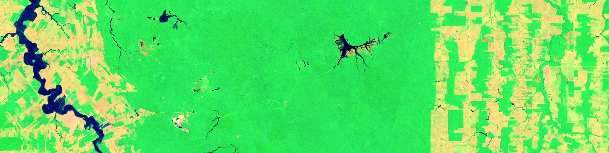
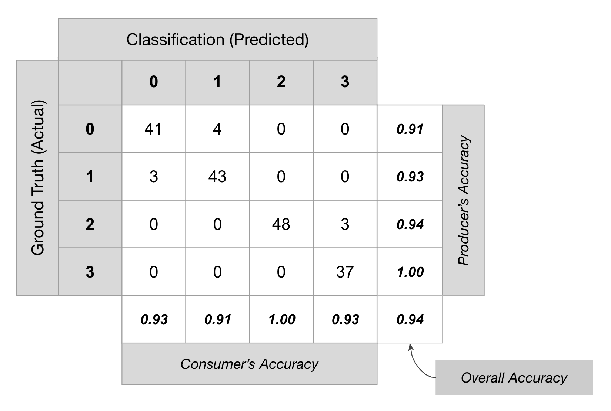
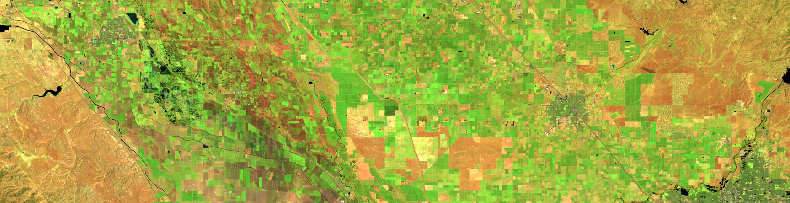

# 3. Image classification

## Objective

Supervised classification is arguably one of the most important classical machine learning techniques in remote sensing. Applications range from generating Land Use/Land Cover maps to change detection. The Earth Engine is unique suited to do classifications at scale. The goal of today's session is to provide an overview of land cover classification routines in Earth Engine environment. Our aim is to provide examples of typical workflows that you can customize and implement depending on your individual needs.&#x20;

## Supervised classification

The increasing availability and accessibility of earth observation imagery provides significant opportunities to assess status and monitor changes in land cover. To unlock this capability supervised and unsupervised classification methods can be applied. Here, we will focus on supervised classifications, as these are most commonly implemented.

### Classification workflow

The `Classifier` package handles supervised classification by traditional ML algorithms running in Earth Engine. These classifiers include CART, RandomForest, NaiveBayes and SVM. The general workflow for classification is:

1. Collect training data. Assemble features which have a property that stores the known class label and properties storing numeric values for the predictors.
2. Instantiate a classifier. Set its parameters if necessary.
3. Train the classifier using the training data.
4. Classify an image or feature collection.
5. Estimate classification error with independent validation data.

The training data is a `FeatureCollection` with a property storing the class label and properties storing predictor variables. Class labels should be consecutive, integers starting from 0. If necessary, use `remap()` to convert class values to consecutive integers. The predictors should be numeric. The training data can be points or polygons representing homogeneous regions. For polygons, every pixel in each polygon is a training point.

[Open in Code Editor](https://code.earthengine.google.com/?scriptPath=users%2Fwulf%2FGEO717%3AEE03_Classification%2F01a%20-%20ClassificationWorkflow_brazil_svm%20example)

```javascript
// Make a cloud-free Landsat 8 TOA composite (from raw imagery).
var l8 = ee.ImageCollection('LANDSAT/LC08/C02/T1');

var image = ee.Algorithms.Landsat.simpleComposite({
  collection: l8.filterDate('2018-01-01', '2018-12-31'),
  asFloat: true
});

// Use these bands for prediction.
var bands = ['B2', 'B3', 'B4', 'B5', 'B6', 'B7', 'B10', 'B11'];

Map.setCenter(-62.9136, -9.1308, 12)
Map.addLayer(image, {bands: ['B7', 'B5', 'B3'], min: 0.05, max: [0.15, 0.35, 0.30], gamma: 2}, 'Landsat composite');


/* HERE YOU NEED TO TAKE ACTION:
1. Use the geometry tool (points or polygons) to define three classes/geometries, 
   named "Forest", "Bare", and "Water". Draw at least three polygons (per class) 
   that are representive for each land cover class on top of the Landsat composite.
2. Import each geometry as a "Feature" (edit lyer properties menu)
3. Add to each feature a property called "class" and assign them values:
   Forest = 0, Bare = 1, Water = 2
*/

// Combine your features to one FeatureCollection
var polygons = ee.FeatureCollection([Forest, Bare, Water]);

// 1. Collect training data.
// Get the values for all pixels in each polygon in the training.
var training = image.sampleRegions({
  // Get the sample from the polygons FeatureCollection.
  collection: polygons,
  // Keep this list of properties from the polygons.
  properties: ['class'],
  // Set the scale to get Landsat pixels in the polygons.
  scale: 30
});

// Investigate the training FeatureCollection
print('Training spectra per class',training.limit(11))

// 2. Instantiate a classifier.
// Create an Support Vector Machine (SVM) classifier with custom parameters.
var classifier_svm = ee.Classifier.libsvm({
  kernelType: 'RBF',
  gamma: 0.5,
  cost: 10
});

// 3. Train the classifier.
var trained_svm = classifier_svm.train({
      features: training,
      classProperty: 'class',
      inputProperties: bands
    });

// 4. Classify the image.
var classified_svm = image.classify(trained_svm);

// Display the classification result.

Map.addLayer(classified_svm,
             {min: 0, max: 2, palette: ['green','red',  'blue']},
             'classification svm');
```

In this example, your training data store the land cover class label. Note that the training property (`'class'`) stores consecutive integers starting at 0 (Use [`remap()`](https://developers.google.com/earth-engine/guides/api_docs#eefeaturecollectionremap) on your table to turn your class labels into consecutive integers starting at zero if necessary). Also note the use of `image.sampleRegions()` to get the predictors into the table and create a training dataset. To train the classifier, specify the name of the class label property and a list of properties in the training table which the classifier should use for predictors. The number and order of the bands in the image to be classified must exactly match the order of the properties list provided to `classifier.train()`. Use `image.select()` to ensure that the classifier schema matches the image.



This previous example uses a Support Vector Machine (SVM) classifier ([Burges 1998](http://rd.springer.com/article/10.1023%2FA%3A1009715923555)). Note that the SVM is specified with a set of custom parameters. Without _a priori_ information about the physical nature of the prediction problem, optimal parameters are unknown. See [Hsu et al. (2003)](http://www.csie.ntu.edu.tw/~cjlin/papers/guide/guide.pdf) for a rough guide to choosing parameters for an SVM.

#### Playtime


Task: Compare your SVM classification with a Random Forest classifier (ee.Classifier.smileRandomForest). Which classifier performs better (in your opinion)?


Use the Code Editor (start from your previous svm-classification script, which you used above). After you finished the comparison, zoom out to see how the classifier performs outside your training area.


Fun fact: The classifiers in Earth Engine API have names starting with **smile** - such as `ee.Classifier.smileRandomForest()`. The _smile_ part refers to the [Statistical Machine Intelligence and Learning Engine (SMILE)](https://haifengl.github.io/index.html) JAVA library which is used by Google Earth Engine to implement these algorithms.


### Accuracy assessment <a href="#accuracy-assessment" id="accuracy-assessment"></a>

It is very important to get a quantitative estimate of the accuracy of the classification. Otherwise, there is no real value behind your results. To do this, a common strategy is to divide your training samples into 2 random fractions - one used for _training_ the model and the other for _validation_ of the predictions. Once a classifier is trained, it can be used to classify the entire image. We can then compare the classified values with the ones in the validation fraction. We can use the `ConfusionMatrix` ([Stehman 1997](http://www.sciencedirect.com/science/article/pii/S0034425797000837)) to assess the accuracy of a given classifier. Classification results are evaluated based on the following metrics:

* **Overall Accuracy**: How many samples were classified correctly.&#x20;
* **Producer’s Accuracy** (recall): How well did the classification predict each class.&#x20;
* **Consumer’s Accuracy** (precision): How reliable is the prediction in each class.&#x20;
* **Kappa Coefficient**: How well the classification performed as compared to random assignment.



The following example uses `sample()` to generate training and validation data from a Copernicus classification reference image and compares confusion matrices representing training and validation accuracy:

[Open in Code Editor](https://code.earthengine.google.com/?scriptPath=users%2Fwulf%2FGEO717%3AEE03_Classification%2F02a%20-%20Classification_AccuracyAssessment%20example)

```javascript
// Define a region of interest as a point.  Change the coordinates
// to get a classification of any place where there is Landsat imagery.
var poi = ee.Geometry.Point(172.102, -43.223);

// Load Landsat 8 input imagery.
var landsat = ee.Image(ee.ImageCollection('LANDSAT/LC08/C01/T1_TOA')
  // Filter to get only one year of images.
  .filterDate('2019-01-01', '2019-12-31')
  // Filter to get only images under the region of interest.
  .filterBounds(poi)
  // Sort by scene cloudiness, ascending.
  .sort('CLOUD_COVER')
  // Get the first (least cloudy) scene.
  .first());

// Compute cloud score.
var cloudScore = ee.Algorithms.Landsat.simpleCloudScore(landsat).select('cloud');

// Mask the L8_image for clouds.  Compute the min of the L8_image mask to mask
// pixels where any band is masked.  Combine that with the cloud mask.
var L8_image = landsat.updateMask(landsat.mask().reduce('min').and(cloudScore.lte(50)));

// Use these bands for prediction.
var bands = ['B2', 'B3', 'B4', 'B5', 'B6', 'B7', 'B10', 'B11'];

// Use the Copernicus Global Land Cover product for training.
var land_cover = ee.Image("COPERNICUS/Landcover/100m/Proba-V-C3/Global/2019")
                         .select('discrete_classification');

// display the land cover image
Map.addLayer(land_cover, {}, "Land Cover");
// print(land_cover)

land_cover = land_cover.remap([0,20,30,40,50,60,70,80,90,100,111,112,113,114,115,116,121,122,123,124,125,126,200],
                              [0,1,2,3,4,5,6,7,8,9,10,11,12,13,14,15,16,17,18,19,20,21,22]).rename('discrete_classification');

/* Land cover classification
0	282828	Unknown. No or not enough satellite data available.
20	FFBB22	Shrubs. Woody perennial plants with persistent and woody stems and without any defined main stem being less than 5 m tall. The shrub foliage can be either evergreen or deciduous.
30	FFFF4C	Herbaceous vegetation. Plants without persistent stem or shoots above ground and lacking definite firm structure. Tree and shrub cover is less than 10 %.
40	F096FF	Cultivated and managed vegetation / agriculture. Lands covered with temporary crops followed by harvest and a bare soil period (e.g., single and multiple cropping systems). Note that perennial woody crops will be classified as the appropriate forest or shrub land cover type.
50	FA0000	Urban / built up. Land covered by buildings and other man-made structures.
60	B4B4B4	Bare / sparse vegetation. Lands with exposed soil, sand, or rocks and never has more than 10 % vegetated cover during any time of the year.
70	F0F0F0	Snow and ice. Lands under snow or ice cover throughout the year.
80	0032C8	Permanent water bodies. Lakes, reservoirs, and rivers. Can be either fresh or salt-water bodies.
90	0096A0	Herbaceous wetland. Lands with a permanent mixture of water and herbaceous or woody vegetation. The vegetation can be present in either salt, brackish, or fresh water.
100	FAE6A0	Moss and lichen.
111	58481F	Closed forest, evergreen needle leaf. Tree canopy >70 %, almost all needle leaf trees remain green all year. Canopy is never without green foliage.
112	009900	Closed forest, evergreen broad leaf. Tree canopy >70 %, almost all broadleaf trees remain green year round. Canopy is never without green foliage.
113	70663E	Closed forest, deciduous needle leaf. Tree canopy >70 %, consists of seasonal needle leaf tree communities with an annual cycle of leaf-on and leaf-off periods.
114	00CC00	Closed forest, deciduous broad leaf. Tree canopy >70 %, consists of seasonal broadleaf tree communities with an annual cycle of leaf-on and leaf-off periods.
115	4E751F	Closed forest, mixed.
116	007800	Closed forest, not matching any of the other definitions.
121	666000	Open forest, evergreen needle leaf. Top layer- trees 15-70 % and second layer- mixed of shrubs and grassland, almost all needle leaf trees remain green all year. Canopy is never without green foliage.
122	8DB400	Open forest, evergreen broad leaf. Top layer- trees 15-70 % and second layer- mixed of shrubs and grassland, almost all broadleaf trees remain green year round. Canopy is never without green foliage.
123	8D7400	Open forest, deciduous needle leaf. Top layer- trees 15-70 % and second layer- mixed of shrubs and grassland, consists of seasonal needle leaf tree communities with an annual cycle of leaf-on and leaf-off periods.
124	A0DC00	Open forest, deciduous broad leaf. Top layer- trees 15-70 % and second layer- mixed of shrubs and grassland, consists of seasonal broadleaf tree communities with an annual cycle of leaf-on and leaf-off periods.
125	929900	Open forest, mixed.
126	648C00	Open forest, not matching any of the other definitions.
200	000080	Oceans, seas. Can be either fresh or salt-water bodies.
*/


// Use MODIS land cover, IGBP classification, for training.
// var modis = ee.Image('MODIS/051/MCD12Q1/2011_01_01')
//     .select('Land_Cover_Type_1');

// Sample the input imagery to get a FeatureCollection of training data.
var training = L8_image.addBands(land_cover).sample({
  numPixels: 5000, 
  seed: 0
});
print('Training data', training.limit(10))

// Make a Random Forest classifier and train it.
var classifier = ee.Classifier.smileRandomForest(10)
    .train({
      features: training,
      classProperty: 'discrete_classification',
      inputProperties: bands
    });
// print(classifier)

// Classify the L8_image imagery.
var classified = L8_image.classify(classifier);

// Get a confusion matrix representing resubstitution accuracy.
var trainAccuracy = classifier.confusionMatrix();
print('Resubstitution error matrix: ', trainAccuracy);
print('Training overall accuracy: ', trainAccuracy.accuracy().multiply(1000).round().divide(1000));


// Sample the L8_image with a different random seed to get validation data.
var validation = L8_image.addBands(land_cover).sample({
  numPixels: 5000,
  seed: 1
  // Filter the result to get rid of any null pixels.
}).filter(ee.Filter.neq('B2', null));

// Classify the validation data.
var validated = validation.classify(classifier);
print('Classified validation data', validated.limit(10))

// Get a confusion matrix representing expected accuracy.
var testAccuracy = validated.errorMatrix('discrete_classification', 'classification');
print('Validation error matrix: ', testAccuracy);
print('Validation overall accuracy: ', testAccuracy.accuracy().multiply(1000).round().divide(1000));
print('Validation user accuracy: ', testAccuracy.consumersAccuracy());
print('Validation producer accuracy: ', testAccuracy.producersAccuracy());
print('Validation kappa: ', testAccuracy.kappa().multiply(1000).round().divide(1000));

// Define a palette for the IGBP classification.

var palette =  ['282828', 'FFBB22', 'FFFF4C', 'F096FF', 'FA0000', 'B4B4B4', 'F0F0F0', 
                '0032C8', '0096A0', 'FAE6A0', '58481F', '009900', '70663E', '00CC00', 
                '4E751F', '007800', '666000', '8DB400', '8D7400', 'A0DC00', '929900', 
                '648C00', '000080']
  
  
// Display the L8_image and the classification.
Map.centerObject(poi, 8);
Map.addLayer(L8_image, {bands: ['B7', 'B5', 'B3'], max: 0.4}, 'landsat');
Map.addLayer(classified, {palette: palette, min: 0, max: 22}, 'classification');
```

This example uses a random forest ([Breiman 2001](http://rd.springer.com/article/10.1023/A:1010933404324)) classifier with 10 trees to downscale classification image (100 m) to Landsat resolution (30 m). The `sample()` method generates two random samples from the classification image: one for training and one for validation. The training sample is used to train the classifier. You can get resubstitution accuracy on the training data from `classifier.confusionMatrix()`. To get validation accuracy, classify the validation data. This adds a `classification` property to the validation `FeatureCollection`. Call `errorMatrix()` on the classified `FeatureCollection` to get a confusion matrix representing validation (expected) accuracy.


Task: Replace the sampling approach using the "stratifiedSample" method to sample and validate all classes more evenly.


Inspect the output to see that the overall accuracy estimated from the training data is much higher than the validation data. The accuracy estimated from training data is an overestimate because the random forest is “fit” to the training data. The expected accuracy on unknown data is lower, as indicated by the estimate from the validation data.

You can also take a single sample and partition it with the [`randomColumn()`](https://developers.google.com/earth-engine/guides/api_docs#ee.featurecollection.randomcolumn) method on feature collections. You may also want to ensure that the training samples are uncorrelated with the evaluation samples. This might result from spatial autocorrelation of the phenomenon being predicted. One way to exclude samples that might be correlated in this manner is to remove samples that are within some distance to any other sample(s). This can be accomplished with a spatial join. See both approaches (sample partitioning and spatial autocorrelation check) included in the previous example:

[Open in Code Editor](https://code.earthengine.google.com/?scriptPath=users%2Fwulf%2FGEO717%3AEE03_Classification%2F02c%20-%20Classification_AccuracyAssessment_stratified_sampleSplit%20example)

```javascript
// Define a region of interest as a point.  Change the coordinates
// to get a classification of any place where there is imagery.
var poi = ee.Geometry.Point(172.102, -43.223);

// Load Landsat 8 input imagery.
var landsat = ee.Image(ee.ImageCollection('LANDSAT/LC08/C01/T1_TOA')
  // Filter to get only one year of images.
  .filterDate('2019-01-01', '2019-12-31')
  // Filter to get only images under the region of interest.
  .filterBounds(poi)
  // Sort by scene cloudiness, ascending.
  .sort('CLOUD_COVER')
  // Get the first (least cloudy) scene.
  .first());

// Compute cloud score.
var cloudScore = ee.Algorithms.Landsat.simpleCloudScore(landsat).select('cloud');

// Mask the L8_image for clouds.  Compute the min of the L8_image mask to mask
// pixels where any band is masked.  Combine that with the cloud mask.
var L8_image = landsat.updateMask(landsat.mask().reduce('min').and(cloudScore.lte(50)));

// Use these bands for prediction.
var bands = ['B2', 'B3', 'B4', 'B5', 'B6', 'B7', 'B10', 'B11'];

// Use the Copernicus Global Land Cover product for training.
var land_cover = ee.Image("COPERNICUS/Landcover/100m/Proba-V-C3/Global/2019")
                         .select('discrete_classification');

// display the land cover image
Map.addLayer(land_cover, {}, "Land Cover");
// print(land_cover)

land_cover = land_cover.remap([0,20,30,40,50,60,70,80,90,100,111,112,113,114,115,116,121,122,123,124,125,126,200],
                              [0,1,2,3,4,5,6,7,8,9,10,11,12,13,14,15,16,17,18,19,20,21,22]).rename('discrete_classification');

// Sample the input imagery to get a FeatureCollection of training data.
var sample = L8_image.addBands(land_cover).stratifiedSample({
  numPoints: 1000,
  classBand: 'discrete_classification', 
  //region: , 
  scale: 30, 
  seed: 0, 
  geometries: true,
    // Filter the result to get rid of any null pixels.
}).filter(ee.Filter.neq('B2', null));

// The randomColumn() method will add a column of uniform random
// numbers in a column named 'random' by default.
sample = sample.randomColumn();

var split = 0.7;  // Roughly 70% training, 30% testing.
var training = sample.filter(ee.Filter.lt('random', split));
var validation = sample.filter(ee.Filter.gte('random', split));

print('training size before spatial filter', training.size());

// Spatial join.
var distFilter = ee.Filter.withinDistance({
  distance: 500,
  leftField: '.geo',
  rightField: '.geo',
  maxError: 10
});

var join = ee.Join.inverted();

// Apply the join.
training = join.apply(training, validation, distFilter);
print('training size after spatial filter', training.size());


// Make a Random Forest classifier and train it.
var classifier = ee.Classifier.smileRandomForest(10)
    .train({
      features: training,
      classProperty: 'discrete_classification',
      inputProperties: bands
    });

// Classify the L8_image imagery.
var classified = L8_image.classify(classifier);

// Get a confusion matrix representing resubstitution accuracy.
var trainAccuracy = classifier.confusionMatrix();
print('Resubstitution error matrix: ', trainAccuracy);
print('Training overall accuracy: ', trainAccuracy.accuracy());


// Classify the validation data.
var validated = validation.classify(classifier);

// Get a confusion matrix representing expected accuracy.
var testAccuracy = validated.errorMatrix('discrete_classification', 'classification');
print('Validation error matrix: ', testAccuracy);
print('Validation overall accuracy: ', testAccuracy.accuracy());
print('Validation user accuracy: ', testAccuracy.consumersAccuracy());
print('Validation producer accuracy: ', testAccuracy.producersAccuracy());
print('Validation kappa: ', testAccuracy.kappa());

// Color palette of the Copernicus Global Land Cover product.
var palette =  ['282828', 'FFBB22', 'FFFF4C', 'F096FF', 'FA0000', 'B4B4B4', 'F0F0F0', 
                '0032C8', '0096A0', 'FAE6A0', '58481F', '009900', '70663E', '00CC00', 
                '4E751F', '007800', '666000', '8DB400', '8D7400', 'A0DC00', '929900', 
                '648C00', '000080']
  
  
// Display the L8_image and the classification.
Map.centerObject(poi, 8);
Map.addLayer(L8_image, {bands: ['B7', 'B5', 'B3'], max: 0.4}, 'landsat');
Map.addLayer(classified, {palette: palette, min: 0, max: 22}, 'classification')
```


Hint: Don’t get carried away tweaking your model to give you the highest validation accuracy. You must use both qualitative measures (such as visual inspection of results) along with quantitative measures to assess the results.


### Crop type classification

Reliable and accurate crop classification maps are an important data source for agricultural monitoring and food security assessment studies. Crops such as rice, wheat, corn and barley are major food resources in many parts of the world, thus information on their spatial distribution and condition are significantly important at regional, national and even global level. To acquire such information on croplands over large agricultural regions, satellite data is an essential data source.



In the Central Valley, also known as the Great Valley of California, 250 different crops are grown with an estimated value of $17 billion per year. The predominate crop types are cereal grains, hay, cotton, tomatoes, vegetables, citrus, tree fruits, nuts, table grapes, and wine grapes. Our aim is to classify some of these crop types using Sentinel-2, Landsat and Sentinel-1 data. Our training data is based on the Cropland Data Layer (CDL), which is a crop-specific land cover data layer created annually for the continental United States using moderate resolution satellite imagery and extensive agricultural ground truth.

[Open in Code Editor](https://code.earthengine.google.com/?scriptPath=users%2Fwulf%2FGEO717%3AEE03_Classification%2F03a%20-%20Classification_Cropland_singleImageL8%20example) (Classification using Landsat 8 single image)

[Open in Code Editor](https://code.earthengine.google.com/?scriptPath=users%2Fwulf%2FGEO717%3AEE03_Classification%2F03b%20-%20Classification_Cropland_timeSeriesL8%20example) (Classification using Landsat 8 time series)

[Open in Code Editor](https://code.earthengine.google.com/?scriptPath=users%2Fwulf%2FGEO717%3AEE03_Classification%2F03c%20-%20Classification_Cropland_timeSeriesS2%20example) (Classification using Sentinel-2 time series)

[Open in Code Editor](https://code.earthengine.google.com/?scriptPath=users%2Fwulf%2FGEO717%3AEE03_Classification%2F03d%20-%20Classification_Cropland_timeSeriesS1%20example) (Classification using Sentinel-1 time series)

[Open in Code Editor](https://code.earthengine.google.com/?scriptPath=users%2Fwulf%2FGEO717%3AEE03_Classification%2F03e%20-%20Classification_Cropland_timeSeriesS1S2%20example) (Classification using Sentinel-1 and Sentinel-2 combined time series)

Another classification example can be found in the JavaScript tutorial of the Earth Engine:



